# Biological neuron

::: {.columns}
::: {.column width=50%}

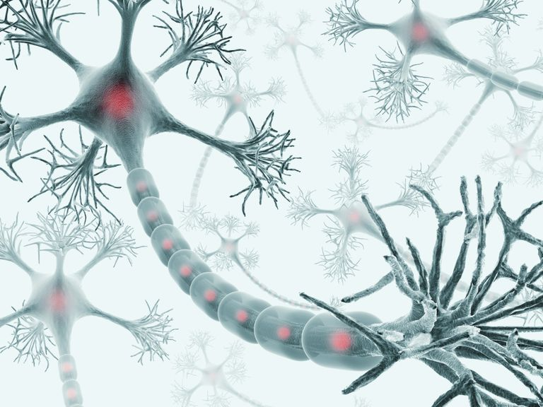{width=70%}

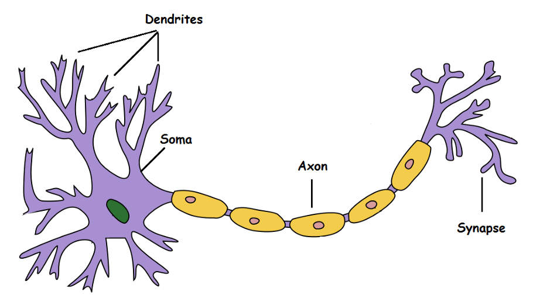{width=80%}

:::
::: {.column width=50%}

* The human brain is composed of 100 billion **neurons**.

* A biological neuron is a cell, composed of a cell body (**soma**), multiple **dendrites** and an **axon**.

* The axon of a neuron can contact the dendrites of another through **synapses** to transmit information.

* There are hundreds of different types of neurons, each with different properties.

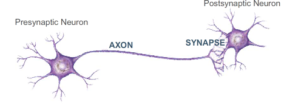

:::
:::

# Biological neuron

::: {.columns}
::: {.column width=50%}

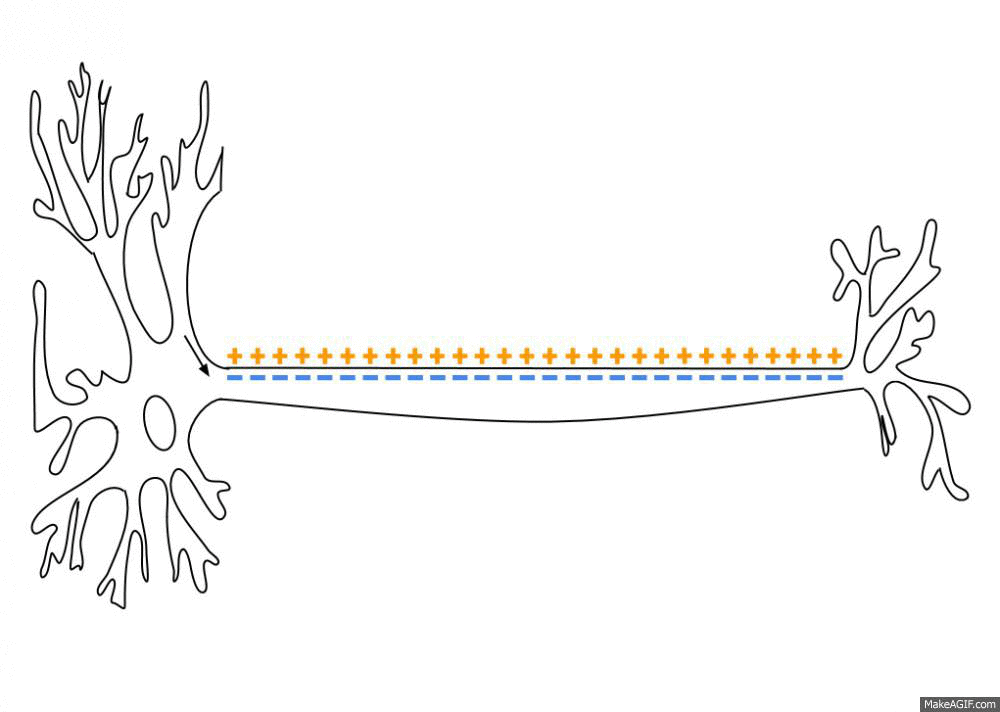

:::
::: {.column width=50%}

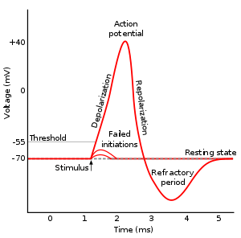

:::
:::

* Neurons are negatively charged: they have a resting potential at around -70 mV.

* When a neuron receives enough input currents, its **membrane potential** can exceed a threshold and the neuron emits an **action potential** (or **spike**) along its axon.

* A spike has a very small duration (1 or 2 ms) and its amplitude is rather constant.

* It is followed by a **refractory period** where the neuron is hyperpolarized, limiting the number of spikes per second to 200.

# Biological neuron

::: {.columns}
::: {.column width=50%}

{width=100%}

:::
::: {.column width=50%}

* The action potential arrives at the synapses and releases **neurotransmitters** in the synaptic cleft:

    * glutamate (AMPA, NMDA)
    * GABA
    * dopamine
    * serotonin
    * nicotin
    * etc...

* Neurotransmitters can enter the receiving neuron through **receptors** and change its potential: the neuron may emit a spike too.

* Synaptic currents change the membrane potential of the post.synaptic neuron.

* The change depends on the strength of the synapse called the **synaptic efficiency** or **weight**.

* Some synapses are stronger than others, and have a larger influence on the post-synaptic cell.

:::
:::

# Biological neuron



# Information is transmitted through spike trains

::: {.columns}
::: {.column width=50%}

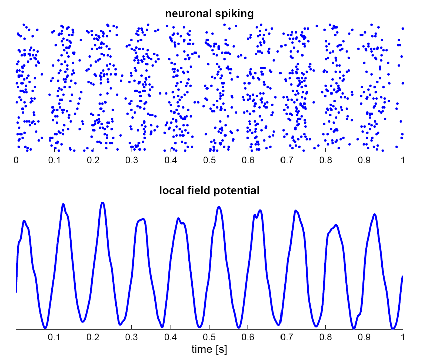

:::
::: {.column width=50%}

* The two important dimensions of the information exchanged by neurons are:

    * The instantaneous **frequency** or **firing rate**: number of spikes per second (Hz).

    * The precise **timing** of the spikes.

* The shape of the spike (amplitude, duration) does not matter much.

* Spikes are binary signals (0 or 1) at precise moments of time.

* Some neuron models called **rate-coded models** only represent the firing rate of a neuron and ignore spike timing.

* Other models called **spiking models** represent explicitly the spiking behavior.

:::
:::

# The Hodgkin-Huxley neuron (Hodgkin and Huxley, 1952)

::: {.columns}
::: {.column width=40%}

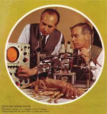

:::
::: {.column width=60%}

* Alan Hodgkin and Andrew Huxley (Nobel prize 1963) were the first to propose a detailed mathematical model of the giant squid neuron.

* The membrane potential $V$ of the neuron is governed by an electrical circuit, including sodium and potassium channels.

* The membrane has a **capacitance** $C$ that models the dynamics of the membrane (time constant).

* The **conductance** $g_L$ allows the membrane potential to relax back to its resting potential $E_L$ in the absence of external currents. 

* For electrical engineers: it is a simple RC network...

* External currents (synaptic inputs) perturb the membrane potential and can bring the neuron to fire an action potential.

:::
:::

# The Hodgkin-Huxley neuron (Hodgkin and Huxley, 1952)

::: {.columns}
::: {.column width=40%}

* Their model include:

    * An ordinary differential equation (ODE) for the membrane potential $v$.

    * Three ODEs for $n$, $m$ and $h$ representing potassium channel activation, sodium channel activation, and sodium channel inactivation.

    * Several parameters determined experimentally.

* Not only did they design experiments to find the parameters, but they designed the equations themselves.

:::
::: {.column width=60%}

$$
\begin{aligned}
    a_n &= 0.01 \, (v + 60) / (1.0 - \exp(-0.1\, (v + 60) ) ) \\
    a_m &= 0.1 \, (v + 45) / (1.0 - \exp (- 0.1 \, ( v + 45 ))) \\
    a_h &= 0.07 \, \exp(- 0.05 \, ( v + 70 )) \\
    b_n &= 0.125 \, \exp (- 0.0125 \, (v + 70)) \\
    b_m &= 4 \,  \exp (- (v + 70) / 80) \\
    b_h &= 1/(1 + \exp (- 0.1 \, ( v + 40 )) ) \\
    & \\
    \frac{dn}{dt} &= a_n \, (1 - n) - b_n \, n  \\
    \frac{dm}{dt} &= a_m \, (1 - m) - b_m \, m  \\
    \frac{dh}{dt} &= a_h \, (1 - h) - b_h \, h  \\
\end{aligned}
$$

$$
\begin{aligned}
    C \, \frac{dv}{dt} = g_L \, (V_L - v) &+ g_K \, n^4 \, (V_K - v) \\
        & + g_\text{Na} \, m^3 \, h \, (V_\text{Na} - v) + I \\
\end{aligned}
$$

:::
:::

# The Hodgkin-Huxley neuron (Hodgkin and Huxley, 1952)

* These equations allow to describe very precisely how an action potential is created from external currents.

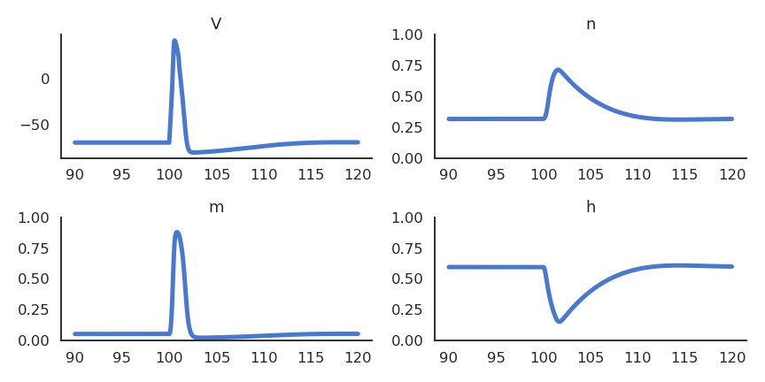

# The leaky integrate-and-fire neuron (Lapicque, 1907)

::: {.columns}
::: {.column width=50%}

* As action potentials are stereotypical, it is a waste of computational resources to model their generation precisely.

* What actually matters are the **sub-threshold dynamics**, i.e. what happens before the spike is emitted.

* The **leaky integrate-and-fire** (LIF) neuron integrates its input current and emits a spike if the membrane potential exceeds a threshold.

$$
    C \, \frac{dv}{dt} = - g_L \, (v - V_L) + I
$$

$$
    \text{if} \; v > V_T \; \text{emit a spike and reset.}
$$

:::
::: {.column width=50%}

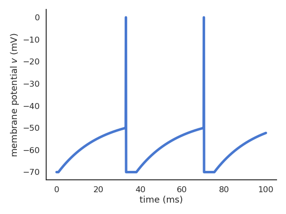

:::
:::

# Different spiking neuron models are possible

::: {.columns}
::: {.column width=40%}

* Izhikevich quadratic IF (Izhikevich, 2001).

$$
    \frac{dv}{dt} = 0.04 \, v^2 + 5 \, v + 140 - u + I 
$$
$$
    \frac{du}{dt} = a \, (b \, v - u)
$$

:::
::: {.column width=55%}

* Adaptive exponential IF (AdEx, Brette and Gerstner, 2005).

$$
\begin{aligned}
    C \, \frac{dv}{dt} = -g_L \ (v - E_L) + & g_L \, \Delta_T \, \exp(\frac{v - v_T}{\Delta_T}) \\
                                            & + I - w
\end{aligned}
$$
$$
    \tau_w \, \frac{dw}{dt} = a \, (v - E_L) - w
$$

:::
:::

# Realistic neuron models can reproduce a variety of dynamics

::: {.columns}
::: {.column width=65%}

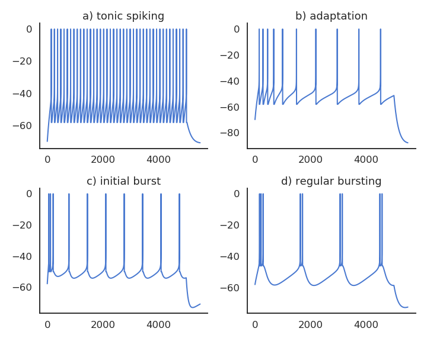

:::
::: {.column width=35%}

Biological neurons do not all respond the same to an input current.

* Some fire regularly.

* Some slow down with time.

* Some emit bursts of spikes.

Modern spiking neuron models allow to recreate these dynamics by changing a few parameters.

:::
:::

# Populations of spiking neurons

::: {.columns}
::: {.column width=50%}

:::
::: {.column width=50%}

* Interconnected networks of spiking neurons tend to fire synchronously (redundancy).

* What if the important information was not the precise spike timings, but the **firing rate** of a small population?

* The instantaneous firing rate is defined in Hz (number of spikes per second).

* It can be estimated by an histogram of the spikes emitted by a network of similar neurons, or by repeating the same experiment multiple times for a single neuron.

* One can also build neural models that directly model the **firing rate** of (a population of) neuron(s): the **rate-coded** neuron.

:::
:::

::: footer
Izhikevich, E.M. (2003). Simple Model of Spiking Neurons, IEEE Transaction on Neural Networks, 14:6
:::

# The rate-coded neuron

* A rate-coded neuron is represented by two time-dependent variables:

    * The **"membrane potential"** $v(t)$ which evolves over time using an ODE.

    * The **firing rate** $r(t)$ which transforms the membrane potential into a single continuous value using a **transfer function** or **activation function**.

::: {.columns}
::: {.column width=50%}

{width=80%}

:::
::: {.column width=50%}

**Rate-coded neuron**

$$
    \tau \, \frac{d v(t)}{dt} + v(t) = \sum_{i=1}^d w_{i, j} \, r_i(t) + b
$$

$$
    r(t) = f(v(t))
$$

:::
:::

* The membrane potential uses a weighted sum of inputs (the firing rates $r_i(t)$ of other neurons) by multiplying each rate with a **weight** $w_i$ and adds a constant value $b$ (the **bias**). The activation function can be any non-linear function, usually making sure that the firing rate is positive.

# The rate-coded neuron

::: {.columns}
::: {.column width=50%}

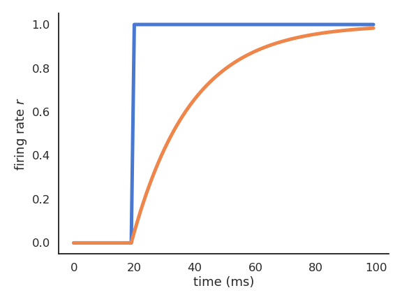

:::
::: {.column width=50%}

* Let's consider a simple rate-coded neuron taking a step signal $I(t)$ as input:

$$
    \tau \, \frac{d v(t)}{dt} + v(t) = I(t)
$$

$$
    r(t) = (v(t))^+
$$

* The "speed" of $v(t)$ is given by its temporal derivative:

$$
    \frac{d v(t)}{dt} = \frac{I(t) - v(t)}{\tau}
$$

:::
:::

* When $v(t)$ is quite different from $I(t)$, the membrane potential "accelerates" to reduce the difference.

* When $v(t)$ is similar to $I(t)$, the membrane potential stays constant.

# The rate-coded neuron

::: {.columns}
::: {.column width=50%}

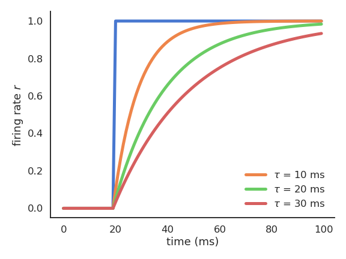

:::
::: {.column width=50%}

* The membrane potential follows an exponential function which tries to "match" its input with a speed determined by the **time constant** $\tau$.

* The time constant $\tau$ determines how fast the rate-coded neuron matches its inputs.

* Biological neurons have time constants between 5 and 30 ms depending on the cell type.

:::
:::

# Activation functions

{width=75%}

# Rectifier activation function

* When using the rectifier activation function

$$
    f(x) = \max(0, x)
$$

the membrane potential $v(t)$ can take any value, but the firing rate $r(t)$ is only positive.

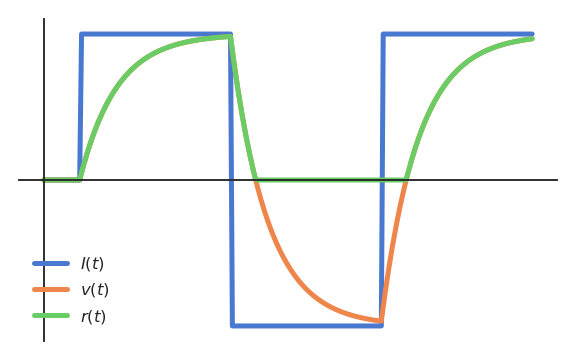

# Logistic activation function

* When using the logistic (or sigmoid) activation function

$$
    f(x) = \frac{1}{1 + \exp(-x)}
$$

the firing rate $r(t)$ is bounded between 0 and 1, but responds for negative membrane potentials.

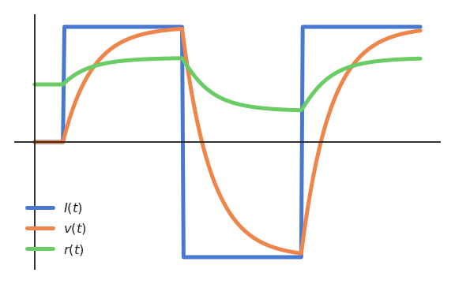

# Networks of rate-coded neurons

* Networks of interconnected rate-coded neurons can exhibit very complex dynamics (e.g. **reservoir computing**). 

$$
    \tau \frac{dv(t)}{dt} + v(t) = \sum_\text{input} w^\text{I} \, I(t) + g \,  \sum_\text{rec} w^\text{R} \, r(t) + \xi(t)
$$

$$
    r(t) = \tanh(v(t))
$$

::: {.columns}
::: {.column width=50%}

:::
::: {.column width=50%}

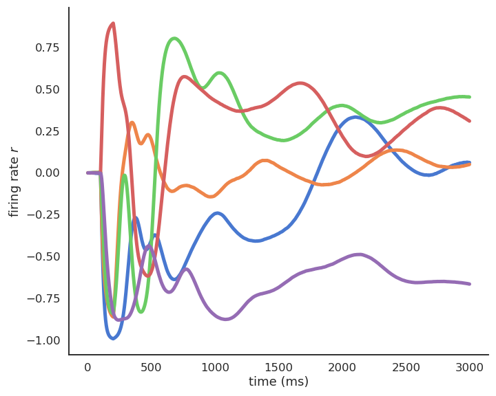

:::
:::

# The McCulloch & Pitts neuron (McCulloch and Pitts, 1943)

* By omitting the dynamics of the rate-coded neuron, one obtains the very simple **artificial neuron**:

::: {.columns}
::: {.column width=50%}

:::
::: {.column width=50%}

**Artificial neuron**

$$
    y = f( \sum_{i=1}^d w_i \, x_i + b)
$$

* An artificial neuron sums its inputs $x_1, \ldots, x_d$ by multiplying them with weights $w_1, \ldots, w_d$, adds a bias $b$ and transforms the result into an output $y$ using an activation function $f$.

* The output $y$ directly reflects the input, without temporal integration.

:::
:::

* The **weighted sum of inputs + bias** $\sum_{i=1}^d w_i \, x_i + b$ is called the **net activation**. 

* This overly simplified neuron model is the basic unit of the **artificial neural networks** (ANN) used in machine learning / deep learning.

# Artificial neurons and hyperplanes

* Let's consider an artificial neuron with only two inputs $x_1$ and $x_2$.

* The net activation $w_1 \, x_1 + w_2 \, x_2 + b$ is the equation of a line in the space $(x_1, x_2)$. 

$$
    w_1 \, x_1 + w_2 \, x_2 + b = 0 \Leftrightarrow x_2 = - \frac{w_1}{w_2} \, x_1 - \frac{b}{w_2}
$$

{width=50%}

# Artificial neurons and hyperplanes

::: {.columns}
::: {.column width=50%}

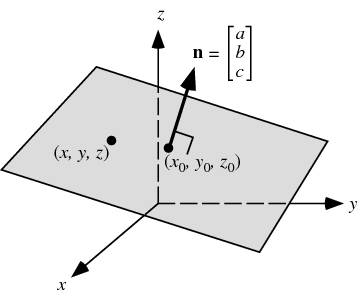

* The net activation is a line in 2D, a plane in 3D, etc.

* Generally, the net activation describes an **hyperplane** in the input space with $d$ dimensions $(x_1, x_2, \ldots, x_d)$. 

* An hyperplane has one dimension less than the space.

:::
::: {.column width=50%}

* We can write the net activation using a **weight vector** $\mathbf{w}$ and a **bias** $b$:

$$
    \sum_{i=1}^d w_i \, x_i + b  = \langle\mathbf{w} \cdot \mathbf{x} \rangle + b
$$

with:

$$
    \mathbf{w} = \begin{bmatrix} w_1 \\ w_2 \\ \ldots \\ w_d \end{bmatrix} \qquad \mathbf{x} = \begin{bmatrix} x_1 \\ x_2 \\ \ldots \\ x_d \end{bmatrix}
$$

* $\langle \cdot \rangle$ is the **dot product** (aka inner product, scalar product) between the **input vector** $\mathbf{x}$ and the weight vector $\mathbf{w}$.

* The weight vector is orthogonal to the hyperplane $(\mathbf{w}, b)$ and defines its orientation. $b$ is the "signed distance" between the hyperplane and the origin.

:::
:::

# Artificial neurons and hyperplanes

* The hyperplane separates the input space into two parts:

    * $\langle\mathbf{w} \cdot \mathbf{x} \rangle + b > 0$ for all points $\mathbf{x}$ **above** the hyperplane.

    * $\langle\mathbf{w} \cdot \mathbf{x} \rangle + b < 0$ for all points $\mathbf{x}$ **below** the hyperplane.

* By looking at the **sign** of the net activation, we can separate the input space into two classes.

{width=50%}

# Overview of neuron models

---


