# 1 - Linear regression

# Linear regression

::: {.columns}
::: {.column width=50%}


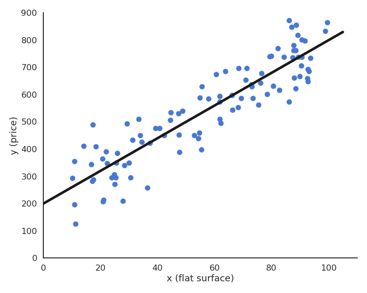

:::
::: {.column width=50%}


* We have a training set of N examples $\mathcal{D} = (x_i, t_i)_{i=1..N}$.

* In **linear regression**, we want to learn a linear model (hypothesis) $y$ that is linearly dependent on the input $x$:

$$
    y = f_{w, b}(x) = w \, x + b
$$

* The **free parameters** of the model are 
    
    * the slope $w$,
    
    * the intercept $b$. 

* The data $\mathcal{D} = (x_i, t_i)_{i=1..N}$ is given (fixed).

:::
:::


# Linear regression

::: {.columns}
::: {.column width=50%}


:::
::: {.column width=50%}


* Mathematical model:

$$
    y = f_{w, b}(x) = w \, x + b
$$

* This corresponds to a single artificial neuron $y$ with: 

    * one input $x$, 

    * one weight $w$, 

    * one bias $b$,

    * a **linear** activation function.

* We will see that this generalizes to multiple inputs and outputs. 

:::
:::


# Linear regression

* The goal of the linear regression (or least mean squares - LMS) is to minimize the **mean square error** (mse) between the targets and the predictions.

* It is defined as:

$$
    \mathcal{L}(w, b) =  \mathbb{E}_{x_i, t_i \in \mathcal{D}} [ (t_i - y_i )^2 ]
$$


{width=100%}

# Linear regression

* The loss function is defined as the mathematical expectation of the quadratic error over the training set.

* As the training set is finite and the samples i.i.d, we can simply replace the expectation by an average:

$$
    \mathcal{L}(w, b) = \frac{1}{N} \, \sum_{i=1}^{N} (t_i - y_i )^2
$$

{width=100%}


# Linear regression

* The minimum of the mse is achieved when the **prediction** $y_i = f_{w, b}(x_i)$ is equal to the **true value** $t_i$ for all training examples.

* In other words, we want to minimize the **residual error** of the model on the data.

* It is not always possible to obtain the global minimum (0) but the closer, the better.

{width=100%}


# Gradient descent for linear regression

* We search for $w$ and $b$ which minimize the mean square error:

$$
    \mathcal{L}(w, b) = \frac{1}{N} \, \sum_{i=1}^{N} (t_i - y_i )^2
$$

* We will apply *gradient descent* to iteratively modify estimates of $w$ and $b$:

$$
    \Delta w = - \eta \, \frac{\partial \mathcal{L}(w, b)}{\partial w}
$$

$$
    \Delta b = - \eta \, \frac{\partial \mathcal{L}(w, b)}{\partial b}
$$

# Gradient descent for linear regression

* Let's search for the partial derivative (gradient) of the quadratic error with respect to $w$:

$$
    \frac{\partial \mathcal{L}(w, b)}{\partial w} = \frac{\partial}{\partial w} [\frac{1}{N} \, \sum_{i=1}^{N} (t_i - y_i )^2]
$$


* Partial derivatives are linear, so the derivative of a sum is the sum of the derivatives:

$$
    \frac{\partial \mathcal{L}(w, b)}{\partial w} = \frac{1}{N} \, \sum_{i=1}^{N} \frac{\partial}{\partial w} (t_i - y_i )^2
$$


* This means we can compute a gradient for each training example instead of for the whole training set (see later the distinction batch/online):

$$
    \frac{\partial \mathcal{L}(w, b)}{\partial w} = \frac{1}{N} \, \sum_{i=1}^{N} \frac{\partial}{\partial w} \mathcal{l}_i(w, b)
    \qquad \text{with} \qquad \mathcal{l}_i(w, b) = (t_i - y_i )^2
$$

# Gradient descent for linear regression

* The individual loss $\mathcal{l}_i(w, b) = (t_i - y_i )^2$ is the composition of two functions:

    * a square error function $g_i(y_i) = (t_i - y_i)^2$.

    * the prediction $y_i = f_{w, b}(x_i) = w \, x_i + b$.

* The **chain rule** tells us how to derive such composite functions:

$$
    \frac{ d f(g(x))}{dx} = \frac{ d f(g(x))}{d g(x)} \times \frac{ d g(x)}{dx} = \frac{ d f(y)}{dy} \times \frac{ d g(x)}{dx}
$$

* The first derivative considers $g(x)$ to be a single variable.

* Applied to our problem, this gives:

$$
     \frac{\partial}{\partial w} \mathcal{l}_i(w, b) =  \frac{\partial g_i(y_i)}{\partial y_i} \times  \frac{\partial y_i}{\partial w}
$$


# Gradient descent for linear regression

* The square error function $g_i(y) = (t_i - y)^2$ is easy to differentiate w.r.t $y$:

$$
    \frac{\partial g_i(y_i)}{\partial y_i} = - 2 \, (t_i - y_i)
$$

* The prediction $y_i = w \, x_i + b$ also w.r.t $w$ and $b$:

$$
   \frac{\partial  y_i}{\partial w} = x_i
$$

$$
   \frac{\partial  y_i}{\partial b} = 1
$$

* The partial derivative of the individual loss is:

$$
    \frac{\partial \mathcal{l}_i(w, b)}{\partial w} = - 2 \, (t_i - y_i) \, x_i
$$

$$
    \frac{\partial \mathcal{l}_i(w, b)}{\partial b} = - 2 \, (t_i - y_i)
$$

# Gradient descent for linear regression

* This gives us:

$$
    \frac{\partial \mathcal{L}(w, b)}{\partial w} = - \frac{2}{N} \sum_{i=1}^{N} (t_i - y_i) \, x_i
$$

$$
    \frac{\partial \mathcal{L}(w, b)}{\partial b} = - \frac{2}{N} \sum_{i=1}^{N} (t_i - y_i)
$$

* Gradient descent is then defined by the learning rules (absorbing the 2 in $\eta$):

$$
    \Delta w = \eta \, \frac{1}{N} \sum_{i=1}^{N} (t_i - y_i) \, x_i
$$

$$
    \Delta b = \eta \, \frac{1}{N} \sum_{i=1}^{N} (t_i - y_i)
$$

# Least Mean Squares (LMS) - Ordinary Least Squares (OLS)

::::: {.columns}
:::: {.column width=50%}


* LMS is a **batch** algorithm: the parameter changes are computed over the whole dataset.

$$
    \Delta w = \eta \, \frac{1}{N} \sum_{i=1}^{N} (t_i - y_i) \, x_i
$$
$$
    \Delta b = \eta \, \frac{1}{N} \sum_{i=1}^{N} (t_i - y_i)
$$

* The parameter changes have to be applied multiple times (**epochs**) in order for the parameters to converge.

* One can stop when the parameters do not change much, or after a fixed number of epochs.

:::::
:::: {.column width=50%}

::::{.callout-tip}
## Least Mean Squares algorithm

* $w=0 \quad;\quad b=0$

* **for** M epochs:

    * $dw=0 \quad;\quad db=0$

    * **for** each sample $(x_i, t_i)$:

        * $y_i = w \, x_i + b$

        * $dw = dw + (t_i - y_i) \, x_i$

        * $db = db + (t_i - y_i)$

    * $\Delta w = \eta \, \frac{1}{N} dw$

    * $\Delta b = \eta \, \frac{1}{N} db$
:::

::::
:::::


# Least mean squares in action


# Least mean squares

* During learning, the **mean square error** (mse) decreases with the number of epochs but does not reach zero because of the noise in the data.

{width=70%}


# Delta learning rule: Online version of LMS

::: {.columns}
::: {.column width=50%}


* LMS is very slow, because it changes the weights only after the whole training set has been evaluated.

$$
\begin{cases}
    \Delta w = \eta \, \frac{1}{N} \sum_{i=1}^{N} (t_i - y_i) \, x_i \\
    \\
    \Delta b = \eta \, \frac{1}{N} \sum_{i=1}^{N} (t_i - y_i) \\
\end{cases}
$$

:::
::: {.column width=50%}


:::{.callout-tip}
## Online version of LMS : delta learning rule

* $w=0 \quad;\quad b=0$

* **for** M epochs:

    * **for** each sample $(x_i, t_i)$:

        * $y_i = w \, x_i + b$

        * $\Delta w = \eta \, (t_i - y_i ) \, x_i$

        * $\Delta b = \eta \, (t_i - y_i)$
:::

:::
:::

* It is also possible to update the weights immediately after each example using the **delta learning rule**:

$$
\begin{cases}
\Delta w = \eta \, (t_i - y_i) \, x_i \\
\\
\Delta b = \eta \, (t_i - y_i)\\
\end{cases}
$$


* The batch version is more stable, but the online version is faster: the weights have already learned something when arriving at the end of the first epoch.

# Delta learning rule in action (same learning rate!)


# Delta learning rule

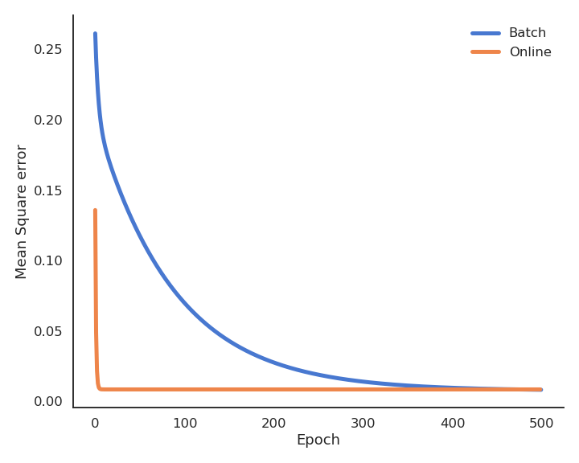

# 2 - Multiple linear regression

# Multiple linear regression


* The key idea of linear regression (one input $x$, one output $y$) can be generalized to multiple inputs and outputs.

::: {.columns}
::: {.column width=45%}

* **Multiple Linear Regression** (MLR) predicts several output variables based on several explanatory variables or **features**:
$$
\begin{cases}
y_1 = w_1 \, x_1 + w_2 \, x_2 + b_1\\
\\
y_2 = w_3 \, x_1 + w_4 \, x_2 + b_2\\
\end{cases}
$$

* All we have is some samples: we want to know the best model for the data.

:::
::: {.column width=55%}

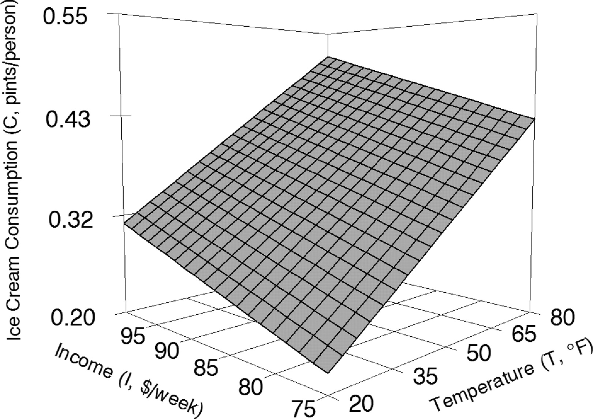

:::
:::


# MLR example: fuel consumption and CO2 emissions

* Let's suppose you have 13971 measurements in some Excel file, linking engine size, number of cylinders, fuel consumption and CO2 emissions of various cars.

* You want to predict fuel consumption and CO2 emissions when you know the engine size and the number of cylinders.

Engine size | Cylinders | Fuel consumption | CO2 emissions
---- | ---- | ---- | ----
2 | 4 | 8.5 | 196
2.4 | 4 | 9.6 | 221
1.5 | 4 | 5.9 | 136
3.5 | 6 | 11 | 255
3.5 | 6 | 11 | 244
3.5 | 6 | 10 | 230
3.5 | 6 | 10 | 232
3.7 | 6 | 11 | 255
3.7 | 6 | 12 | 267
... | ... | ... | ...


# MLR example: fuel consumption and CO2 emissions

{width=65%}

# MLR example: fuel consumption and CO2 emissions

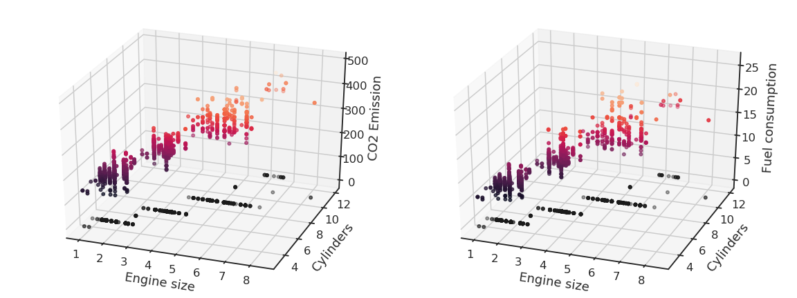{width=100%}


# MLR example: fuel consumption and CO2 emissions

* Noting the variables $x_1$, $x_2$, $y_1$, $y_2$, we can define our MLR problem:

$$
\begin{cases}
y_1 = w_1 \, x_1 + w_2 \, x_2 + b_1\\
\\
y_2 = w_3 \, x_1 + w_4 \, x_2 + b_2\\
\end{cases}
$$

and use the least mean squares method to obtain the value of the parameters.

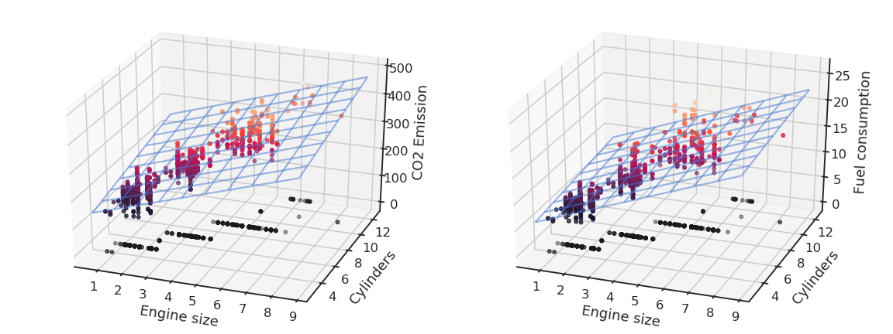{width=70%}


* Note: using the Python library `scikit-learn` (<https://scikit-learn.org>), this is done in two lines of code:

```python
from sklearn.linear_model import LinearRegression
reg = LinearRegression().fit(X, y)
```


# Multiple linear regression

* The system of equations:

$$
\begin{cases}
y_1 = w_1 \, x_1 + w_2 \, x_2 + b_1\\
\\
y_2 = w_3 \, x_1 + w_4 \, x_2 + b_2\\
\end{cases}
$$

can be put in a matrix-vector form:

$$
    \begin{bmatrix} y_1 \\ y_2 \\\end{bmatrix} = \begin{bmatrix} w_1 & w_2 \\ w_3 & w_4 \\\end{bmatrix} \times \begin{bmatrix} x_1 \\ x_2 \\\end{bmatrix} + \begin{bmatrix} b_1 \\ b_2 \\\end{bmatrix}
$$

* We simply create the corresponding vectors and matrices:

$$
    \mathbf{x} = \begin{bmatrix} x_1 \\ x_2 \\\end{bmatrix} \qquad \mathbf{y} = \begin{bmatrix} y_1 \\ y_2 \\\end{bmatrix} \qquad \mathbf{t} = \begin{bmatrix} t_1 \\ t_2 \\\end{bmatrix} \qquad \mathbf{b} = \begin{bmatrix} b_1 \\ b_2 \\\end{bmatrix} \qquad W = \begin{bmatrix} w_1 & w_2 \\ w_3 & w_4 \\\end{bmatrix}
$$

* $\mathbf{x}$ is the input vector, $\mathbf{y}$ is the output vector, $\mathbf{t}$ is the target vector.

* $W$ is called the **weight matrix** and $\mathbf{b}$ the **bias vector**.

$$
    \mathbf{y} = f_{W, \mathbf{b}}(\mathbf{x}) = W \times \mathbf{x} + \mathbf{b}
$$

# Multiple linear regression

{width=60%}

::: {.columns}
::: {.column width=40%}


:::
::: {.column width=60%}

* The model is now defined by:

$$
    \mathbf{y} = f_{W, \mathbf{b}}(\mathbf{x}) = W \times \mathbf{x} + \mathbf{b}
$$

* The problem is exactly the same as before, except that we use vectors and matrices instead of scalars: $\mathbf{x}$ and $\mathbf{y}$ can have any number of dimensions, the same procedure will apply.

* This corresponds to a **linear neural network** (or linear perceptron), with one **output neuron** per predicted value $y_i$ using the linear activation function.

:::
:::


# Multiple linear regression

* The mean square error still needs to be a scalar in order to be minimized. We can define it as the squared norm of the error **vector**:

$$
    \min_{W, \mathbf{b}} \, \mathcal{L}(W, \mathbf{b}) = \mathbb{E}_\mathcal{D} [ ||\mathbf{t} - \mathbf{y}||^2 ] = \mathbb{E}_\mathcal{D} [ ((t_1 - y_1)^2 + (t_2 - y_2)^2) ]
$$

* In order to apply gradient descent, one needs to calculate partial derivatives w.r.t the weight matrix $W$ and the bias vector $\mathbf{b}$, i.e. **gradients**:

$$
    \begin{cases}
    \Delta W = - \eta \, \nabla_W \, \mathcal{L}(W, \mathbf{b}) \\
    \\
    \Delta \mathbf{b} = - \eta \, \nabla_\mathbf{b}  \mathcal{L}(W, \mathbf{b}) \\
    \end{cases}
$$

* Some more advanced linear algebra becomes important to know how to compute these gradients:

<https://web.stanford.edu/class/cs224n/readings/gradient-notes.pdf>

# Multiple linear regression

* We search the minimum of the mse loss function:

$$
    \min_{W, \mathbf{b}} \, \mathcal{L}(W, \mathbf{b}) = \mathbb{E}_\mathcal{D} [ ||\mathbf{t} - \mathbf{y}||^2 ] \approx \frac{1}{N} \, \sum_{i=1}^N ||\mathbf{t}_i - \mathbf{y}_i||^2 = \frac{1}{N} \, \sum_{i=1}^N \mathcal{l}_i(W, \mathbf{b})
$$

* The individual loss function $\mathcal{l}_i(W, \mathbf{b})$ is the squared $\mathcal{L}^2$-norm of the error vector, what can be expressed as a dot product or a vector multiplication:

$$
    \mathcal{l}_i(W, \mathbf{b}) = ||\mathbf{t}_i - \mathbf{y}_i||^2 = \langle \mathbf{t}_i - \mathbf{y}_i \cdot \mathbf{t}_i - \mathbf{y}_i \rangle = (\mathbf{t}_i - \mathbf{y}_i)^T \times (\mathbf{t}_i - \mathbf{y}_i)
$$

* Remember:

$$\mathbf{x}^T \times \mathbf{x} = \begin{bmatrix} x_1 & x_2 & \ldots & x_n \end{bmatrix} \times \begin{bmatrix} x_1 \\ x_2 \\ \vdots \\ x_n \end{bmatrix} = x_1 \, x_1 + x_2 \, x_2 + \ldots + x_n \, x_n = \langle \mathbf{x} \cdot \mathbf{x} \rangle = ||\mathbf{x}||^2_2$$


# Multiple linear regression

* The chain rule tells us in principle that:

$$\nabla_{W} \, \mathcal{l}_i(W, \mathbf{b}) = \nabla_{\mathbf{y}_i} \, \mathcal{l}_i(W, \mathbf{b}) \times \nabla_{W} \, \mathbf{y}_i$$

* The gradient w.r.t the output vector $\mathbf{y}_i$ is quite easy to obtain, as it a quadratic function of $\mathbf{t}_i - \mathbf{y}_i$:

$$\nabla_{\mathbf{y}_i} \, \mathcal{l}_i(W, \mathbf{b}) = \nabla_{\mathbf{y}_i} \, (\mathbf{t}_i - \mathbf{y}_i)^T \times (\mathbf{t}_i - \mathbf{y}_i)$$

* The proof relies on product differentiation $(f\times g)' = f' \, g + f \, g'$:

$$\begin{aligned}
    \nabla_{\mathbf{y}_i} \, (\mathbf{t}_i - \mathbf{y}_i)^T \times (\mathbf{t}_i - \mathbf{y}_i) & = ( \nabla_{\mathbf{y}_i} \, (\mathbf{t}_i - \mathbf{y}_i) ) \times (\mathbf{t}_i - \mathbf{y}_i) + (\mathbf{t}_i - \mathbf{y}_i) \times \nabla_{\mathbf{y}_i} \, (\mathbf{t}_i - \mathbf{y}_i)  \\
    &\\
    &= - (\mathbf{t}_i - \mathbf{y}_i) - (\mathbf{t}_i - \mathbf{y}_i) \\
    &\\
    &= - 2 \, (\mathbf{t}_i - \mathbf{y}_i) \\
\end{aligned}
$$

**Note:** We use the properties $\nabla_{\mathbf{x}}\,  \mathbf{x}^T \times \mathbf{z} = \mathbf{z}$ and $\nabla_{\mathbf{z}} \, \mathbf{x}^T \times \mathbf{z} = \mathbf{x}$ to get rid of the transpose.


# Multiple linear regression

{width=60%}

* The "problem" is when computing $\nabla_{W} \, \mathbf{y}_i = \nabla_{W} \, (W \times \mathbf{x}_i + \mathbf{b})$: 

    * $\mathbf{y}_i$ is a vector and $W$ a matrix.

    * $\nabla_{W} \, \mathbf{y}_i$ is then a Jacobian (matrix), not a gradient (vector).


* Intuitively, differentiating $W \times \mathbf{x}_i + \mathbf{b}$ w.r.t $W$ should return $\mathbf{x}_i$, but it is a vector, not a matrix...

* The gradient (or Jacobian) of $\mathcal{l}_i(W, \mathbf{b})$ w.r.t $W$ should be a matrix of the same size as $W$ so that we can apply gradient descent:

$$\Delta W = - \eta \, \nabla_W \, \mathcal{L}(W, \mathbf{b})$$


# Multiple linear regression

* We already know that:

$$\nabla_{W} \, \mathcal{l}_i(W, \mathbf{b}) = - 2\, (\mathbf{t}_i - \mathbf{y}_i) \times \nabla_{W} \, \mathbf{y}_i$$

* If $\mathbf{x}_i$ has $n$ elements and $\mathbf{y}_i$ $m$ elements, $W$ is a $m \times n$ matrix.

* Remember the outer product between two vectors:

$$
\mathbf{u} \times \mathbf{v}^\textsf{T} =
  \begin{bmatrix}u_1 \\ u_2 \\ u_3 \\ u_4\end{bmatrix}
    \begin{bmatrix}v_1 & v_2 & v_3\end{bmatrix} =
  \begin{bmatrix}
    u_1v_1 & u_1v_2 & u_1v_3 \\
    u_2v_1 & u_2v_2 & u_2v_3 \\
    u_3v_1 & u_3v_2 & u_3v_3 \\
    u_4v_1 & u_4v_2 & u_4v_3
  \end{bmatrix}.
$$

* It is easy to see that the outer product between $(\mathbf{t}_i - \mathbf{y}_i)$ and $\mathbf{x}_i$ gives a $m \times n$ matrix:

$$
    \nabla_W \, \mathcal{l}_i(W, \mathbf{b}) = - 2 \, (\mathbf{t}_i - \mathbf{y}_i) \times \mathbf{x}_i^T\\
$$

# Example

* Let's prove it element per element:

$$
    \mathbf{y} = W \times \mathbf{x} + \mathbf{b}
$$

$$
    \begin{bmatrix} y_1 \\ y_2 \\\end{bmatrix} = \begin{bmatrix} w_1 & w_2 \\ w_3 & w_4 \\\end{bmatrix} \times \begin{bmatrix} x_1 \\ x_2 \\\end{bmatrix} + \begin{bmatrix} b_1 \\ b_2 \\\end{bmatrix}
$$

$$
\mathcal{l}(W, \mathbf{b}) = (\mathbf{t} - \mathbf{y})^T \times (\mathbf{t} - \mathbf{y}) = \begin{bmatrix} t_1 - y_1 & t_2 - y_2 \\\end{bmatrix} \times \begin{bmatrix} t_1 - y_1 \\ t_2 - y_2 \\\end{bmatrix} = (t_1 - y_1)^2 + (t_2 - y_2)^2
$$

* The Jacobian w.r.t $W$ can be explicitly formed using partial derivatives:

$$
\nabla_W \, \mathcal{l}(W, \mathbf{b}) = \begin{bmatrix} 
\dfrac{\partial \mathcal{l}(W, \mathbf{b})}{\partial w_1} & \dfrac{\partial \mathcal{l}(W, \mathbf{b})}{\partial w_2} \\ \dfrac{\partial \mathcal{l}(W, \mathbf{b})}{\partial w_3} & \dfrac{\partial \mathcal{l}(W, \mathbf{b})}{\partial w_4} \\
\end{bmatrix}
= \begin{bmatrix} 
-2 \, (t_1 - y_1) \, x_1 & -2 \, (t_1 - y_1) \, x_2 \\ -2 \, (t_2 - y_2) \, x_1 & -2 \, (t_2 - y_2) \, x_2 \\
\end{bmatrix}
$$

* We can rearrange this matrix as an outer product:

$$
\nabla_W \, \mathcal{l}(W, \mathbf{b}) = -2 \, \begin{bmatrix} 
t_1 - y_1  \\  t_2 - y_2 \\
\end{bmatrix} \times \begin{bmatrix} 
x_1 & x_2 \\
\end{bmatrix}
= - 2 \, (\mathbf{t} - \mathbf{y}) \times \mathbf{x}^T
$$

# Multiple linear regression


::: {.columns}
::: {.column width=50%}


{width=60%}

:::
::: {.column width=50%}


* Batch version:

$$\begin{cases}
    \Delta W = \eta \, \dfrac{1}{N} \sum_{i=1}^N \, (\mathbf{t}_i - \mathbf{y}_i ) \times \mathbf{x}_i^T \\
    \\
    \Delta \mathbf{b} = \eta \, \dfrac{1}{N} \sum_{i=1}^N \, (\mathbf{t}_i - \mathbf{y}_i) \\
\end{cases}$$

* Online version (**delta learning rule**):

$$\begin{cases}
    \Delta W = \eta \, (\mathbf{t}_i - \mathbf{y}_i ) \times \mathbf{x}_i^T \\
    \\
    \Delta \mathbf{b} = \eta \, (\mathbf{t}_i - \mathbf{y}_i) \\
\end{cases}$$

:::
:::


* This is completely equivalent to having one learning rule per parameter:

$$
\begin{cases}
    \Delta w_1 = \eta \, (t_1 - y_1) \, x_1 \\
    \Delta w_2 = \eta \, (t_1 - y_1) \, x_2 \\
    \Delta w_3 = \eta \, (t_2 - y_2) \, x_1 \\
    \Delta w_4 = \eta \, (t_2 - y_2) \, x_2 \\
\end{cases}
\qquad
\begin{cases}
    \Delta b_1 = \eta \, (t_1 - y_1) \\
    \Delta b_2 = \eta \, (t_2 - y_2) \\
\end{cases}
$$

* The delta learning rule is always of the form: $\Delta w$ = eta $\times$ error $\times$ input. Biases have an input of 1.


# 3 - Logistic regression

# Logistic regression


::: {.columns}
::: {.column width=50%}


{width=70%}

:::
::: {.column width=50%}


* Let's suppose we want to perform a regression, but where the outputs $t_i$ are bounded between 0 and 1.

* We could use a logistic (or sigmoid) function instead of a linear function in order to transform the input into an output:

$$
    y = \sigma(w \, x + b )  = \frac{1}{1+\exp(-w \, x - b )}
$$

:::
:::


* The logistic function

$$
    \sigma(x)=\frac{1}{1+\exp(-x)}
$$

has the nice property that

$$
    \sigma'(x) = \sigma(x) \, (1 - \sigma(x) )
$$

# Logistic regression

* We can perform a logistic regression with the same online LMS method as in the linear case:

$$l_i(w, b) = (t_i - \sigma(w \, x_i + b) )^2 $$

* The partial derivative of the individual loss is easy to find using the chain rule:

$$
\begin{aligned}
    \frac{\partial l_i(w, b)}{\partial w}
        &= 2 \, (t_i - y_i)  \, \frac{\partial}{\partial w}  (t_i - \sigma(w \, x_i + b ))\\
        &\\
        &= - 2 \, (t_i - y_i) \, \sigma'(w \, x_i + b ) \,  x_i \\
\end{aligned}
$$

* The non-linear transfer function $\sigma(x)$ adds its derivative into the gradient:

$$
    \Delta w = \eta \, (t_i - y_i) \, \sigma'(w \, x_i + b ) \, x_i
$$

* With the property $\sigma'(x) = \sigma(x) \, (1 - \sigma(x) )$, it even becomes:

$$
    \Delta w = \eta \, (t_i - y_i) \, y_i \, ( 1 - y_i ) \, x_i
$$

so we do not even need to compute the derivative!

# Logistic regression


::: {.columns}
::: {.column width=50%}


:::
::: {.column width=50%}


* Model:

$$
    y = \sigma(w \, x + b )  = \frac{1}{1+\exp(-w \, x - b )}
$$

* The delta learning rule in case of logistic regression is:

$$
\begin{cases}
    \Delta w = \eta \, (t_i - y_i) \, y_i \, ( 1 - y_i ) \, x_i \\
\\
    \Delta b = \eta \, (t_i - y_i) \, y_i \, ( 1 - y_i ) \\
\end{cases}
$$

:::
:::


# Generalized form of the delta learning rule

::: {.columns}
::: {.column width=50%}


{width=70%}

:::
::: {.column width=50%}


* Model:

$$
    \mathbf{y} = f(W \times \mathbf{x} + \mathbf{b} )  
$$

* Loss function (mse):

$$
    \mathcal{L}(W, \mathbf{b}) = \mathbb{E}_{\mathbf{x}, \mathbf{t} \in \mathcal{D}}[||\mathbf{t} - \mathbf{y}||^2]
$$

* Delta learning rule:

$$
\begin{cases}
    \Delta W = \eta \, (\mathbf{t} - \mathbf{y}) \times f'(W \times \mathbf{x} + \mathbf{b}) \times \mathbf{x}^T \\
\\
    \Delta \mathbf{b} = \eta \, (\mathbf{t} - \mathbf{y}) \times f'(W \times \mathbf{x} + \mathbf{b}) \\
\end{cases}
$$

:::
:::


* In the linear case, $f'(x) = 1$.

* One can use any non-linear function, e.g hyperbolic tangent tanh(), ReLU, etc.

* Transfer functions are chosen for neural networks so that we can compute their derivative easily.


# 4 - Polynomial regression

# Polynomial regression

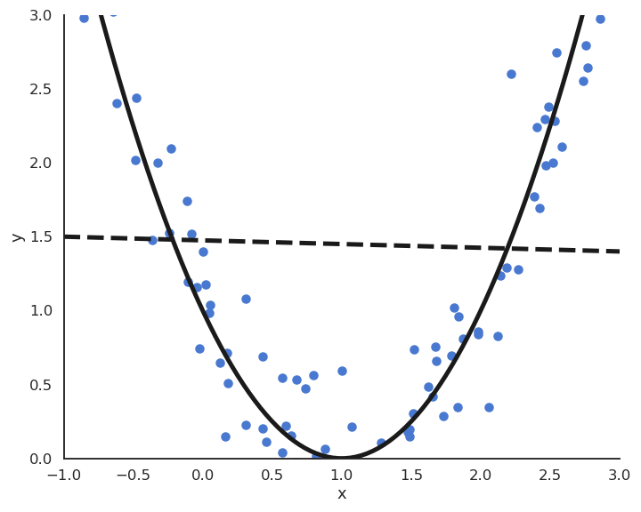{width=50%}

* The functions underlying real data are rarely linear plus some noise around the ideal value.

* In the figure, the input/output function is better modeled by a second-order polynomial:

$$y = f_{\mathbf{w}, b}(x) = w_1 \, x + w_2 \, x^2 +b$$


# Polynomial regression


* Model:

$$y = f_{\mathbf{w}, b}(x) = w_1 \, x + w_2 \, x^2 +b$$

* We can transform the input into a vector of coordinates:

$$\mathbf{x} = \begin{bmatrix} x \\ x^2 \\ \end{bmatrix} \qquad \mathbf{w} = \begin{bmatrix} w_1 \\ w_2 \\ \end{bmatrix}$$

* The problem becomes:

$$y = \langle \mathbf{w} . \mathbf{x} \rangle + b = \sum_j w_j \, x_j + b$$

* We can simply apply multiple linear regression (MLR) to find $\mathbf{w}$ and b:

$$\Delta \mathbf{w} =  \eta \, (t - y) \, \mathbf{x}$$

$$\Delta b =  \eta \, (t - y)$$

# Polynomial regression

* This generalizes to polynomials of any order $p$:

$$y = f_{\mathbf{w}, b}(x) = w_1 \, x + w_2 \, x^2 + \ldots + w_p \, x^p + b$$

* We create a vector of powers of $x$:

$$\mathbf{x} = \begin{bmatrix} x \\ x^2 \\ \ldots \\ x^p \end{bmatrix} \qquad \mathbf{w} = \begin{bmatrix} w_1 \\ w_2 \\ \ldots \\ w_p \end{bmatrix}$$

* And apply multiple linear regression (MLR) to find $\mathbf{w}$ and b:

$$\Delta \mathbf{w} =  \eta \, (t - y) \, \mathbf{x}$$

$$\Delta b =  \eta \, (t - y)$$

* Non-linear problem solved! The only unknown is which order for the polynomial matches best the data.

* One can perform regression with any kind of parameterized function using gradient descent.


# 5 - A bit of learning theory

# What matters during training?

* Before going further, let's think about what we have been doing so far. We had a bunch of data samples $\mathcal{D} = (x_i, t_i)_{i=1..N}$ (the **training set**) and we decided to apply a (linear) model on it:

$$y_i = w \, x_i + b$$

* We then minimized the mean square error (mse) on that training set using gradient descent. At the end of learning, we can measure the **residual error** of the model on the data:

$$
    \epsilon_\mathcal{D} = \frac{1}{N} \, \sum_{i=1}^{N} (t_i - y_i )^2
$$

* We get a number, for example 0.04567. Is that good?


{width=70%}

# Regression error

* The **mean square error** mse is not very informative, as its value depends on how the outputs are scaled:

$$
    \epsilon_\mathcal{D} = \frac{1}{N} \, \sum_{i=1}^N (t_i - y_i)^2
$$

* If you multiply both the data $t$ and the prediction $y$ by 10, the residual error will be 100 times higher, without any change to the model.


{width=90%}

# Coefficient of determination

* The **coefficient of determination** $R^2$ is a rescaled variant of the mse comparing the variance of the residuals to the variance of the data around its mean $\hat{t}$:

$$
    R^2 = 1 - \frac{\text{Var}(\text{residuals})}{\text{Var}(\text{data})} = 1 - \frac{\sum_{i=1}^N (t_i- y_i)^2}{\sum_{i=1}^N (t_i - \hat{t})^2}
$$

* $R^2$ should be as close from 1 as possible. For example, if $R^2 = 0.8$, we can say that the **model explains 80% of the variance of the data**.  

{width=60%}

::: footer
Source: <https://towardsdatascience.com/introduction-to-linear-regression-in-python-c12a072bedf0>
:::

# Sensibility to outliers

* Suppose we have a training set with one **outlier** (bad measurement, bad luck, etc).

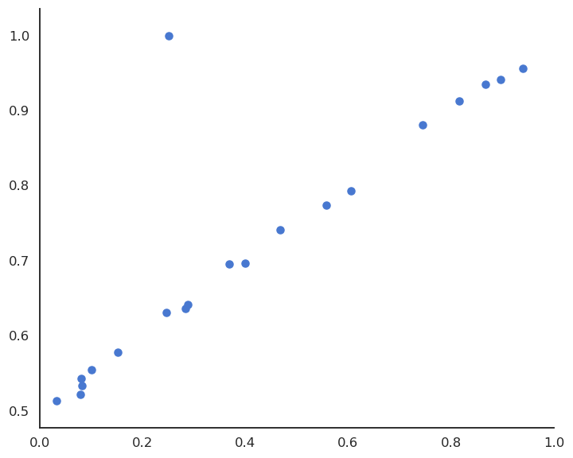

# Sensibility to outliers

* LMS would find the minimum of the mse, but it is clearly a bad fit for most points.


# Sensibility to outliers

* This model feels much better, but its residual mse is higher...

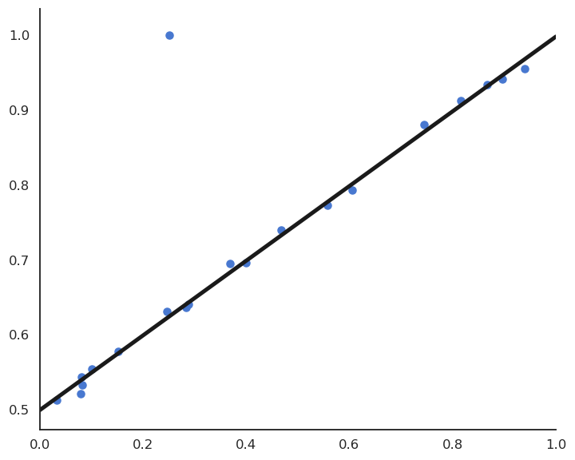

# Polynomial regression


# Polynomial regression

::: {.columns}
::: {.column width=60%}

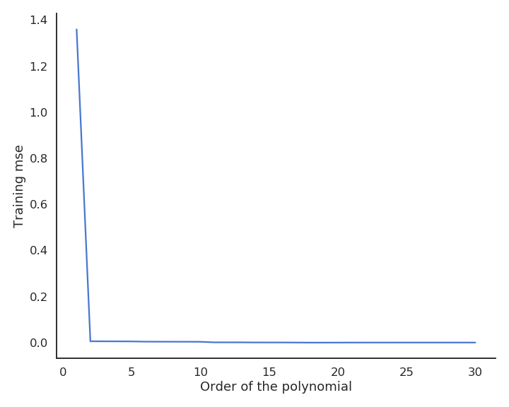

:::
::: {.column width=40%}

* When only looking at the residual mse on the training data, one could think that the higher the order of the polynomial, the better.

* But it is obvious that the interpolation quickly becomes very bad when the order is too high.

* A **complex** model (with a lot of parameters) is useless for predicting new values.

* We actually do **not** care about the error on the training set.

* We care about **generalization**.

:::
:::


# Cross-validation

* Let’s suppose we dispose of $m$ models $\mathcal{M} = \{ M_1, ..., M_m\}$ that could be used to fit (or classify) some data $\mathcal{D} = \{x_i, t_i\}_{i=1}^N$.

* Such a class could be the ensemble of polynomes with different orders, different algorithms (NN, SVM) or the same algorithm with different values for the hyperparameters (learning rate, regularization parameters...).

* The naive and **wrong** method to find the best hypothesis would be:

:::{.callout-warning}
## Wrong method!

- For all models $M_i$:

    - Train $M_i$ on $\mathcal{D}$ to obtain an hypothesis $h_i$.

    - Compute the training error $\epsilon_\mathcal{D}(h_i)$ of $h_i$ on $\mathcal{D}$ :

    $$
        \epsilon_\mathcal{D}(h_i) =  \mathbb{E}_{(\mathbf{x}, t) \in \mathcal{D}} [(h_i(\mathbf{x}) - t)^2]
    $$

- Select the hypothesis $h_{i}^*$ with the minimal training error : $h_{i}^* = \text{argmin}_{h_i \in \mathcal{M}} \quad \epsilon_\mathcal{D}(h_i)$
:::

* This method leads to **overfitting**, as only the training error is used.


# Cross-validation: training and test sets

::: {.columns}
::: {.column width=60%}


:::
::: {.column width=40%}

* The solution is randomly take some samples out of the training set to form the **test set**.

* Typical values are 20 or 30 % of the samples in the test set.

* Method:

    1. Train the model on the training set (70% of the data).
    
    2. Test the performance of the model on the test set (30% of the data).

* The test performance will better measure how well the model generalizes to new examples.

:::
:::


# Simple hold-out cross-validation

:::{.callout-tip}
## Algorithm

- Split the training data $\mathcal{D}$ into $\mathcal{S}_{\text{train}}$ and $\mathcal{S}_{\text{test}}$.

- For all models $M_i$:

    - Train $M_i$ on $\mathcal{S}_{\text{train}}$ to obtain an hypothesis $h_i$.

    - Compute the empirical error $\epsilon_{\text{test}}(h_i)$ of $h_i$ on $\mathcal{S}_{\text{test}}$ :

    $$\epsilon_{\text{test}}(h_i) = \mathbb{E}_{(\mathbf{x}, t) \in  \mathcal{S}_{\text{test}}} [(h_i(\mathbf{x}) - t)^2]$$

- Select the hypothesis $h_{i}^*$ with the minimal empirical error : $h_{i}^* = \text{argmin}_{h_i \in \mathcal{M}} \quad \epsilon_{\text{test}}(h_i)$
:::

* Disadvantage: 20 or 30% of the data is wasted and not used for learning. It may be a problem when data is rare or expensive.


# k-fold cross-validation


* **Idea:** 
    
    * build several different training/test sets with the same data.
    
    * train and test each model repeatedly on each partition.
    
    * choose the hypothesis that works best on average.

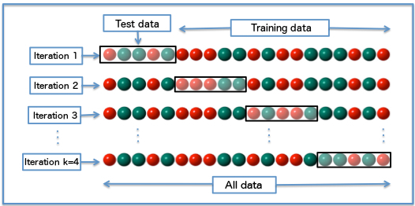

::: footer
Source <https://upload.wikimedia.org/wikipedia/commons/1/1c/K-fold_cross_validation_EN.jpg>
:::

# k-fold cross-validation


:::{.callout-tip}
## Algorithm

* Randomly split the data $\mathcal{D}$ into $k$ subsets of $\frac{N}{k}$ examples $\{ \mathcal{S}_{1}, \dots , \mathcal{S}_{k}\}$

* For all models $M_i$:

    * For all $k$ subsets $\mathcal{S}_j$:

        * Train $M_i$ on $\mathcal{D} - \mathcal{S}_j$ to obtain an hypothesis $h_{ij}$

        * Compute the empirical error $\epsilon_{\mathcal{S}_j}(h_{ij})$ of $h_{ij}$ on $\mathcal{S}_j$

    * The empirical error of the model $M_i$ on $\mathcal{D}$ is the average of empirical errors made on $(\mathcal{S}_j)_{j=1}^{k}$
        
        $$
            \epsilon_{\mathcal{D}} (M_i) = \frac{1}{k} \cdot \sum_{j=1}^{k} \epsilon_{\mathcal{S}_j}(h_{ij})
        $$
* Select the model $M_{i}^*$ with the minimal empirical error on $\mathcal{D}$.
:::

* In general $k=10$. Extreme cases take $k=N$: **leave-one-out cross-validation**.

* k-fold cross-validation works well, but needs a lot of repeated learning.


# Training and test errors

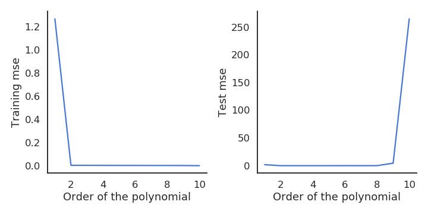{width=70%}

* While the training mse always decrease with more complex models, the test mse increases after a while.

* This is called **overfitting**: learning by heart the data without caring about generalization.

* The two curves suggest that we should chose a polynomial order between 2 and 9.

# Underfitting / Overfitting

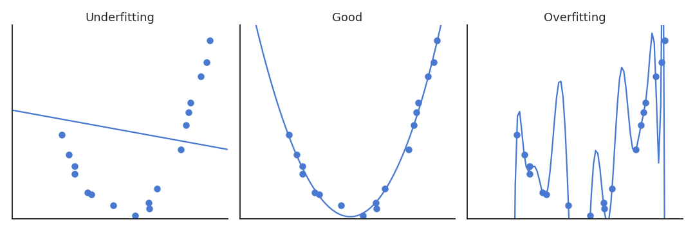

* A model not complex enough for the data will **underfit**: its training error is high.

* A model too complex for the data will **overfit**: its test error is high.

* In between, there is the right complexity for the model: it learns the data correctly but does not overfit. 


# What does complexity mean?

* In polynomial regression, the complexity is related to the order of the polynomial, i.e. the number of coefficients to estimate:

$$y = f_{\mathbf{w}, b}(x) = \sum_{k=1}^p w_k \, x^k + b$$


$$\mathbf{x} = \begin{bmatrix} x \\ x^2 \\ \ldots \\ x^p \end{bmatrix} \qquad \mathbf{w} = \begin{bmatrix} w_1 \\ w_2 \\ \ldots \\ w_p \end{bmatrix}$$

* A polynomial of order $p$ has $p+1$ unknown parameters (**free parameters**): the $p$ weights and the bias.

* Generally, the **complexity of a model** relates to its **number of free parameters**:

    * **The more free parameters, the more complex the model is, the more likely it will overfit.**

# Bias - variance trade-off

::: {.columns}
::: {.column width=50%}


::: footer
<http://scott.fortmann-roe.com/docs/BiasVariance.html>
:::

:::
::: {.column width=50%}


* Under-/Over-fitting relates to the statistical concept of **bias-variance trade-off**.

* The **bias** is the training error that the hypothesis would make if the training set was infinite (accuracy, flexibility of the model).

    * A model with high bias is underfitting.

* The **variance** is the error that will be made by the hypothesis on new examples taken from the same distribution (spread, the model is correct on average, but not for individual samples).

    * A model with high variance is overfitting.

:::
:::


# Bias - variance trade-off

::: {.columns}
::: {.column width=50%}


::: footer
<http://scott.fortmann-roe.com/docs/BiasVariance.html>
:::

:::
::: {.column width=50%}


* The bias decreases when the model becomes complex.

* The variance increases when the model becomes complex.

* The **generalization error** is a combination of the bias and variance:

$$
    \text{generalization error} = \text{bias}^2 + \text{variance}
$$

:::
:::


* We search for the model with the **optimum complexity** realizing the trade-off between bias and variance.

* It is better to have a model with a slightly higher bias (training error) but with a smaller variance (generalization error).

# 6 - Regularized regression

# Linear regression can either underfit or overfit depending on the data

::: {.columns}
::: {.column width=50%}


**Underfitting**


:::
::: {.column width=50%}


**Overfitting**

{width=85%}

:::
:::


* When linear regression **underfits** (both training and test errors are high), the data is not linear: we need to use a **neural network**.

* When linear regression **overfits** (the test error is higher than the training error), we would like to **decrease its complexity**.

# Complexity of a linear regression

::: {.columns}
::: {.column width=50%}


{width=80%}

:::
::: {.column width=50%}


* The problem is that the number of free parameters in linear regression only depends on the number of inputs (dimensions of the input space).

$$
    y = \sum_{i=1}^d w_i \, x_i + b
$$

* For $d$ inputs, there are $d+1$ free parameters: the $d$ weights and the bias.

:::
:::


* We must find a way to reduce the complexity of the linear regression without changing the number of parameters, which is impossible.

* The solution is to **constrain** the values that the parameters can take: **regularization**.

* Regularization reduces the variance at the cost of increasing the bias.


# L2 regularization - Ridge regression

* Using **L2 regularization** for linear regression leads to the **Ridge regression** algorithm.

* The individual loss function is defined as:

$$
    \mathcal{l}_i(\mathbf{w}, b) = (t_i - y_i)^2 + \lambda \, ||\mathbf{w}||^2
$$

* The first part of the loss function is the classical **mse** on the training set: its role is to reduce the **bias**.

* The second part minimizes the L2 norm of the weight vector (or matrix), reducing the variance:

$$
    ||\mathbf{w}||^2 = \sum_{i=1}^d w_i^2
$$

* Deriving the regularized delta learning rule is straightforward:

$$
    \Delta w_i = \eta \, ((t_i - y_i) \ x_i - \lambda \, w_i)
$$

* Ridge regression is also called **weight decay**: even if there is no error, all weights will decay to 0.

# L1 regularization - LASSO regression

* Using **L1 regularization** for linear regression leads to the **LASSO regression** algorithm (least absolute shrinkage and selection operator).

* The individual loss function is defined as:

$$
    \mathcal{l}_i(\mathbf{w}, b) =  (t_i - y_i)^2 + \lambda \, |\mathbf{w}|
$$

* The second part minimizes this time the L1 norm of the weight vector, i.e. its absolute value:

$$
    |\mathbf{w}| = \sum_{i=1}^d |w_i|
$$

* Regularized delta learning rule with LASSO:

$$
    \Delta w_i = \eta \, ((t_i - y_i) \ x_i - \lambda \, \text{sign}(w_i))
$$

* **Weight decay** does not depend on the value of the weight, only its sign. Weights can decay very fast to 0.

# Ridge and Lasso regression

::: {.columns}
::: {.column width=50%}


* **Ridge regression** finds the smallest value for the weights that minimize the mse.


:::
::: {.column width=50%}


* **LASSO regression** tries to set as many weight to 0 as possible (sparse code).

:::
:::


* Both methods depend on the **regularization parameter** $\lambda$. Its value determines how important the regularization term should.

* Regularization introduce a **bias**, as the solution found is **not** the minimum of the mse, but reduces the variance of the estimation, as small weights are less sensible to noise.

::: footer
<https://www.mlalgorithms.org/articles/l1-l2-regression/>
:::


---

* LASSO allows **feature selection**: features with a zero weight can be removed from the training set.

::: {.columns}
::: {.column width=50%}


**Linear regression**

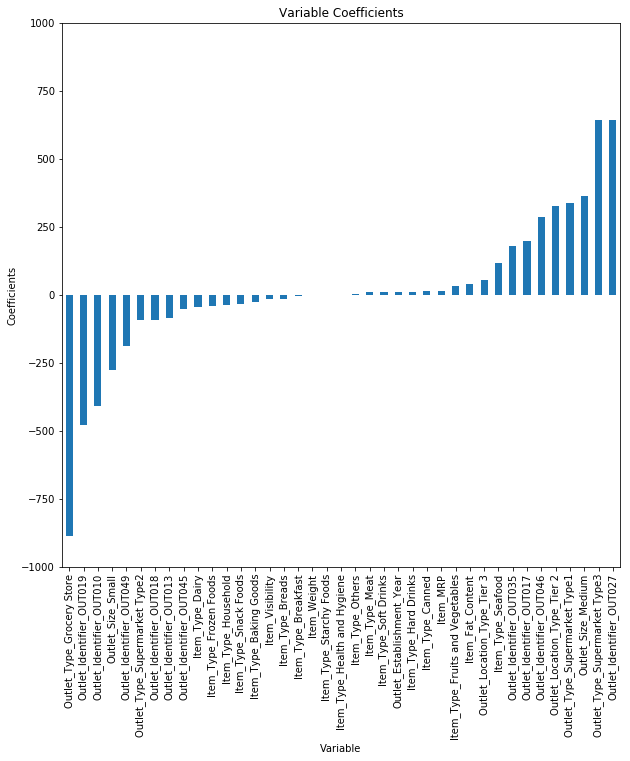


:::
::: {.column width=50%}


**LASSO**

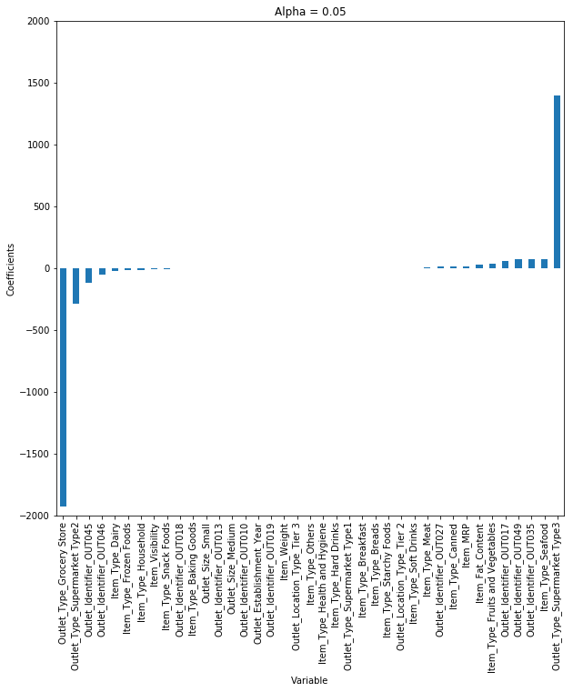

:::
:::


::: footer
<https://www.analyticsvidhya.com/blog/2017/06/a-comprehensive-guide-for-linear-ridge-and-lasso-regression/>
:::

# L1+L2 regularization - ElasticNet

::: {.columns}
::: {.column width=50%}


:::
::: {.column width=50%}


:::
:::


* An **ElasticNet** is a linear regression using both L1 and L2 regression:

$$
    \mathcal{l}_i(\mathbf{w}, b) =  (t_i - y_i)^2 + \lambda_1 \, |\mathbf{w}| + \lambda_2 \, ||\mathbf{w}||^2
$$

* It combines the advantages of Ridge and LASSO, at the cost of having now two regularization parameters to determine.

::: footer
<https://www.analyticsvidhya.com/blog/2017/06/a-comprehensive-guide-for-linear-ridge-and-lasso-regression/>
:::