# 1 - Hard linear classification

#  Binary classification

* The training data $\mathcal{D}$ is composed of $N$ examples $(\mathbf{x}_i, t_i)_{i=1..N}$ , with a d-dimensional input vector $\mathbf{x}_i \in \Re^d$ and a binary output $t_i \in \{-1, +1\}$

* The data points where $t = + 1$ are called the **positive class**, the other the **negative class**.

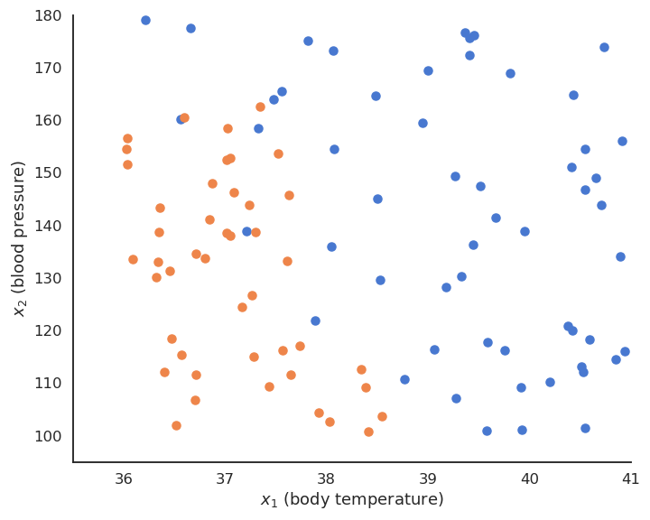{width=50%}

#  Binary classification

* For example, the inputs $\mathbf{x}_i$ can be images (one dimension per pixel) and the positive class corresponds to cats ($t_i = +1$), the negative class to dogs ($t_i = -1$).

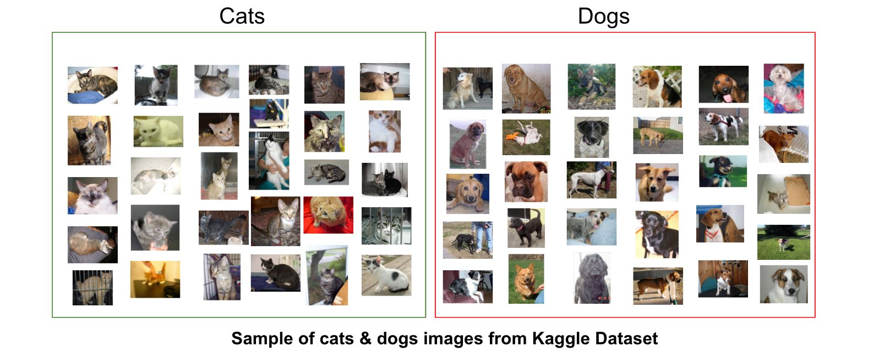

::: footer
<http://adilmoujahid.com/posts/2016/06/introduction-deep-learning-python-caffe>
:::

#  Binary linear classification

* We want to find the hyperplane $(\mathbf{w}, b)$ of $\Re^d$ that correctly separates the two classes.

#  Binary linear classification

::: {.columns}
::: {.column width=50%}

* For a point $\mathbf{x} \in \mathcal{D}$, $\langle \mathbf{w} \cdot \mathbf{x} \rangle +b$  is the projection of $\mathbf{x}$  onto the hyperplane $(\mathbf{w}, b)$.

    * If $\langle \mathbf{w} \cdot \mathbf{x} \rangle +b > 0$, the point is
        above the hyperplane.

    * If $\langle \mathbf{w} \cdot \mathbf{x} \rangle +b < 0$, the point is
        below the hyperplane.

    * If $\langle \mathbf{w} \cdot \mathbf{x} \rangle +b = 0$, the point is
        on the hyperplane.

* By looking at the **sign** of $\langle \mathbf{w} \cdot \mathbf{x} \rangle +b$, we can predict the class of the input:

:::
::: {.column width=50%}

:::
:::

$$\text{sign}(\langle \mathbf{w} \cdot \mathbf{x} \rangle +b) = \begin{cases} +1 \; \text{if} \; \langle \mathbf{w} \cdot \mathbf{x} \rangle +b \geq 0 \\ -1 \; \text{if} \; \langle \mathbf{w} \cdot \mathbf{x} \rangle +b < 0 \\ \end{cases}$$

#  Binary linear classification

* Binary linear classification can be made by a single **artificial neuron** using the sign transfer function.

$$
y = f_{\mathbf{w}, b} (\mathbf{x}) = \text{sign} ( \langle \mathbf{w} \cdot \mathbf{x} \rangle +b )  = \text{sign} ( \sum_{j=1}^d w_j \, x_j +b )
$$

::: {.columns}
::: {.column width=50%}

:::
::: {.column width=50%}

* $\mathbf{w}$ is the weight vector and $b$ is the bias.

:::
:::

# Linearly separable datasets

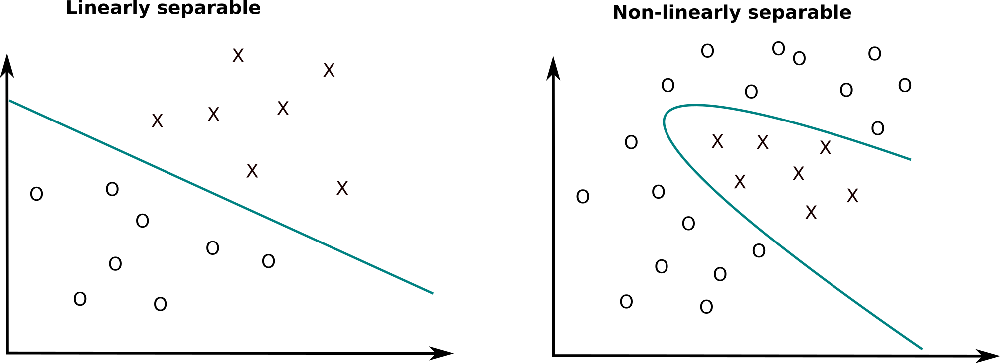

* Linear classification is the process of finding an hyperplane $(\mathbf{w}, b)$ that correctly separates the two classes.

* If such an hyperplane can be found, the training set is said **linearly separable**.

* Otherwise, the problem is **non-linearly separable** and other methods have to be applied (MLP, SVM...).

# Linear classification as an optimization problem

* The Perceptron algorithm tries to find the weights and biases minimizing the **mean square error** (*mse*) or **quadratic loss**:

$$\mathcal{L}(\mathbf{w}, b) = \mathbb{E}_\mathcal{D} [(t_i - y_i)^2] \approx \frac{1}{N} \, \sum_{i=1}^{N} (t_i - y_i)^2$$

* When the prediction $y_i$ is the same as the data $t_i$ for all examples in the training set (perfect classification), the mse is minimal and equal to 0.

* We can apply gradient descent to find this minimum.

$$
\begin{cases}
    \Delta \mathbf{w} = - \eta \, \nabla_\mathbf{w} \, \mathcal{L}(\mathbf{w}, b)\\
    \\
    \Delta b = - \eta \, \nabla_b \, \mathcal{L}(\mathbf{w}, b)\\
\end{cases}
$$

# Linear classification as an optimization problem

* Let's search for the partial derivative of the quadratic error function with respect to the weight vector:

$$
    \nabla_\mathbf{w} \, \mathcal{L}(\mathbf{w}, b) = \nabla_\mathbf{w} \,  \frac{1}{N} \, \sum_{i=1}^{N} (t_i - y_i )^2 = \frac{1}{N} \, \sum_{i=1}^{N} \nabla_\mathbf{w} \,  (t_i - y_i )^2 = \frac{1}{N} \, \sum_{i=1}^{N} \nabla_\mathbf{w} \,  \mathcal{l}_i (\mathbf{w}, b)
$$

::: {.columns}
::: {.column width=60%}

* Everything is similar to linear regression until we get:

$$
    \nabla_\mathbf{w} \,  \mathcal{l}_i (\mathbf{w}, b) = - 2 \, (t_i - y_i) \, \nabla_\mathbf{w} \, \text{sign}( \langle \mathbf{w} \cdot \mathbf{x}_i \rangle +b)
$$

* In order to continue with the chain rule, we would need to differentiate $\text{sign}(x)$.

$$
    \nabla_\mathbf{w} \,  \mathcal{l}_i (\mathbf{w}, b) = - 2 \, (t_i - y_i) \, \text{sign}'( \langle \mathbf{w} \cdot \mathbf{x}_i \rangle +b) \,  \mathbf{x}_i 
$$

* But the sign function is **not** differentiable...

:::
::: {.column width=40%}

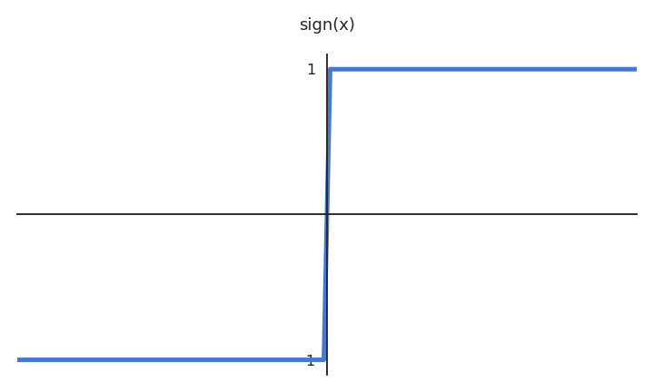

:::
:::

# Linear classification as an optimization problem

* We will simply pretend that the sign() function is linear, with a derivative of 1:

$$
    \nabla_\mathbf{w} \,  \mathcal{l}_i (\mathbf{w}, b) = - 2 \, (t_i - y_i) \,   \mathbf{x}_i 
$$

* The update rule for the weight vector $\mathbf{w}$ and the bias $b$ is therefore the same as in linear regression:

$$
\begin{cases}
    \Delta \mathbf{w} =  \eta \, \frac{1}{N} \, \sum_{i=1}^{N} (t_i - y_i) \, \mathbf{x}_i\\
    \\
    \Delta b = \eta \, \frac{1}{N} \, \sum_{i=1}^{N} (t_i - y_i )\\
\end{cases}
$$

# Batch version of linear classification

* By applying gradient descent on the quadratic error function, one obtains the following algorithm:

:::{.callout-tip}
### Batch linear classification

* **for** $M$ epochs:

    * $\mathbf{dw} = 0 \qquad db = 0$

    * **for** each sample $(\mathbf{x}_i, t_i)$:

        * $y_i =  \text{sign}( \langle \mathbf{w} \cdot \mathbf{x}_i \rangle + b)$

        * $\mathbf{dw} = \mathbf{dw} + (t_i - y_i) \, \mathbf{x}_i$

        * $db = db + (t_i - y_i)$

    * $\Delta \mathbf{w} = \eta \, \frac{1}{N} \, \mathbf{dw}$

    * $\Delta b = \eta \, \frac{1}{N} \, db$

:::

* This is called the **batch** version of the Perceptron algorithm.

* If the data is linearly separable and $\eta$ is well chosen, it converges to the minimum of the mean square error.

# Linear classification: batch version

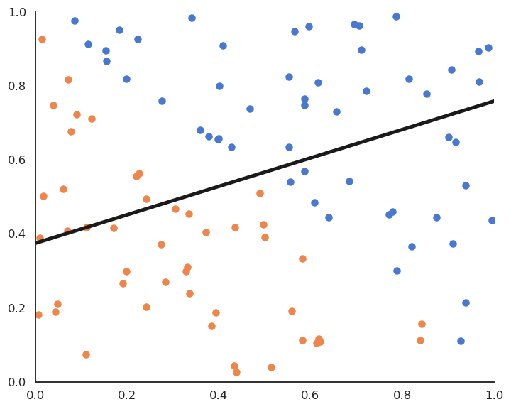

# Linear classification: batch version

# Online version of linear classification : the Perceptron algorithm

* The **Perceptron algorithm** was invented by the psychologist Frank Rosenblatt in 1958. It was the first algorithmic neural network able to learn linear classification.

:::{.callout-tip}
### Perceptron algorithm

* **for** $M$ epochs:

    * **for** each sample $(\mathbf{x}_i, t_i)$:

        * $y_i =  \text{sign}( \langle \mathbf{w} \cdot \mathbf{x}_i \rangle + b)$

        * $\Delta \mathbf{w} = \eta \, (t_i - y_i) \, \mathbf{x}_i$

        * $\Delta b = \eta \, (t_i - y_i)$
:::

* This algorithm iterates over all examples of the training set and applies the **delta learning rule** to each of them immediately, not at the end on the whole training set.

* One could check whether there are still classification errors on the training set at the end of each epoch and stop the algorithm.

* The delta learning rule depends on the learning rate $\eta$, the error made by the prediction ($t_i - y_i$) and the input $\mathbf{x}_i$.

# Linear classification: online version

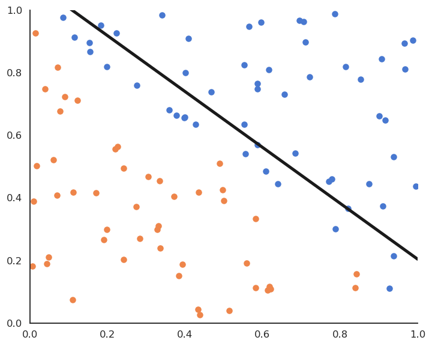

# Linear classification: online version

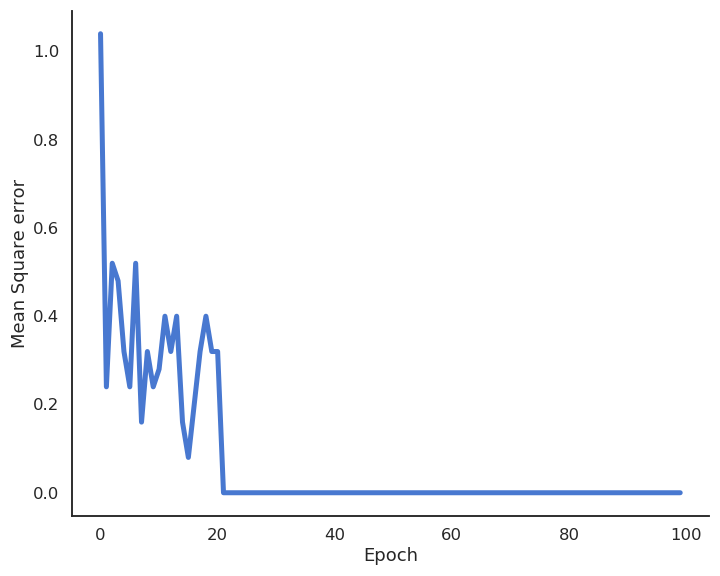

# Batch vs. Online learning

* The mean square error is defined as the **expectation** over the data:

$$\mathcal{L}(\mathbf{w}, b) = \mathbb{E}_\mathcal{D} [(t_i - y_i)^2]$$

::: {.columns}
::: {.column width=50%}

* **Batch learning** uses the whole training set as samples to estimate the mse:

$$\mathcal{L}(\mathbf{w}, b) \approx \frac{1}{N} \, \sum_{i=1}^{N} (t_i - y_i)^2$$

$$
    \Delta \mathbf{w} = \eta \, \frac{1}{N} \sum_{i=1}^{N} (t_i - y_i ) \, \mathbf{x_i}
$$

:::
::: {.column width=50%}

* **Online learning** uses a single sample to estimate the mse:

$$\mathcal{L}(\mathbf{w}, b) \approx (t_i - y_i)^2$$

$$
    \Delta \mathbf{w} = \eta \, (t_i - y_i) \, \mathbf{x_i}
$$

:::
:::

* Batch learning has less bias (central limit theorem) and is less sensible to noise in the data, but is very slow.

* Online learning converges faster, but can be instable and overfits (high variance). 

# Stochastic Gradient Descent - SGD

* In practice, we use a trade-off between batch and online learning called **Stochastic Gradient Descent (SGD)** or **Minibatch Gradient Descent**.

::: {.columns}
::: {.column width=50%}

* The training set is randomly split at each epoch into small chunks of data (a **minibatch**, usually 32 or 64 examples) and the batch learning rule is applied on each chunk.

$$
    \Delta \mathbf{w} = \eta \, \frac{1}{K} \sum_{i=1}^{K} (t_i - y_i) \, \mathbf{x_i}
$$

* If the **batch size** is well chosen, SGD is as stable as batch learning and as fast as online learning.

* The minibatches are randomly selected at each epoch (i.i.d).

:::
::: {.column width=50%}

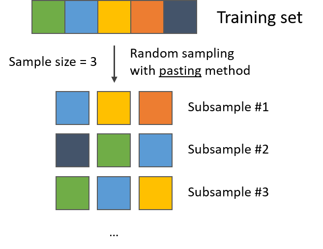

:::
:::

* Online learning is a stochastic gradient descent with a batch size of 1.

# 2 - Maximum Likelihood Estimation

# Maximum Likelihood Estimation

::: {.columns}
::: {.column width=50%}

* Let's consider $N$ **samples** $\{x_i\}_{i=1}^N$ independently taken from a **normal distribution** $X$.

* The probability density function (pdf) of a normal distribution is:

$$
    f(x ; \mu, \sigma) =  \frac{1}{\sqrt{2\pi \sigma^2}} \, \exp{- \frac{(x - \mu)^2}{2\sigma^2}}
$$

where $\mu$ is the mean of the distribution and $\sigma$ its standard deviation.

:::
::: {.column width=50%}

:::
:::

* The problem is to find the values of $\mu$ and $\sigma$ which explain best the observations $\{x_i\}_{i=1}^N$.

# Maximum Likelihood Estimation

::: {.columns}
::: {.column width=50%}

* The idea of MLE is to maximize the joint density function for all observations. This function is expressed by the **likelihood function**:

$$
    L(\mu, \sigma) = P( x ; \mu , \sigma  )  = \prod_{i=1}^{N} f(x_i ; \mu, \sigma )
$$

* When the pdf takes high values for all samples, it is quite likely that the samples come from this particular distribution.

* The likelihood function reflects the probability that the parameters $\mu$ and $\sigma$ explain the observations $\{x_i\}_{i=1}^N$.

:::
::: {.column width=50%}

:::
:::

# Maximum Likelihood Estimation

* We therefore search for the values $\mu$ and $\sigma$ which **maximize** the likelihood function.

$$
    \text{max}_{\mu, \sigma} \quad L(\mu, \sigma) = \prod_{i=1}^{N} f(x_i ; \mu, \sigma )
$$

* For the normal distribution, the likelihood function is:

$$
\begin{aligned}
    L(\mu, \sigma) & = \prod_{i=1}^{N} f(x_i ; \mu, \sigma ) \\
                   & = \prod_{i=1}^{N} \frac{1}{\sqrt{2\pi \sigma^2}} \, \exp{- \frac{(x_i - \mu)^2}{2\sigma^2}}\\
                   & =  (\frac{1}{\sqrt{2\pi \sigma^2}})^N \, \prod_{i=1}^{N} \exp{- \frac{(x_i - \mu)^2}{2\sigma^2}}\\
                   & =  (\frac{1}{\sqrt{2\pi \sigma^2}})^N \, \exp{- \frac{\sum_{i=1}^{N}(x_i - \mu)^2}{2\sigma^2}}\\
\end{aligned}
$$

# Maximum Likelihood Estimation

* To find the maximum of $L(\mu, \sigma)$, we need to search where the gradient is equal to zero:

$$
\begin{cases}
    \dfrac{\partial L(\mu, \sigma)}{\partial \mu} = 0 \\
    \dfrac{\partial L(\mu, \sigma)}{\partial \sigma} = 0 \\
\end{cases}
$$

* The likelihood function is complex to differentiate, so we consider its logarithm $l(\mu, \sigma) = \log(L(\mu, \sigma))$ which has a maximum for the same value of $(\mu, \sigma)$ as the log function is monotonic.

$$
\begin{aligned}
    l(\mu, \sigma) & = \log(L(\mu, \sigma)) \\
                   & =  \log \left((\frac{1}{\sqrt{2\pi \sigma^2}})^N \, \exp{- \frac{\sum_{i=1}^{N}(x_i - \mu)^2}{2\sigma^2}} \right)\\
                   & =  - \frac{N}{2} \log (2\pi \sigma^2) - \frac{\sum_{i=1}^{N}(x_i - \mu)^2}{2\sigma^2}\\
\end{aligned}
$$

* $l(\mu, \sigma)$ is called the **log-likelihood** function.

# Maximum Likelihood Estimation

$$
\begin{aligned}
    l(\mu, \sigma) & =  - \frac{N}{2} \log (2\pi \sigma^2) - \frac{\sum_{i=1}^{N}(x_i - \mu)^2}{2\sigma^2}\\
\end{aligned}
$$

* The maximum of the log-likelihood function respects:

$$
\begin{aligned}
    \frac{\partial l(\mu, \sigma)}{\partial \mu} & = \frac{\sum_{i=1}^{N}(x_i - \mu)}{\sigma^2} = 0 \\
    \frac{\partial l(\mu, \sigma)}{\partial \sigma} & = - \frac{N}{2} \frac{4 \pi \sigma}{2 \pi \sigma^2} + \frac{\sum_{i=1}^{N}(x_i - \mu)^2}{\sigma^3} \\
                                                    & = - \frac{N}{\sigma} + \frac{\sum_{i=1}^{N}(x_i - \mu)^2}{\sigma^3} = 0\\
\end{aligned}
$$

* We obtain:

$$
    \mu = \frac{1}{N} \sum_{i=1}^{N} x_i  \qquad\qquad    \sigma^2 = \frac{1}{N} \sum_{i=1}^{N}(x_i - \mu)^2
$$

# Maximum Likelihood Estimation

* Unsurprisingly, the mean and variance of the normal distribution which best explains the data are the mean and variance of the data...

$$
    \mu = \frac{1}{N} \sum_{i=1}^{N} x_i  \qquad\qquad    \sigma^2 = \frac{1}{N} \sum_{i=1}^{N}(x_i - \mu)^2
$$

* The same principle can be applied to estimate the parameters of any distribution: normal, exponential, Bernouilli, Poisson, etc...

* When a machine learning method has an probabilistic interpretation (i.e. it outputs probabilities), MLE can be used to find its parameters.

* One can use global optimization like here, or gradient descent to estimate the parameters iteratively.

# 3 - Soft linear classification : Logistic regression

# Reminder: Logistic regression

* We want to perform a regression, but where the targets $t_i$ are bounded betwen 0 and 1.

{width=30%}

* We can use a logistic function instead of a linear function in order to transform the net activation into an output:

$$
\begin{aligned}
    y = \sigma(w \, x + b )  = \frac{1}{1+\exp(-w \, x - b )}
\end{aligned}
$$

# Use of logistic regression for soft classification

* Logistic regression can be used in binary classification if we consider $y = \sigma(w \, x + b )$ as the probability that the example belongs to the positive class ($t=1$).

$$
    P(t = 1 | x; w, b) = y ; \qquad P(t = 0 | x; w, b) = 1 - y
$$

* The output $t$ therefore comes from a Bernouilli distribution $\mathcal{B}$ of parameter $p = y = f_{w, b}(x)$. The probability density function (pdf) is:

$$f(t | x; w, b) = y^t \, (1- y)^{1-t}$$

* If we consider our training samples $(x_i, t_i)$ as independently taken from this distribution, our task is:

    * to find the parameterized distribution that best explains the data, which means:

    * to find the parameters $w$ and $b$ maximizing the **likelihood** that the samples $t$ come from a Bernouilli distribution when $x$, $w$  and $b$ are given.

* We only need to apply **Maximum Likelihood Estimation** (MLE) on this Bernouilli distribution!

# MLE for logistic regression

* The likelihood function for logistic regression is :

$$
\begin{aligned}
    L( w, b) &= P( t | x; w,  b )  = \prod_{i=1}^{N} f(t_i | x_i;  w,  b ) \\
    &= \prod_{i=1}^{N}  y_i^{t_i} \, (1- y_i)^{1-t_i}
\end{aligned}
$$

* The likelihood function is quite hard to differentiate, so we take the *log-likelihood* function:

$$
\begin{aligned}
    l( w, b) &= \log L( w, b) \\
    &=  \sum_{i=1}^{N} [t_i \, \log y_i + (1 - t_i) \, \log( 1- y_i)]\\
\end{aligned}
$$

* or even better: the **negative log-likelihood** which will be minimized using gradient descent:

$$
    \mathcal{L}( w, b) =  - \sum_{i=1}^{N} [t_i \, \log y_i + (1 - t_i) \, \log( 1- y_i)]
$$

# MLE for logistic regression

* We then search for the minimum of the negative log-likelihood function by computing its gradient (here for a single sample):

$$
\begin{aligned}
    \frac{\partial \mathcal{l}_i(w, b)}{\partial w}
        &= -\frac{\partial}{\partial w} [ t_i \, \log y_i + (1 - t_i) \, \log( 1- y_i) ] \\
        &= - t_i \, \frac{\partial}{\partial w} \log y_i - (1 - t_i) \, \frac{\partial}{\partial w}\log( 1- y_i) \\
        &= - t_i \, \frac{\frac{\partial}{\partial w} y_i}{y_i} - (1 - t_i) \, \frac{\frac{\partial}{\partial w}( 1- y_i)}{1- y_i} \\
        &= - t_i \, \frac{y_i \, (1 - y_i) \, x_i}{y_i} + (1 - t_i) \, \frac{y_i \, (1-y_i) \, x_i}{1 - y_i}\\
        &= - ( t_i - y_i ) \, x_i\\
\end{aligned}
$$

* Same gradient as the linear perceptron, but with a non-linear output function!

# Logistic regression for soft classification

* Logistic regression is a regression method used for classification. It uses a non-linear transfer function $\sigma(x)=\frac{1}{1+\exp(-x)}$ applied on the net activation:

$$
    y_i = \sigma(\langle \mathbf{w} \cdot \mathbf{x}_i \rangle + b )
$$

* The continuous output $y$ is interpreted as the probability of belonging to the positive class.

$$
   P(t_i = 1 | \mathbf{x}_i; \mathbf{w}, b) = y_i ; \qquad P(t_i = 0 | \mathbf{x}_i; \mathbf{w}, b) = 1 - y_i
$$

* We minimize the **negative log-likelihood** loss function using gradient descent:

$$
    \mathcal{L}(\mathbf{w}, b) =  - \sum_{i=1}^{N} [t_i \, \log y_i + (1 - t_i) \, \log( 1- y_i)]
$$

* We obtain the delta learning rule, using the class as a target and the probability as a prediction:

$$
    \begin{cases}
    \Delta \mathbf{w} = \eta \, ( t_i - y_i ) \, \mathbf{x}_i \\
    \\
    \Delta b = \eta \, ( t_i - y_i ) \\
    \end{cases}
$$

# Logistic regression

::: {.columns}
::: {.column width=40%}

:::{.callout-tip}
## Logistic regression

* $\mathbf{w} = 0 \qquad b = 0$

* **for** $M$ epochs:

    * **for** each sample $(\mathbf{x}_i, t_i)$:

        * $y_i =  \sigma( \langle \mathbf{w} \cdot \mathbf{x}_i \rangle  + b)$

        * $\Delta \mathbf{w} = \eta \, (t_i - y_i) \, \mathbf{x}_i$

        * $\Delta b = \eta \, (t_i - y_i)$
:::

:::
::: {.column width=60%}

* Logistic regression works just like linear classification, except in the way the prediction is done.

* To know to which class $\mathbf{x}_i$ belongs, simply draw a random number between 0 and 1:

  * if it is smaller than $y_i$ (probability $y_i$), it belongs to the positive class.

  * if it is bigger than $y_i$ (probability $1-y_i$), it belongs to the negative class.

* Alternatively, you can put a **hard limit** at 0.5:

    * if $y_i > 0.5$ then the class is positive.

    * if $y_i < 0.5$ then the class is negative.

:::
:::

# Logistic regression

# Logistic regression and confidence score

::: {.columns}
::: {.column width=50%}

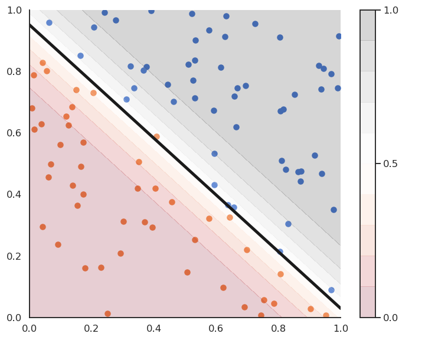

:::
::: {.column width=50%}

* Logistic regression also provides a **confidence score**: 

    * the closer $y$ is from 0 or 1, the more confident we can be that the classification is correct.

* This is particularly important in **safety critical** applications:

    * If you detect the positive class but with a confidence of 0.51, you should perhaps not trust the prediction.

    * If the confidence score is 0.99, you can probably trust the prediction.

:::
:::

# 4 - Multi-class classification

# Multi-class classification

* Can we perform multi-class classification using the previous methods when $t \in \{A, B, C\}$ instead of $t = +1$ or $-1$?

{width=50%}

# Multi-class classification

Two main solutions:

* **One-vs-All** (or One-vs-the-rest): one trains simultaneously a binary (linear) classifier for each class. The examples belonging to this class form the positive class, all others are the negative class:

    * A vs. B and C
    * B vs. A and C
    * C vs. A and B

If multiple classes are predicted for a single example, ones needs a confidence level for each classifier saying how sure it is of its prediction.

* **One-vs-One**: one trains a classifier for each pair of class:

    * A vs. B
    * B vs. C
    * C vs. A

A majority vote is then performed to find the correct class.

# Multi-class classification

* Example of **One-vs-All** classification: one binary classifier per class.

::: footer
Source <http://cs231n.github.io/linear-classify>
:::

# Softmax linear classifier

::: {.columns}
::: {.column width=30%}

:::
::: {.column width=70%}

* Suppose we have $C$ classes (dog vs. cat vs. ship vs...).

* The One-vs-All scheme involves $C$ binary classifiers $(\mathbf{w}_i, b_i)$, each with a weight vector and a bias, working on the same input $\mathbf{x}$.

$$y_i = f(\langle \mathbf{w}_i \cdot \mathbf{x} \rangle + b_i)$$

* Putting all neurons together, we obtain a **linear perceptron** similar to multiple linear regression:

$$
    \mathbf{y} = f(W \times \mathbf{x} + \mathbf{b})
$$

* The $C$ weight vectors form a $d\times C$ **weight matrix** $W$, the biases form a vector $\mathbf{b}$.

:::
:::

# Softmax linear classifier

{width=80%}

* The net activations form a vector $\mathbf{z}$:

$$
    \mathbf{z} = f_{W, \mathbf{b}}(\mathbf{x}) = W \times \mathbf{x} + \mathbf{b}
$$

* Each element $z_j$ of the vector $\mathbf{z}$ is called the **logit score** of the class: 

  * the higher the score, the more likely the input belongs to this class.

* The logit scores are not probabilities, as they can be negative and do not sum to 1.

::: footer
Source <http://cs231n.github.io/linear-classify>
:::

# One-hot encoding

* How do we represent the ground truth $\mathbf{t}$ for each neuron?

* The target vector $\mathbf{t}$ is represented using **one-hot encoding**.

* The binary vector has one element per class: only one element is 1, the others are 0.

* Example:

$$
    \mathbf{t} = [\text{cat}, \text{dog}, \text{ship}, \text{house}, \text{car}] = [0, 1, 0, 0, 0]
$$

# One-hot encoding

* The labels can be seen as a **probability distribution** over the training set, in this case a **multinomial** distribution (a dice with $C$ sides).

* For a given image $\mathbf{x}$ (e.g. a picture of a dog), the conditional pmf is defined by the one-hot encoded vector $\mathbf{t}$:

$$P(\mathbf{t} | \mathbf{x}) = [P(\text{cat}| \mathbf{x}), P(\text{dog}| \mathbf{x}), P(\text{ship}| \mathbf{x}), P(\text{house}| \mathbf{x}), P(\text{car}| \mathbf{x})] = [0, 1, 0, 0, 0]$$

* We need to transform the logit score $\mathbf{z}$ into a **probability distribution** $P(\mathbf{y} | \mathbf{x})$ that should be as close as possible from $P(\mathbf{t} | \mathbf{x})$.

# Softmax linear classifier

* The **softmax** operator makes sure that the sum of the outputs $\mathbf{y} = \{y_i\}$ over all classes is 1.

$$
    y_j = P(\text{class = j} | \mathbf{x}) = \mathcal{S}(z_j) = \frac{\exp(z_j)}{\sum_k \exp(z_k)}
$$

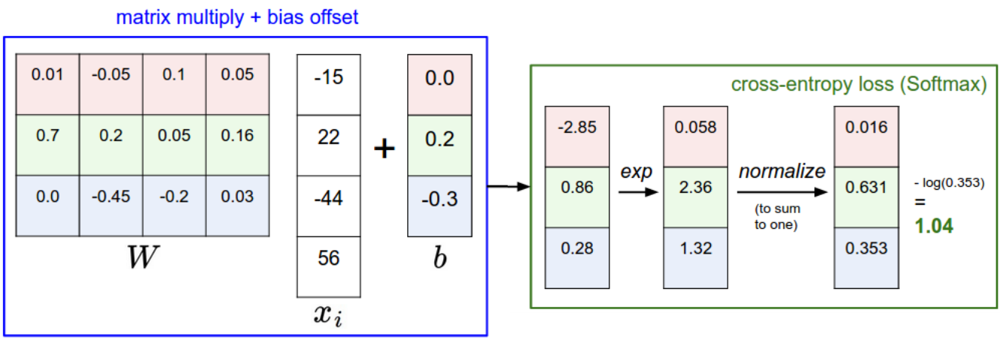{width=80%}

* The higher $z_j$, the higher the probability that the example belongs to class $j$.

* This is very similar to logistic regression for soft classification, except that we have multiple classes.

::: footer
Source <http://cs231n.github.io/linear-classify>
:::

# Cross-entropy loss function

* We cannot use the mse as a loss function, as the softmax function would be hard to differentiate:

$$
    \text{mse}(W, \mathbf{b}) = \sum_j (t_{j} - \frac{\exp(z_j)}{\sum_k \exp(z_k)})^2
$$

* We actually want to minimize the statistical distance netween two distributions:

    * The model outputs a multinomial probability distribution $\mathbf{y}$ for an input $\mathbf{x}$: $P(\mathbf{y} | \mathbf{x}; W, \mathbf{b})$.

    * The one-hot encoded classes also come from a multinomial probability distribution $P(\mathbf{t} | \mathbf{x})$.

* We search which parameters $(W, \mathbf{b})$ make the two distributions $P(\mathbf{y} | \mathbf{x}; W, \mathbf{b})$ and $P(\mathbf{t} | \mathbf{x})$ close.

# Cross-entropy loss function

* The training data $\{\mathbf{x}_i, \mathbf{t}_i\}$ represents samples from $P(\mathbf{t} | \mathbf{x})$.

* $P(\mathbf{y} | \mathbf{x}; W, \mathbf{b})$ is a good model of the data when the two distributions are close, i.e. when the **negative log-likelihood** of each sample under the model is small.

{width=80%}

* For an input $\mathbf{x}$, we minimize the **cross-entropy** between the target distribution and the predicted outputs:

$$
    \mathcal{l}(W, \mathbf{b}) = \mathcal{H}(\mathbf{t} | \mathbf{x}, \mathbf{y} | \mathbf{x}) =  \mathbb{E}_{t \sim P(\mathbf{t} | \mathbf{x})} [ - \log P(\mathbf{y} = t | \mathbf{x})]
$$

# Cross-entropy and negative log-likelihood

* The cross-entropy samples from $\mathbf{t} | \mathbf{x}$:

$$
    \mathcal{l}(W, \mathbf{b}) = \mathcal{H}(\mathbf{t} | \mathbf{x}, \mathbf{y} | \mathbf{x}) =  \mathbb{E}_{t \sim P(\mathbf{t} | \mathbf{x})} [ - \log P(\mathbf{y} = t | \mathbf{x})]
$$

* For a given input $\mathbf{x}$, $\mathbf{t}$ is non-zero only for the correct class $t^*$, as $\mathbf{t}$ is a one-hot encoded vector $[0, 1, 0, 0, 0]$:

$$
    \mathcal{l}(W, \mathbf{b}) =  - \log P(\mathbf{y} = t^* | \mathbf{x})
$$

* If we note $j^*$ the index of the correct class $t^*$, the cross entropy is simply:

$$
    \mathcal{l}(W, \mathbf{b}) =  - \log y_{j^*}
$$

# Cross-entropy and negative log-likelihood

::: {.columns}
::: {.column width=50%}

:::
::: {.column width=50%}

* As only one element of $\mathbf{t}$ is non-zero, the cross-entropy is the same as the **negative log-likelihood** of the prediction for the true label:

$$
    \mathcal{l}(W, \mathbf{b}) =  - \log y_{j^*}
$$

* The minimum of $- \log y$ is obtained when $y =1$:

    * We want to classifier to output a probability 1 for the true label.

* Because of the softmax activation function, the probability for the other classes should become closer from 0.

$$
    y_j = P(\text{class = j}) = \frac{\exp(z_j)}{\sum_k \exp(z_k)}
$$

:::
:::

* Minimizing the cross-entropy / negative log-likelihood pushes the output distribution $\mathbf{y} | \mathbf{x}$ to be as close as possible to the target distribution $\mathbf{t} | \mathbf{x}$.

# Cross-entropy loss function

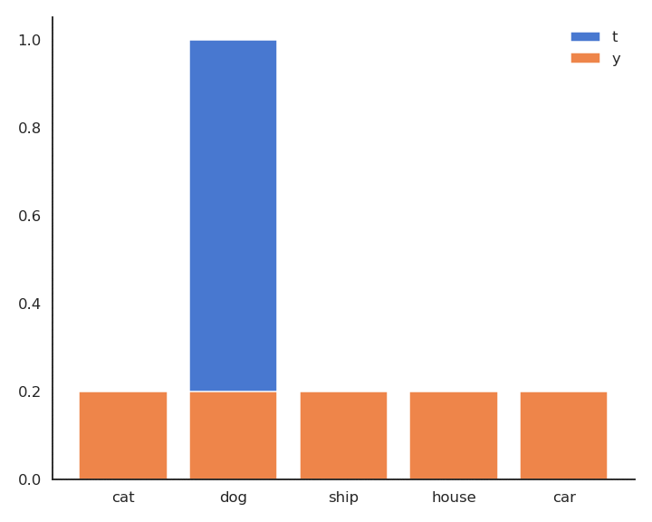

# Cross-entropy loss function

* As $\mathbf{t}$ is a binary vector $[0, 1, 0, 0, 0]$, the cross-entropy / negative log-likelihood can also be noted as the dot product between $\mathbf{t}$ and $\log \mathbf{y}$:

$$
    \mathcal{l}(W, \mathbf{b}) = - \langle \mathbf{t} \cdot \log \mathbf{y} \rangle = - \sum_{j=1}^C t_j \, \log y_j =  - \log y_{j^*}
$$

{width=50%}

* The **cross-entropy loss function** is then the expectation over the training set of the individual cross-entropies:

$$
    \mathcal{L}(W, \mathbf{b}) = \mathbb{E}_{\mathbf{x}, \mathbf{t} \sim \mathcal{D}} [- \langle \mathbf{t} \cdot \log \mathbf{y} \rangle ] \approx \frac{1}{N} \sum_{i=1}^N - \langle \mathbf{t}_i \cdot \log \mathbf{y}_i \rangle
$$

# Cross-entropy loss function

* The nice thing with the **cross-entropy** loss function, when used on a softmax activation function, is that the partial derivative w.r.t the logit score $\mathbf{z}$ is simple:

$$
\begin{split}
    \frac{\partial {l}(W, \mathbf{b})}{\partial z_i} & = - \sum_j \frac{\partial}{\partial z_i}  t_j \log(y_j)=
- \sum_j t_j \frac{\partial \log(y_j)}{\partial z_i} = - \sum_j t_j \frac{1}{y_j} \frac{\partial y_j}{\partial z_i} \\
& = - \frac{t_i}{y_i} \frac{\partial y_i}{\partial z_i} - \sum_{j \neq i}^C \frac{t_j}{y_j} \frac{\partial y_j}{\partial z_i}
= - \frac{t_i}{y_i} y_i (1-y_i) - \sum_{j \neq i}^C \frac{t_j}{y_i} (-y_j \, y_i) \\
& = - t_i + t_i \, y_i + \sum_{j \neq i}^C t_j \, y_i = - t_i + \sum_{j = 1}^C t_j y_i
= -t_i + y_i \sum_{j = 1}^C t_j \\
& = - (t_i - y_i)
\end{split}
$$

i.e. the same as with the mse in linear regression!

* Vector notation:

$$
    \frac{\partial \mathcal{l}(W, \mathbf{b})}{\partial \mathbf{z}} =  -  (\mathbf{t} - \mathbf{y} ) 
$$

::: footer
See <https://peterroelants.github.io/posts/cross-entropy-softmax/> for more explanations on the differentiation.
:::

# Cross-entropy loss function

* As:

$$
    \mathbf{z} = W \times \mathbf{x} + \mathbf{b}
$$

we can obtain the partial derivatives:

$$
\begin{cases}
    \dfrac{\partial \mathcal{l}(W, \mathbf{b})}{\partial W} = \dfrac{\partial \mathcal{l}(W, \mathbf{b})}{\partial \mathbf{z}} \times \dfrac{\partial \mathbf{z}}{\partial W} = - (\mathbf{t} - \mathbf{y} ) \times \mathbf{x}^T \\
    \\
    \dfrac{\partial \mathcal{l}(W, \mathbf{b})}{\partial \mathbf{b}} = \dfrac{\partial \mathcal{l}(W, \mathbf{b})}{\partial \mathbf{z}} \times \dfrac{\partial \mathbf{z}}{\partial \mathbf{b}} = - (\mathbf{t} - \mathbf{y} ) \\
\end{cases}
$$

* So gradient descent leads to the **delta learning rule**:

$$
\begin{cases}
    \Delta W = \eta \,  (\mathbf{t} - \mathbf{y} ) \times \mathbf{x}^T \\
    \\
    \Delta \mathbf{b} = \eta \,  (\mathbf{t} - \mathbf{y} ) \\
\end{cases}
$$

# Softmax linear classifier

::: {.columns}
::: {.column width=50%}

:::
::: {.column width=50%}

* We first compute the **logit scores** $\mathbf{z}$ using a linear layer:

$$
    \mathbf{z} = W \times \mathbf{x} + \mathbf{b}
$$

* We turn them into probabilities $\mathbf{y}$ using the **softmax activation function**:

$$
    y_j = \frac{\exp(z_j)}{\sum_k \exp(z_k)}
$$

:::
:::

* We minimize the **cross-entropy** / **negative log-likelihood** on the training set:

$$
    \mathcal{L}(W, \mathbf{b}) = \mathbb{E}_{\mathbf{x}, \mathbf{t} \sim \mathcal{D}} [ - \langle \mathbf{t} \cdot \log \mathbf{y} \rangle]
$$

which simplifies into the **delta learning rule**:

$$
\begin{cases}
    \Delta W = \eta \,  (\mathbf{t} - \mathbf{y} ) \times \mathbf{x}^T \\
    \\
    \Delta \mathbf{b} = \eta \,  (\mathbf{t} - \mathbf{y} ) \\
\end{cases}
$$

# Comparison of linear classification and regression

* Classification and regression differ in the nature of their outputs: in classification they are discrete, in regression they are continuous values.

* However, when trying to minimize the mismatch between a model $\mathbf{y}$ and the real data $\mathbf{t}$, we have found the same **delta learning rule**:

$$
\begin{cases}
    \Delta W = \eta \,  (\mathbf{t} - \mathbf{y} ) \times \mathbf{x}^T \\
    \\
    \Delta \mathbf{b} = \eta \,  (\mathbf{t} - \mathbf{y} ) \\
\end{cases}
$$

* Regression and classification are in the end the same problem for us. The only things that needs to be adapted is the activation function of the output and the **loss function**:

    * For regression, we use regular activation functions and the **mean square error** (mse):

    $$
    \mathcal{L}(W, \mathbf{b}) = \mathbb{E}_{\mathbf{x}, \mathbf{t} \in \mathcal{D}} [ ||\mathbf{t} - \mathbf{y}||^2 ]
    $$

    * For classification, we use the softmax activation function and the **cross-entropy** (negative log-likelihood) loss function:

    $$\mathcal{L}(W, \mathbf{b}) = \mathbb{E}_{\mathbf{x}, \mathbf{t} \sim \mathcal{D}} [ - \langle \mathbf{t} \cdot \log \mathbf{y} \rangle]$$

# 5 - Multi-label classification

# Multi-label classification

::: {.columns}
::: {.column width=40%}

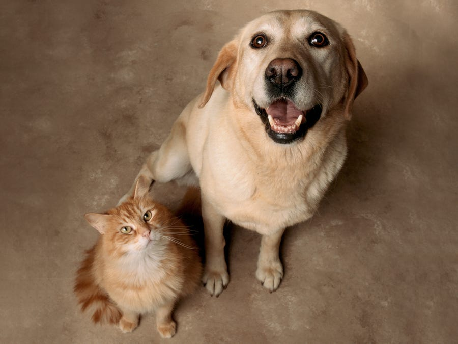

:::
::: {.column width=60%}

* What if there is more than one label on the image?

* The target vector $\mathbf{t}$ does not represent a probability distribution anymore:

$$
    \mathbf{t} = [\text{cat}, \text{dog}, \text{ship}, \text{house}, \text{car}] = [1, 1, 0, 0, 0]
$$

* Normalizing the vector does not help: it is not a dog **or** a cat, it is a dog **and** a cat.

$$
    \mathbf{t} = [\text{cat}, \text{dog}, \text{ship}, \text{house}, \text{car}] = [0.5, 0.5, 0, 0, 0]
$$

:::
:::

# Multi-label classification

::: {.columns}
::: {.column width=30%}

:::
::: {.column width=70%}

* For multi-label classification, we can simply use the **logistic** activation function for the output neurons:

$$
    \mathbf{y} = \sigma(W \times \mathbf{x} + \mathbf{b})
$$

* The outputs are between 0 and 1, but they do not sum to one. Each output neuron performs **logistic regression for soft classification** on their class:

$$y_j = P(\text{class} = j | \mathbf{x})$$

* Each output neuron $y_j$ has a binary target $t_j$ (one-vs-the-rest) and has to minimize the negative log-likelihood:

$$
\mathcal{l}_j(W, \mathbf{b}) =  - t_j \, \log y_j + (1 - t_j) \, \log( 1- y_j)
$$

:::
:::

* The **binary cross-entropy** loss for the whole network is the sum of the negative log-likelihood for each class:
$$
\mathcal{L}(W, \mathbf{b}) =  \mathbb{E}_{\mathcal{D}} [- \sum_{j=1}^C t_j \, \log y_j + (1 - t_j) \, \log( 1- y_j)]
$$

