# Object recognition vs. object detection

::: footer
<https://blog.athelas.com/a-brief-history-of-cnns-in-image-segmentation-from-r-cnn-to-mask-r-cnn-34ea83205de4>
:::

# Object detection with heatmaps

* A naive and very expensive method is to use a trained CNN as a high-level filter.

* The CNN is trained on small images and convolved on bigger images.

* The output is a heatmap of the probability that a particular object is present.

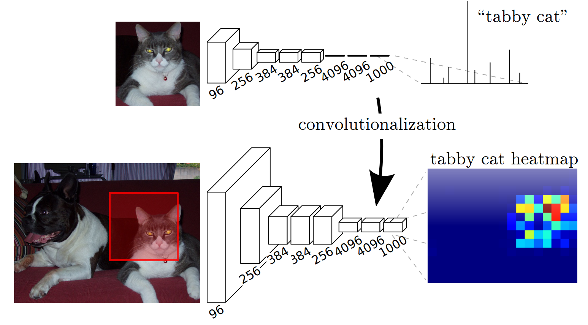{width=70%}

::: footer
<https://blog.athelas.com/a-brief-history-of-cnns-in-image-segmentation-from-r-cnn-to-mask-r-cnn-34ea83205de4>
:::

# PASCAL Visual Object Classes Challenge

::: {.columns}
::: {.column width=50%}

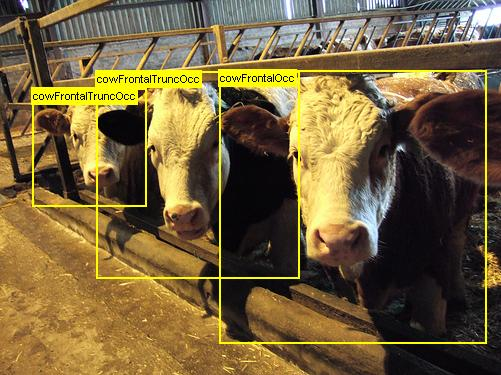

:::
::: {.column width=50%}

* The main dataset for object detection is the **PASCAL** Visual Object Classes Challenge:

    * 20 classes

    * ~10K images

    * ~25K annotated objects

* It is both a:

    * **Classification** problem, as one has to recognize an object.

    * **Regression** problem, as one has to predict the coordinates $(x, y, w, h)$ of the bounding box.

:::
:::

::: footer
Sources: <http://host.robots.ox.ac.uk/pascal/VOC/voc2008/> <https://towardsdatascience.com/r-cnn-fast-r-cnn-faster-r-cnn-yolo-object-detection-algorithms-36d53571365e>
:::

# MS COCO dataset (Common Objects in COntext)

{width=80%}

* 330K images, 80 labels.

* Also contains data for semantic segmentation, caption generation, etc.

::: footer
<http://cocodataset.org>
:::

# R-CNN : Regions with CNN features

{width=80%}

1. Bottom-up region proposals (selective search) by searching bounding boxes based on pixel info.

2. Feature extraction using a pre-trained CNN (AlexNet).

3. Classification using a SVM (object or not; if yes, which one?)

4. If an object is found, linear regression on the region proposal to generate tighter bounding box coordinates.

::: footer
Girshick, Donahue, Darrell and Malik (2014). Rich feature hierarchies for accurate object detection and semantic segmentation. CVPR.
:::

::: footer
Selective search: <https://ivi.fnwi.uva.nl/isis/publications/2013/UijlingsIJCV2013/UijlingsIJCV2013.pdf>
:::

# R-CNN : Regions with CNN features

::: {.columns}
::: {.column width=40%}

* Each region proposal is processed by the CNN, followed by a SVM and a bounding box regressor.

:::
::: {.column width=55%}

* The CNN is pre-trained on ImageNet and fine-tuned on Pascal VOC.

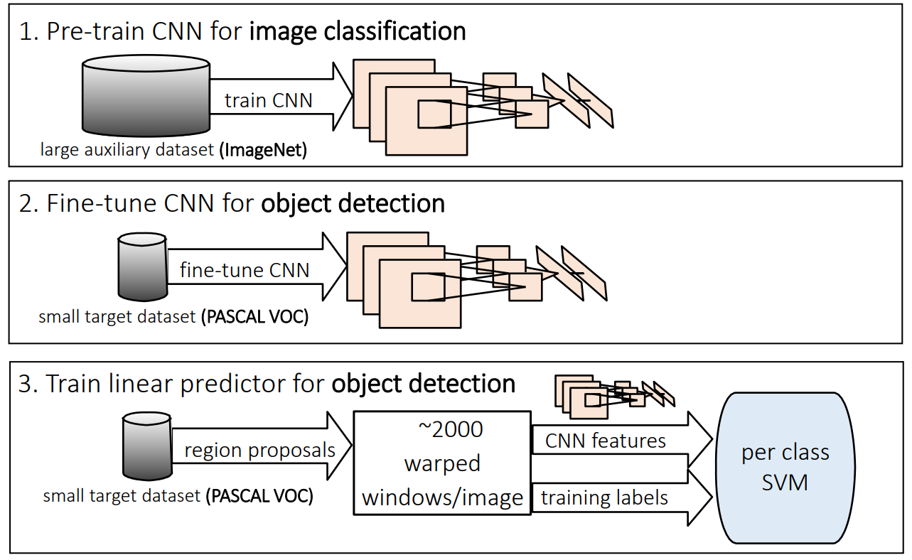

:::
:::

::: footer
<https://courses.cs.washington.edu/courses/cse590v/14au/cse590v_wk1_rcnn.pdf>
:::

::: footer
<https://towardsdatascience.com/r-cnn-fast-r-cnn-faster-r-cnn-yolo-object-detection-algorithms-36d53571365e>
:::

# Fast R-CNN

::: {.columns}
::: {.column width=50%}

:::
::: {.column width=50%}

* The main drawback of R-CNN is that each of the 2000 region proposals have to go through the CNN: extremely slow.

* The idea behind **Fast R-CNN** is to extract region proposals in higher feature maps and to use transfer learning.

:::
:::

* The network first processes the whole image with several convolutional and max pooling layers to produce a feature map.

* Each object proposal is projected to the feature map, where a region of interest (RoI) pooling layer extracts a fixed-length feature vector.

* Each feature vector is fed into a sequence of FC layers that finally branch into two sibling output layers:

    * a softmax probability estimate over the K classes plus a catch-all “background” class.
    * a regression layer that outputs four real-valued numbers for each class.

* The loss function to minimize is a composition of different losses and penalty terms:

$$
    \mathcal{L}(\theta) = \lambda_1 \, \mathcal{L}_\text{classification}(\theta) + \lambda_2 \, \mathcal{L}_\text{regression}(\theta) + \lambda_3 \, \mathcal{L}_\text{regularization}(\theta)
$$

::: footer
Girschick (2015). Fast R-CNN. arxiv:1504.08083
:::

# Faster R-CNN

::: {.columns}
::: {.column width=50%}

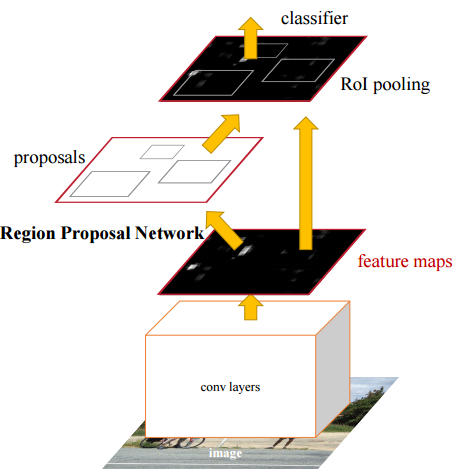

:::
::: {.column width=50%}

* Both R-CNN and Fast R-CNN use selective search to find out the region proposals: slow and time-consuming.

* Faster R-CNN introduces an object detection algorithm that lets the network learn the region proposals.

* The image is passed through a pretrained CNN to obtain a convolutional feature map.

* A separate network is used to predict the region proposals.

* The predicted region proposals are then reshaped using a RoI pooling layer which is then used to classify the object and predict the bounding box.

:::
:::

::: footer
Ren et al. (2015). Faster R-CNN: Towards Real-Time Object Detection with Region Proposal Networks. arXiv:1506.01497
:::

# YOLO (You Only Look Once)

::: {.columns}
::: {.column width=60%}

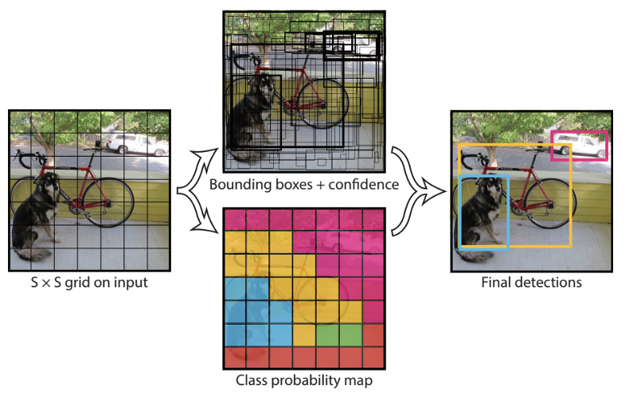

:::
::: {.column width=35%}

* (Fast(er)) R-CNN perform classification for each region proposal sequentially: slow.

* YOLO applies a single neural network to the full image to predict all possible boxes and the corresponding classes.

* YOLO divides the image into a SxS grid of cells.

:::
:::

* Each grid cell predicts a single object, with the corresponding $C$ **class probabilities** (softmax).

* It also predicts the coordinates of $B$ possible **bounding boxes** (x, y, w, h) as well as a box **confidence score**.

* The SxSxB predicted boxes are then pooled together to form the final prediction.

::: footer
Redmon et al. (2015).  You Only Look Once: Unified, Real-Time Object Detection. arxiv:1506.02640
:::

# YOLO (You Only Look Once)

* The yellow box predicts the presence of a **person** (the class) as well as a candidate **bounding box** (it may be bigger than the grid cell itself).

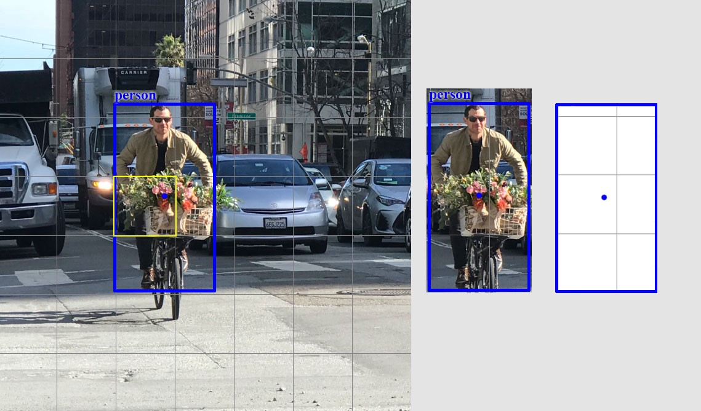

::: footer
Source: <https://medium.com/@jonathan_hui/real-time-object-detection-with-yolo-yolov2-28b1b93e2088>
:::

# YOLO (You Only Look Once)

* We will suppose here that each grid cell proposes 2 bounding boxes.

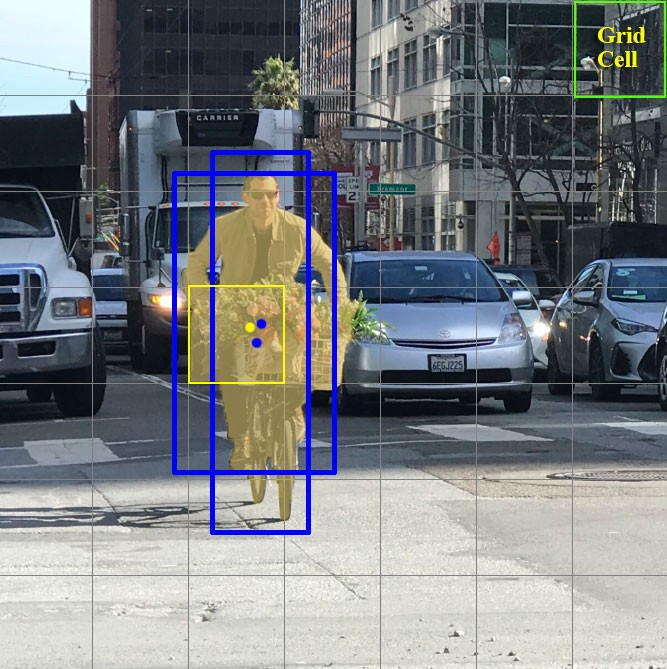{width=50%}

::: footer
Source: <https://medium.com/@jonathan_hui/real-time-object-detection-with-yolo-yolov2-28b1b93e2088>
:::

# YOLO (You Only Look Once)

* Each grid cell predicts a probability for each of the 20 classes, and two bounding boxes (4 coordinates and a confidence score per bounding box).

* This makes C + B * 5 = 30 values to predict for each cell.

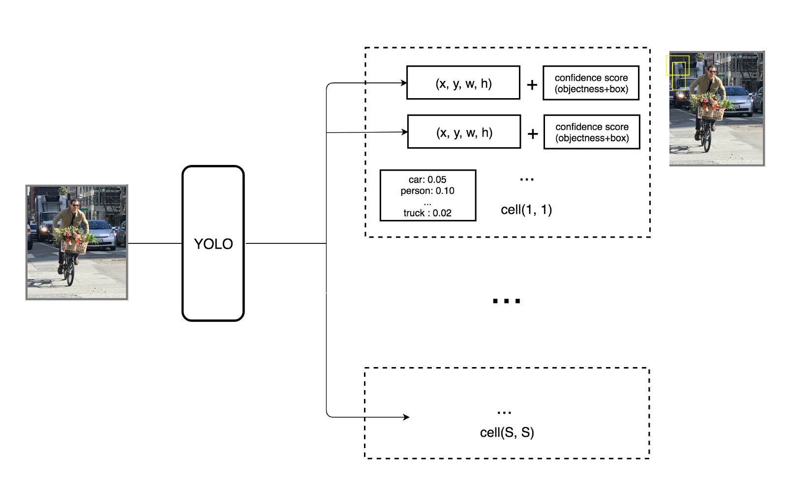{width=70%}

::: footer
Source: <https://medium.com/@jonathan_hui/real-time-object-detection-with-yolo-yolov2-28b1b93e2088>
:::

# YOLO : CNN architecture

* YOLO uses a CNN with 24 convolutional layers and 4 max-pooling layers to obtain a 7x7 grid.

* The last convolution layer outputs a tensor with shape (7, 7, 1024). The tensor is then flattened and passed through 2 fully connected layers.

* The output is a tensor of shape (7, 7, 30), i.e. 7x7 grid cells, 20 classes and 2 boundary box predictions per cell.

{width=80%}

::: footer
Redmon et al. (2015).  You Only Look Once: Unified, Real-Time Object Detection. arxiv:1506.02640
:::

# YOLO : confidence score

* The 7x7 grid cells predict 2 bounding boxes each: maximum of 98 bounding boxes on the whole image.

* Only the bounding boxes with the **highest class confidence score** are kept.

$$
    \text{class confidence score = box confidence score * class probability}
$$

* In practice, the class confidence score should be above 0.25 to be retained.

{width=80%}

::: footer
Redmon et al. (2015).  You Only Look Once: Unified, Real-Time Object Detection. arxiv:1506.02640
:::

# YOLO : Intersection over Union (IoU)

* To ensure specialization, only one bounding box per grid cell should be responsible for detecting an object.

* During learning, we select the bounding box with the biggest overlap with the object.

* This can be measured by the **Intersection over the Union** (IoU).

::: {.columns}
::: {.column width=50%}

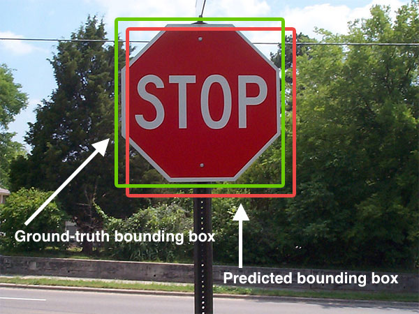

:::
::: {.column width=50%}

:::
:::

::: footer
Source: <https://www.pyimagesearch.com/2016/11/07/intersection-over-union-iou-for-object-detection/>
:::

# YOLO : loss functions

* The output of the network is a 7x7x30 tensor, representing for each cell:

    * the probability that an object of a given class is present.

    * the position of two bounding boxes.

    * the confidence that the proposed bounding boxes correspond to a real object (the IoU).

* We are going to combine three different loss functions:

1. The **categorization loss**: each cell should predict the correct class.

2. The **localization loss**: error between the predicted boundary box and the ground truth for each object.

3. The **confidence loss**: do the predicted bounding boxes correspond to real objects?

::: footer
Redmon et al. (2015).  You Only Look Once: Unified, Real-Time Object Detection. arxiv:1506.02640
:::

# YOLO : classification loss

* The classification loss is the **mse** between:

    * $\hat{p}_i(c)$: the one-hot encoded class $c$ of the object present under each cell $i$, and

    * $p_i(c)$: the predicted class probabilities of cell $i$.

$$
    \mathcal{L}_\text{classification}(\theta) =  \sum_{i=0}^{S^2} \mathbb{1}_i^\text{obj} \sum_{c \in \text{classes}} (p_i(c) - \hat{p}_i(c))^2
$$

where $\mathbb{1}_i^\text{obj}$ is 1 when there actually is an object behind the cell $i$, 0 otherwise (background).

* They could also have used the cross-entropy loss, but the output layer is not a softmax layer.

* Using mse is also more compatible with the other losses.

::: footer
Redmon et al. (2015).  You Only Look Once: Unified, Real-Time Object Detection. arxiv:1506.02640
:::

# YOLO : localization loss

* For all bounding boxes matching a real object, we want to minimize the **mse** between:

    * $(\hat{x}_i, \hat{y}_i, \hat{w}_i, \hat{h}_i)$: the coordinates of the ground truth bounding box, and

    * $(x_i, y_i, w_i, h_i)$: the coordinates of the predicted bounding box.

$$
    \mathcal{L}_\text{localization}(\theta) = \sum_{i=0}^{S^2} \sum_{j=0}^{B} \mathbb{1}_{ij}^\text{obj} [ (x_i - \hat{x}_i)^2 + (y_i - \hat{y}_i)^2] \\
    \qquad\qquad\qquad\qquad + \sum_{i=0}^{S^2} \sum_{j=0}^{B} \mathbb{1}_{ij}^\text{obj} [ (\sqrt{w_i} - \sqrt{\hat{w}_i})^2 + (\sqrt{h_i} - \sqrt{\hat{h}_i})^2]
$$

where $\mathbb{1}_{ij}^\text{obj}$ is 1 when the bounding box $j$ of cell $i$ "matches" with an object (IoU).

* The root square of the width and height of the bounding boxes is used.

* This allows to penalize more the errors on small boxes than on big boxes.

::: footer
Redmon et al. (2015).  You Only Look Once: Unified, Real-Time Object Detection. arxiv:1506.02640
:::

# YOLO : confidence loss

* Finally, we need to learn the confidence score of each bounding box, by minimizing the **mse** between:

    * $C_i$: the predicted confidence score of cell $i$, and

    * $\hat{C}_i$: the IoU between the ground truth bounding box and the predicted one.

$$
    \mathcal{L}_\text{confidence}(\theta) = \sum_{i=0}^{S^2} \sum_{j=0}^{B} \mathbb{1}_{ij}^\text{obj} (C_{ij} - \hat{C}_{ij})^2  \\
    \qquad\qquad\qquad\qquad + \lambda^\text{noobj} \, \sum_{i=0}^{S^2} \sum_{j=0}^{B} \mathbb{1}_{ij}^\text{noobj} (C_{ij} - \hat{C}_{ij})^2
$$

* Two cases are considered:

    1. There was a real object at that location ($\mathbb{1}_{ij}^\text{obj} = 1$): the confidences should be updated fully.

    2. There was no real object ($\mathbb{1}_{ij}^\text{noobj} = 1$): the confidences should only be moderately updated ($\lambda^\text{noobj} = 0.5$)

* This is to deal with **class imbalance**: there are much more cells on the background than on real objects.

::: footer
Redmon et al. (2015).  You Only Look Once: Unified, Real-Time Object Detection. arxiv:1506.02640
:::

# YOLO : loss function

* Put together, the loss function to minimize is:

$$
\begin{align}
    \mathcal{L}(\theta) & = \mathcal{L}_\text{classification}(\theta) + \lambda_\text{coord} \, \mathcal{L}_\text{localization}(\theta) + \mathcal{L}_\text{confidence}(\theta) \\
              & = \sum_{i=0}^{S^2} \mathbb{1}_i^\text{obj} \sum_{c \in \text{classes}} (p_i(c) - \hat{p}_i(c))^2 \\
              & + \lambda_\text{coord} \, \sum_{i=0}^{S^2} \sum_{j=0}^{B} \mathbb{1}_{ij}^\text{obj} [ (x_i - \hat{x}_i)^2 + (y_i - \hat{y}_i)^2] \\
              & + \lambda_\text{coord} \, \sum_{i=0}^{S^2} \sum_{j=0}^{B} \mathbb{1}_{ij}^\text{obj} [ (\sqrt{w_i} - \sqrt{\hat{w}_i})^2 + (\sqrt{h_i} - \sqrt{\hat{h}_i})^2] \\
              & + \sum_{i=0}^{S^2} \sum_{j=0}^{B} \mathbb{1}_{ij}^\text{obj} (C_{ij} - \hat{C}_{ij})^2  \\
              & + \lambda^\text{noobj} \, \sum_{i=0}^{S^2} \sum_{j=0}^{B} \mathbb{1}_{ij}^\text{noobj} (C_{ij} - \hat{C}_{ij})^2 \\
\end{align}
$$

::: footer
Redmon et al. (2015).  You Only Look Once: Unified, Real-Time Object Detection. arxiv:1506.02640
:::

# YOLO : Training on PASCAL VOC

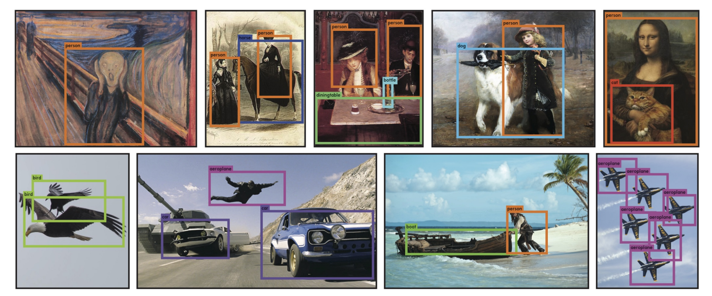

::: {.columns}
::: {.column width=50%}

:::
::: {.column width=50%}

* YOLO was trained on PASCAL VOC (natural images) but generalizes well to other datasets (paintings...).

* Runs real-time (60 fps) on a NVIDIA Titan X.

* Faster and more accurate versions of YOLO have been developed: YOLO9000, YOLOv3, YOLOv4, YOLOv5...

:::
:::

---

<video src="videos/yolov3.mp4" style="display:block; margin: 0 auto 10px 10px;" controls allow="autoplay loop"></video>

::: footer
<https://pjreddie.com/darknet/yolo/> <https://www.youtube.com/watch?v=MPU2HistivI>
:::

# SSD: Single-Shot Detector

::: {.columns}
::: {.column width=50%}

* The idea of SSD is similar to YOLO, but:

    * faster
    * more accurate
    * not limited to 98 objects per scene
    * multi-scale

:::
::: {.column width=50%}

* Contrary to YOLO, all convolutional layers are used to predict a bounding box, not just the final tensor.

    * Skip connections.

* This allows to detect boxes at multiple scales (pyramid).

:::
:::

::: footer
Liu et al. (2016) SSD: Single Shot MultiBox Detector. arXiv:1512.02325
:::

# R-CNNs on RGB-D images

* It is also possible to use **depth** information (e.g. from a Kinect) as an additional channel of the R-CNN.

* The depth information provides more information on the structure of the object, allowing to disambiguate certain situations (segmentation).

{width=100%}

::: footer
Gupta et al. (2014). Learning Rich Features from RGB-D Images for Object Detection and Segmentation, ECCV 2014.
:::

# VoxelNet

* Lidar point clouds can also be used for detecting objects, for example **VoxelNet** trained on the KITTI dataset.

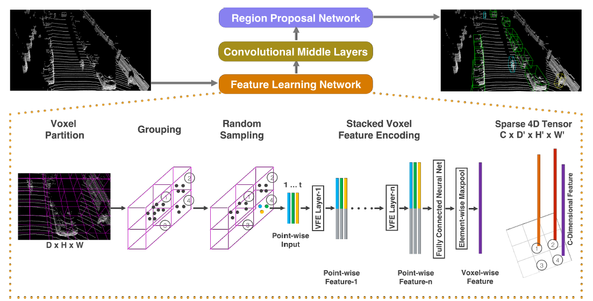

::: footer
Zhou Y, Tuzel O. (2017). VoxelNet: End-to-End Learning for Point Cloud Based 3D Object Detection. arXiv:171106396
:::

# VoxelNet

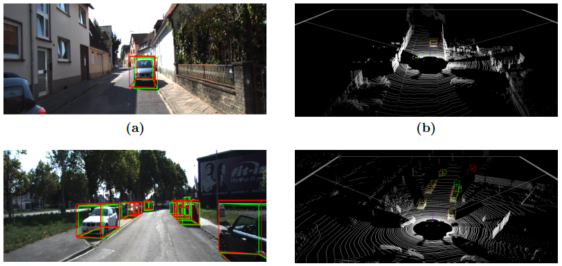{width=100%}

::: footer
Source: <https://medium.com/@SmartLabAI/3d-object-detection-from-lidar-data-with-deep-learning-95f6d400399a>
:::

# Additional resources on object detection

* <https://medium.com/comet-app/review-of-deep-learning-algorithms-for-object-detection-c1f3d437b852>

* <https://medium.com/@smallfishbigsea/faster-r-cnn-explained-864d4fb7e3f8>

* <https://towardsdatascience.com/r-cnn-fast-r-cnn-faster-r-cnn-yolo-object-detection-algorithms-36d53571365e>

* <https://medium.com/@jonathan_hui/real-time-object-detection-with-yolo-yolov2-28b1b93e2088>

* <https://medium.com/@jonathan_hui/ssd-object-detection-single-shot-multibox-detector-for-real-time-processing-9bd8deac0e06>

* <https://towardsdatascience.com/lidar-3d-object-detection-methods-f34cf3227aea>