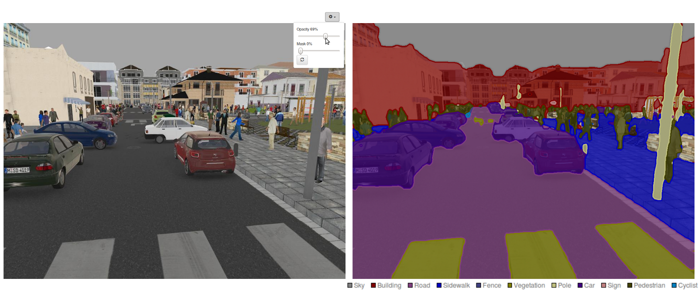
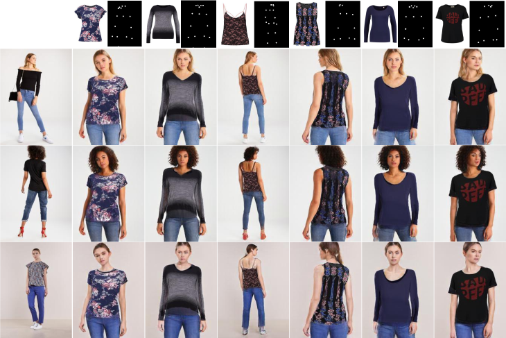
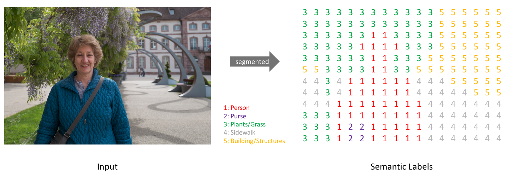
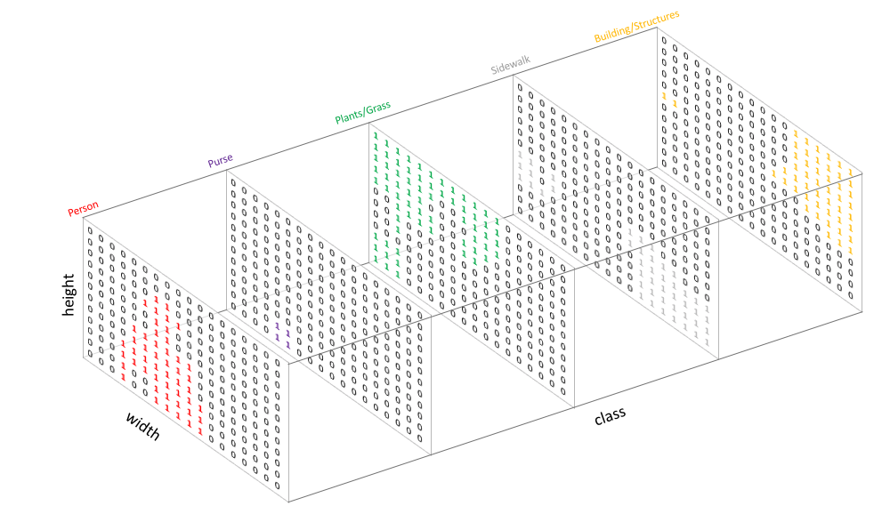
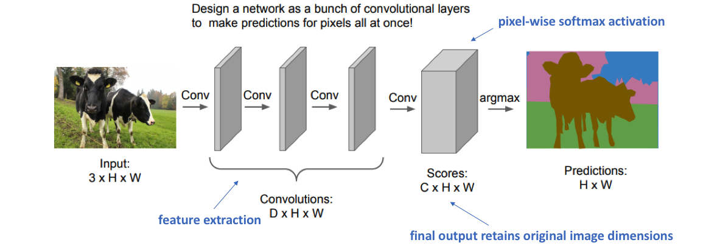
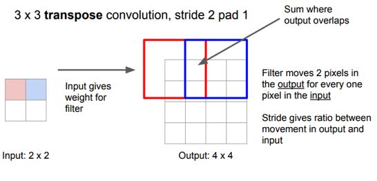
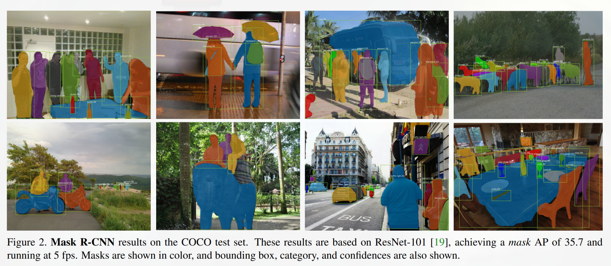

# Semantic segmentation

* **Semantic segmentation** is a class of segmentation methods where you use knowledge about the identity of objects to partition the image pixel-per-pixel.

* Classical segmentation methods only rely on the similarity between neighboring pixels, they do not use class information.

* The output of a semantic segmentation is another image, where each pixel represents the class.

::: footer
Source : <https://medium.com/nanonets/how-to-do-image-segmentation-using-deep-learning-c673cc5862ef>
:::

# Semantic segmentation

* The classes can be binary, for example foreground/background, person/not, etc.

* Semantic segmentation networks are used for example in Youtube stories to add **virtual backgrounds** (background matting).

::: {.columns}
::: {.column width=40%}

{width=60%}

::: footer
Source: <https://ai.googleblog.com/2018/03/mobile-real-time-video-segmentation.html>
:::

:::
::: {.column width=60%}

* Clothes can be segmented to allow for virtual try-ons.

::: footer
Wang B, Zheng H, Liang X, Chen Y, Lin L, Yang M. (2018). Toward Characteristic-Preserving Image-based Virtual Try-On Network. arXiv:180707688.
:::

:::
:::

# Datasets for semantic segmentation

* There are many datasets freely available, but annotating such data is very painful, expensive and error-prone.

    * PASCAL VOC 2012 Segmentation Competition
    * COCO 2018 Stuff Segmentation Task
    * BDD100K: A Large-scale Diverse Driving Video Database
    * Cambridge-driving Labeled Video Database (CamVid)
    * Cityscapes Dataset
    * Mapillary Vistas Dataset
    * ApolloScape Scene Parsing
    * KITTI pixel-level semantic segmentation

# Output encoding

* Each pixel of the input image is associated to a label (as in classification).

::: footer
Source : <https://medium.com/nanonets/how-to-do-image-segmentation-using-deep-learning-c673cc5862ef>
:::

# Output encoding

* A **one-hot encoding** of the segmented image is therefore a tensor:

::: footer
Source : <https://medium.com/nanonets/how-to-do-image-segmentation-using-deep-learning-c673cc5862ef>
:::

# Fully convolutional network

* A **fully convolutional network** only has convolutional layers and learns to predict the output tensor.

* The last layer has a pixel-wise softmax activation. We minimize the **pixel-wise cross-entropy loss**

$$\mathcal{L}(\theta) = \mathbb{E}_\mathcal{D} [- \sum_\text{pixels} \sum_\text{classes} t_i \, \log y_i]$$

* Downside: the image size is preserved throughout the network: computationally expensive. It is therefore difficult to increase the number of features in each convolutional layer.

::: footer
Source : <http://cs231n.stanford.edu/slides/2017/cs231n_2017_lecture11.pdf>
:::

# SegNet: segmentation network

* **SegNet** has an **encoder-decoder** architecture, with max-pooling to decrease the spatial resolution while increasing the number of features.

* But what is the inverse of max-pooling? Upsampling operation.

::: footer
Badrinarayanan, Handa and Cipolla (2015). "SegNet: A Deep Convolutional Encoder-Decoder Architecture for Robust Semantic Pixel-Wise Labelling." arXiv:1505.07293
:::

# Upsampling: some methods

* Nearest neighbor and Bed of nails would just make random decisions for the upsampling.

* In SegNet, max-unpooling uses the information of the corresponding max-pooling layer in the encoder to place pixels adequately.

{width=70%}

::: footer
Source : <http://cs231n.stanford.edu/slides/2017/cs231n_2017_lecture11.pdf>
:::

# Upsampling: transposed convolution

* Another popular option in the followers of SegNet is the **transposed convolution**.

::: {.columns}
::: {.column width=50%}

:::
::: {.column width=50%}

* The original feature map is upsampled by putting zeros between the values.

* A learned filter performs a regular convolution to produce an upsampled feature map.

* Works well when convolutions with stride are used in the encoder.

* Quite expensive computationally.

:::
:::

::: footer
Source: <https://github.com/vdumoulin/conv_arithmetic>  <http://cs231n.stanford.edu/slides/2017/cs231n_2017_lecture11.pdf>
:::

# U-Net

::: {.columns}
::: {.column width=60%}

:::
::: {.column width=40%}

* The problem of SegNet is that small details (small scales) are lost because of the max-pooling. the segmentation is not precise.

* The solution proposed by **U-Net** is to add **skip connections** (as in ResNet) between different levels of the encoder-decoder.

* The final segmentation depends both on:

    * large-scale information computed in the middle of the encoder-decoder.

    * small-scale information processed in the early layers of the encoder.

:::
:::

::: footer
Ronneberger, Fischer, Brox (2015). U-Net: Convolutional Networks for Biomedical Image Segmentation. arXiv:1505.04597
:::

# Mask R-CNN

* For many applications, segmenting the background is useless. A two-stage approach can save computations.

* **Mask R-CNN** uses faster R-CNN to extract bounding boxes around interesting objects, followed by the prediction of a **mask** to segment the object.

{width=80%}

::: footer
He K, Gkioxari G, Dollár P, Girshick R. 2018. Mask R-CNN. arXiv:170306870
:::

# Mask R-CNN

::: footer
He K, Gkioxari G, Dollár P, Girshick R. 2018. Mask R-CNN. arXiv:170306870
:::

# Mask R-CNN

<video src="videos/segnet.mp4" style="display:block; margin: 0 auto 10px 10px;" controls allow="autoplay loop"></video>

::: footer
<https://www.youtube.com/watch?v=OOT3UIXZztE>
:::