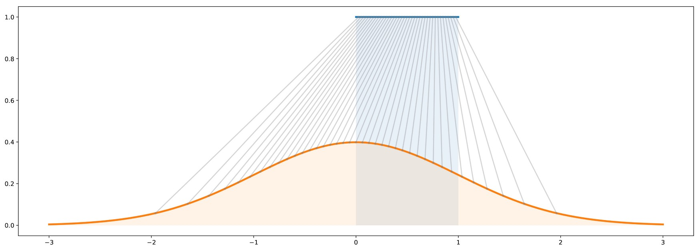
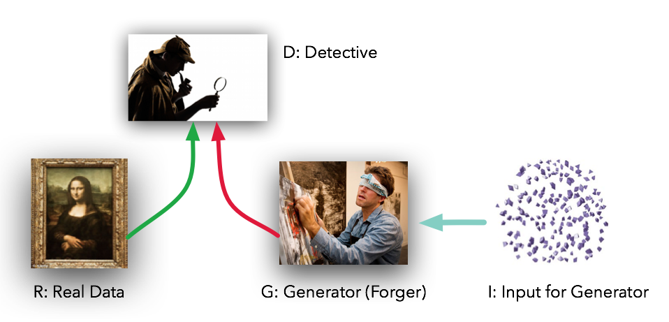
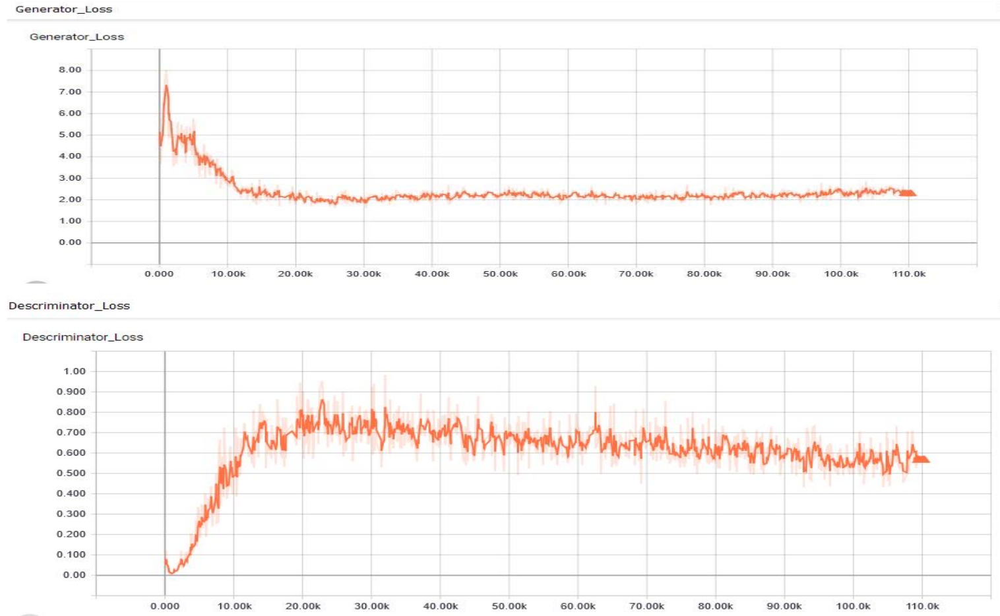
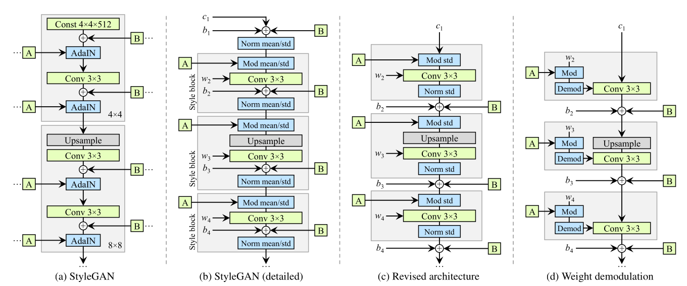
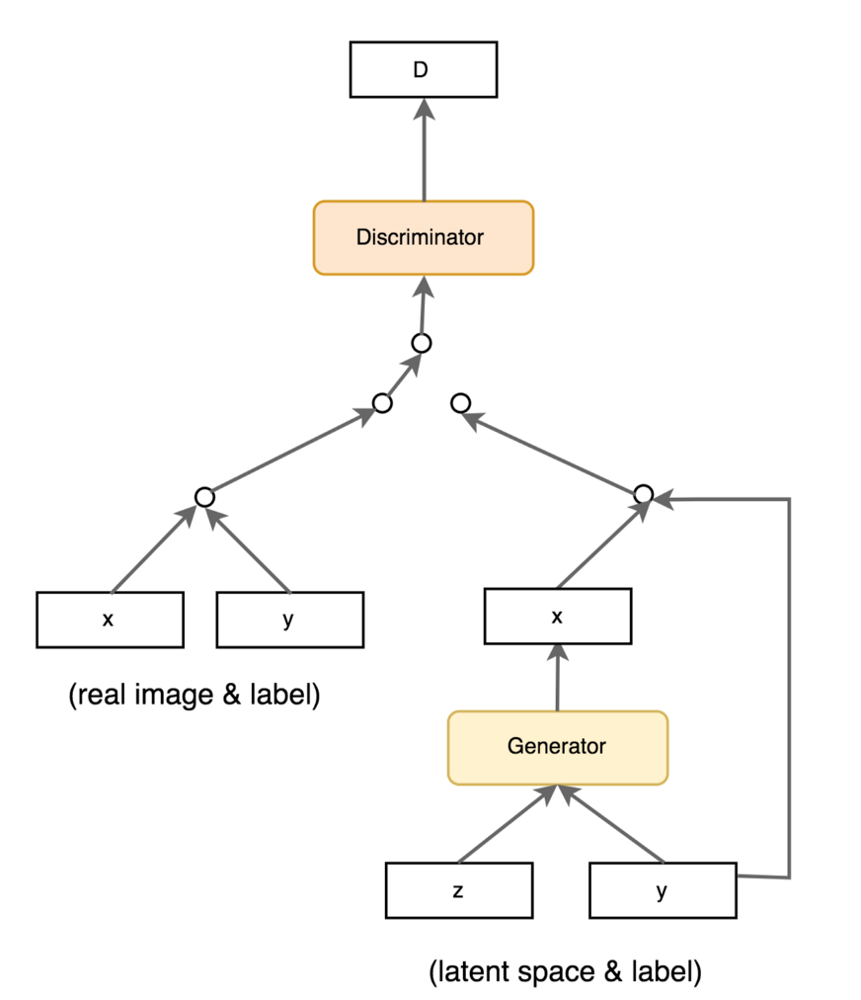
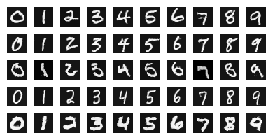
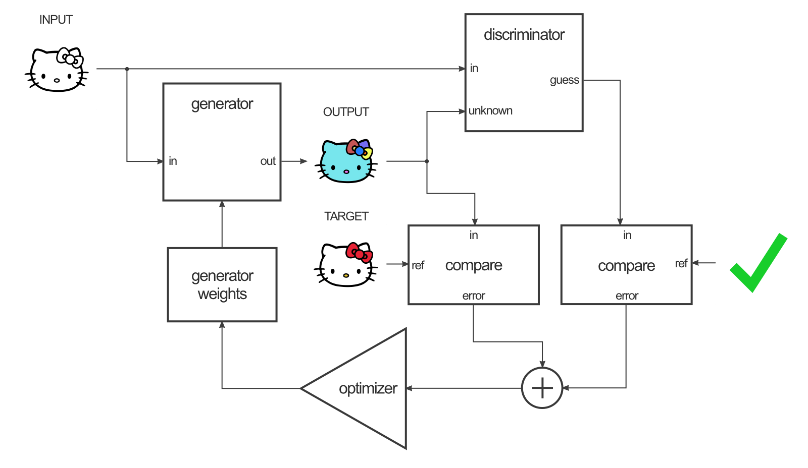
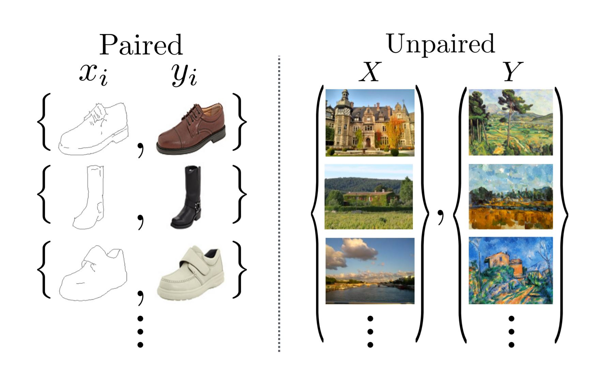
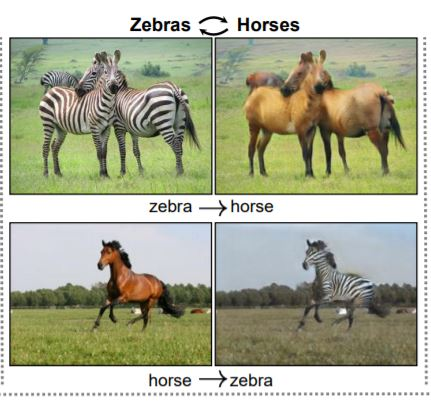
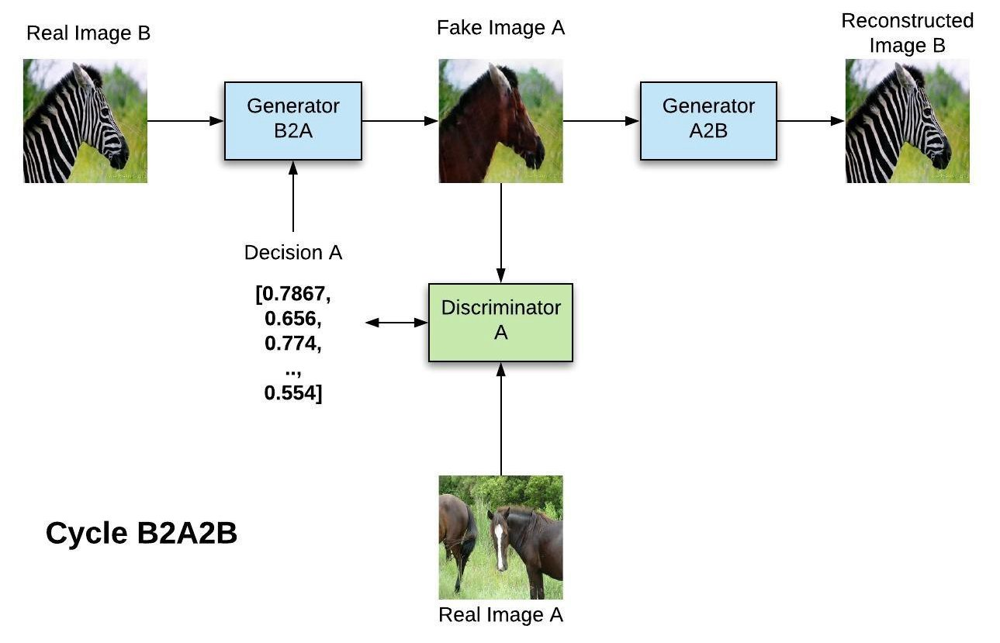

# 1 - Generative adversarial network

# Generative models

* An autoencoder learns to first encode inputs in a **latent space** and then use a generative model to model the data distribution.

$$\mathcal{L}_\text{autoencoder}(\theta, \phi) = \mathbb{E}_{\mathbf{x} \in \mathcal{D}, \mathbf{z} \sim q_\phi(\mathbf{z}|\mathbf{x})} [ - \log p_\theta(\mathbf{z})]$$

* Couldn't we learn a decoder using random noise as input but still learning the distribution of the data?

$$\mathcal{L}_\text{GAN}(\theta, \phi) = \mathbb{E}_{\mathbf{z} \sim \mathcal{N}(0, 1)} [ - \log p_\theta(\mathbf{z}) ]$$

* After all, this is how random numbers are generated: a uniform distribution of pseudo-random numbers is transformed into samples of another distribution using a mathematical formula.

{width=80%}

::: footer
Source: <https://towardsdatascience.com/understanding-generative-adversarial-networks-gans-cd6e4651a29>
:::

# Generative models

* The problem is how to estimate the discrepancy between the true distribution and the generated distribution when we only have samples. 

* The Maximum Mean Discrepancy (MMD) approach allows to do that, but does not work very well in highly-dimensional spaces.

::: footer
Source: <https://towardsdatascience.com/understanding-generative-adversarial-networks-gans-cd6e4651a29>
:::

# Generative adversarial network

* The **Generative Adversarial Network** (GAN, Goodfellow at al., 2014) is a smart way of providing a loss function to the generative model. It is composed of two parts:

    * The **Generator** (or decoder) produces an image based on latent variables sampled from some random distribution (e.g. uniform or normal).

    * The **Discriminator** has to recognize real images from generated ones.

{width=70%}

::: footer
Goodfellow IJ, Pouget-Abadie J, Mirza M, Xu B, Warde-Farley D, Ozair S, Courville A, Bengio Y. 2014. Generative Adversarial Networks. arXiv:14062661
:::

::: footer
Source: <https://medium.com/@devnag/generative-adversarial-networks-gans-in-50-lines-of-code-pytorch-e81b79659e3f>
:::

# Generative adversarial network

* The generator only sees noisy latent representations and outputs a reconstruction.

* The discriminator gets alternatively real or generated inputs and predicts whether it is real or fake.

{width=80%}

::: footer
Source: <https://www.oreilly.com/library/view/java-deep-learning/9781788997454/60579068-af4b-4bbf-83f1-e988fbe3b226.xhtml>
:::

# The discriminator should be able to recognize false bills from true ones

::: footer
Source: <https://medium.com/@ageitgey/abusing-generative-adversarial-networks-to-make-8-bit-pixel-art-e45d9b96cee7>
:::

# The generator should be able to generate realistic bills

::: footer
Source: <https://medium.com/@ageitgey/abusing-generative-adversarial-networks-to-make-8-bit-pixel-art-e45d9b96cee7>
:::

# The generator is initially very bad...

::: footer
Source: <https://medium.com/@ageitgey/abusing-generative-adversarial-networks-to-make-8-bit-pixel-art-e45d9b96cee7>
:::

# ... but the discriminator too!

::: footer
Source: <https://medium.com/@ageitgey/abusing-generative-adversarial-networks-to-make-8-bit-pixel-art-e45d9b96cee7>
:::

# After a while, the discriminator gets better...

::: footer
Source: <https://medium.com/@ageitgey/abusing-generative-adversarial-networks-to-make-8-bit-pixel-art-e45d9b96cee7>
:::

# So the generator also has to improve

::: footer
Source: <https://medium.com/@ageitgey/abusing-generative-adversarial-networks-to-make-8-bit-pixel-art-e45d9b96cee7>
:::

# Generative adversarial network

* The generator and the discriminator are in competition with each other.

* The discriminator uses pure **supervised learning**: we know if the input is real or generated (binary classification) and train the discriminator accordingly.

* The generator tries to fool the discriminator, without ever seeing the data!

::: footer
Source: <https://towardsdatascience.com/understanding-generative-adversarial-networks-gans-cd6e4651a29>
:::

# Loss of the discriminator

::: {.columns}
::: {.column width=60%}

* Let's define $x \sim P_\text{data}(x)$ as a real image from the dataset and $G(z)$ as an image generated by the generator,  where $z \sim P_z(z)$ is a random input.

* The output of the discriminator is a single sigmoid neuron:

    * $D(x) = 1$ for real images.

    * $D(G(z)) = 0$ for generated images

* We want both $D(x)$ and $1-D(G(z))$ to be close from 1.

:::
::: {.column width=40%}

:::
:::

* The goal of the discriminator is to **minimize** the negative log-likelihood (cross-entropy) of classifying correctly the data:

$$
    \mathcal{L}(D) = \mathbb{E}_{x \sim P_\text{data}(x)} [ - \log D(x)] + \mathbb{E}_{z \sim P_z(z)} [ - \log(1 - D(G(z)))]
$$

* It is similar to logistic regression: $x$ belongs to the positive class, $G(z)$ to the negative class.

# Loss of the generator

* The goal of the generator is to **maximize** the negative log-likelihood of the discriminator being correct on the generated images, i.e. fool it: 

$$
    \mathcal{J}(G) = \mathbb{E}_{z \sim P_z(z)} [ - \log(1 - D(G(z)))]
$$

* The generator tries to maximize what the discriminator tries to minimize.

::: {.columns}
::: {.column width=65%}

:::
::: {.column width=35%}

:::
:::

::: footer
Source: <https://www.oreilly.com/library/view/java-deep-learning/9781788997454/60579068-af4b-4bbf-83f1-e988fbe3b226.xhtml>
:::

# GAN loss

* Putting both objectives together, we obtain the following **minimax** problem:

$$
    \min_G \max_D \, \mathcal{V}(D, G) = \mathbb{E}_{x \sim P_\text{data}(x)} [\log D(x)] + \mathbb{E}_{z \sim P_z(z)} [\log(1 - D(G(z)))]
$$

* $D$ and $G$ compete on the same objective function: one tries to maximize it, the other to minimize it.

* Note that the generator $G$ never sees the data $x$: all it gets is a **backpropagated gradient** through the discriminator:

$$\nabla_{G(z)} \, \mathcal{V}(D, G) = \nabla_{D(G(z))} \, \mathcal{V}(D, G) \times \nabla_{G(z)} \, D(G(z))$$

* It informs the generator which **pixels** are the most responsible for an eventual bad decision of the discriminator.

{width=50%}

::: footer
Source: <https://www.oreilly.com/library/view/java-deep-learning/9781788997454/60579068-af4b-4bbf-83f1-e988fbe3b226.xhtml>
:::

# GAN loss

* This objective function can be optimized when the generator uses gradient descent and the discriminator gradient ascent: just apply a minus sign on the weight updates!

$$
    \min_G \max_D V(D, G) = \mathbb{E}_{x \sim P_\text{data}(x)} [\log D(x)] + \mathbb{E}_{z \sim P_z(z)} [\log(1 - D(G(z)))]
$$

* Both can therefore use the usual **backpropagation** algorithm to adapt their parameters.

* The discriminator and the generator should reach a **Nash equilibrium**: they try to beat each other, but both become better over time.

{width=60%}

::: footer
Source: <https://www.oreilly.com/library/view/java-deep-learning/9781788997454/60579068-af4b-4bbf-83f1-e988fbe3b226.xhtml>
:::

# Generative adversarial network

* The loss functions reach an equilibrium, it is quite hard to tell when the network has converged.

::: footer
Research project - Vivek Bakul Maru - TU Chemnitz
:::

# DCGAN : Deep convolutional GAN

* DCGAN is the convolutional version of GAN, using transposed convolutions in the generator and concolutions with stride in the discriminator.

{width=80%}

::: footer
Radford, Metz and Chintala (2015). Unsupervised Representation Learning with Deep Convolutional Generative Adversarial Networks. arxiv:1511.06434
:::

# Generative adversarial networks

* GAN are quite sensible to train: the discriminator should not become too good too early, otherwise there is no usable gradient for the generator.

* In practice, one updates the generator more often than the discriminator.

* There has been many improvements on GANs to stabilizes training:

    * Wasserstein GAN (relying on the Wasserstein distance instead of the log-likelihood).

    * f-GAN (relying on any f-divergence).

* But the generator often **collapses**, i.e. outputs non-sense, or always the same image.

* Hyperparameter tuning is very difficult.

::: footer
Tim Salimans, Ian Goodfellow, Wojciech Zaremba, Vicki Cheung, Alec Radford, and Xi Chen (2016). Improved techniques for training GANs. In Advances in Neural Information Processing Systems.
:::

::: footer
Source: Brundage M, Avin S, Clark J, et al. (2018). The Malicious Use of Artificial Intelligence: Forecasting, Prevention, and Mitigation. arXiv:180207228
:::

# StyleGAN2

* StyleGAN2 from NVIDIA is one of the most realistic GAN variant. Check its generated faces at:

<https://thispersondoesnotexist.com/>

::: footer
Karras T, Laine S, Aittala M, Hellsten J, Lehtinen J, Aila T. (2020). Analyzing and Improving the Image Quality of StyleGAN. arXiv:191204958
:::

# 2 - Conditional GANs

# Conditional GAN (cGAN)

::: {.columns}
::: {.column width=50%}

:::
::: {.column width=50%}

* The generator can also get additional **deterministic** information to the latent space, not only the random vector $z$.

* One can for example provide the **label** (class) in the context of supervised learning, allowing to generate many **new** examples of each class: data augmentation.

* One could also provide the output of a pre-trained CNN (ResNet) to condition on images.

:::
:::

::: footer
Mirza and Osindero (2014). Conditional Generative Adversarial Nets. arXiv:1411.1784
:::

# cGAN: text-to-image synthesis

::: footer
Source: Reed et al. (2016). Generative Adversarial Text to Image Synthesis. arXiv:1605.05396
:::

# pix2pix: image-to-image translation

* cGAN can be extended to have an autoencoder-like architecture, allowing to generate images from images.

* **pix2pix** is trained on pairs of similar images in different domains. The conversion from one domain to another is easy in one direction, but we want to learn the opposite.

{width=80%}

::: footer
Isola P, Zhu J-Y, Zhou T, Efros AA. 2018. Image-to-Image Translation with Conditional Adversarial Networks. arXiv:161107004.  <https://phillipi.github.io/pix2pix/>
:::

# pix2pix: image-to-image translation

::: {.columns}
::: {.column width=20%}

:::
::: {.column width=80%}

* The goal of the generator is to convert for example a black-and-white image into a colorized one.

* It is a deep convolutional autoencoder, with convolutions with strides and transposed convolutions (SegNet-like).

:::
:::

::: footer
Source: <https://affinelayer.com/pix2pix/>
:::

# pix2pix: image-to-image translation

::: {.columns}
::: {.column width=20%}

:::
::: {.column width=80%}

* In practice, it has a **U-Net** architecture with skip connections to generate fine details.

:::
:::

::: footer
Source: <https://affinelayer.com/pix2pix/>
:::

# pix2pix: image-to-image translation

::: {.columns}
::: {.column width=40%}

:::
::: {.column width=60%}

* The discriminator takes a **pair** of images as input: input/target or input/generated.

* It does not output a single value real/fake, but a 30x30 "image" telling how real or fake is the corresponding **patch** of the unknown image.

* Patches correspond to overlapping 70x70 regions of the 256x256 input image.

* This type of discriminator is called a **PatchGAN**.

:::
:::

::: footer
Source: <https://affinelayer.com/pix2pix/>
:::

# pix2pix: image-to-image translation

* The discriminator is trained like in a regular GAN by alternating input/target or input/generated pairs.

{width=80%}

::: footer
Source: <https://affinelayer.com/pix2pix/>
:::

# pix2pix: image-to-image translation

* The generator is trained by maximizing the GAN loss (using gradients backpropagated through the discriminator) but also by minimizing the L1 distance between the generated image and the target (supervised learning).

$$
    \min_G \max_D V(D, G) = V_\text{GAN}(D, G) + \lambda \, \mathbb{E}_\mathcal{D} [|T - G|]
$$

{width=70%}

::: footer
Source: <https://affinelayer.com/pix2pix/>
:::

# CycleGAN : Neural Style Transfer

::: {.columns}
::: {.column width=55%}

:::
::: {.column width=45%}

* The drawback of pix2pix is that you need **paired** examples of each domain, which is sometimes difficult to obtain.

* In **style transfer**, we are interested in converting images using unpaired datasets, for example realistic photographies and paintings.

* **CycleGAN** is a GAN architecture for neural style transfer.

:::
:::

::: footer
Source: <https://hardikbansal.github.io/CycleGANBlog/>
:::

::: footer
Zhu J-Y, Park T, Isola P, Efros AA. 2020. Unpaired Image-to-Image Translation using Cycle-Consistent Adversarial Networks. arXiv:170310593
:::

# CycleGAN : Neural Style Transfer

::: {.columns}
::: {.column width=50%}

:::
::: {.column width=50%}

* Let's suppose that we want to transform **domain A** (horses) into **domain B** (zebras) or the other way around.

* The problem is that the two datasets are not paired, so we cannot provide targets to pix2pix (supervised learning).

* If we just select any zebra target for a horse input, pix2pix would learn to generate zebras that do not correspond to the input horse (the shape may be lost).

* How about we train a second GAN to generate the target?

:::
:::

::: footer
Zhu J-Y, Park T, Isola P, Efros AA. 2020. Unpaired Image-to-Image Translation using Cycle-Consistent Adversarial Networks. arXiv:170310593
:::

# CycleGAN : Neural Style Transfer

::: footer
Source: <https://towardsdatascience.com/gender-swap-and-cyclegan-in-tensorflow-2-0-359fe74ab7ff>
:::

# CycleGAN : Neural Style Transfer

::: footer
Source: <https://towardsdatascience.com/gender-swap-and-cyclegan-in-tensorflow-2-0-359fe74ab7ff>
:::

# CycleGAN : Neural Style Transfer

::: {.columns}
::: {.column width=45%}

:::
::: {.column width=55%}

**Cycle A2B2A**

* The A2B generator generates a sample of B from an image of A.

* The B discriminator allows to train A2B using real images of B.

* The B2A generator generates a sample of A from the output of A2B, which can be used to minimize the L1-reconstruction loss (shape-preserving). 

**Cycle B2A2B**

* In the B2A2B cycle, the domains are reversed, what allows to train the A discriminator.

* This cycle is repeated throughout training, allowing to train both GANS concurrently.

:::
:::

::: footer
Source: <https://towardsdatascience.com/gender-swap-and-cyclegan-in-tensorflow-2-0-359fe74ab7ff>
:::

# CycleGAN : Neural Style Transfer

::: footer
<https://github.com/junyanz/CycleGAN>
:::

# CycleGAN : Neural Style Transfer

::: footer
<https://github.com/junyanz/CycleGAN>
:::

# CycleGAN : Neural Style Transfer

::: footer
<https://github.com/junyanz/CycleGAN>
:::

# Neural Doodle

<iframe width="854" height="480" src="https://www.youtube.com/embed/fu2fzx4w3mI" frameborder="0" allow="autoplay; encrypted-media" allowfullscreen></iframe>

::: footer
<https://github.com/alexjc/neural-doodle> <https://www.youtube.com/watch?v=fu2fzx4w3mI>
:::
