# 1 - Transformers

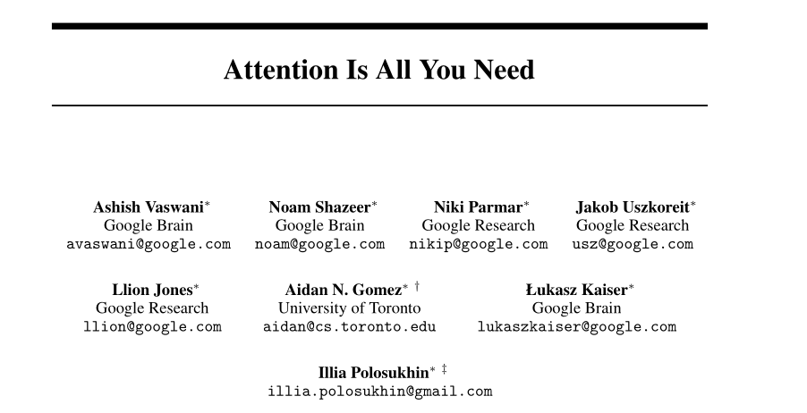


::: footer
Vaswani, A., Shazeer, N., Parmar, N., Uszkoreit, J., Jones, L., Gomez, A. N., et al. (2017). **Attention Is All You Need**. arXiv:1706.03762.
:::


# Transformer networks

* Attentional mechanisms are so powerful that recurrent networks are not even needed anymore.

* **Transformer networks** use **self-attention** in a purely feedforward architecture and outperform recurrent architectures.

* Used in Google BERT and OpenAI GPT-2/3 for text understanding (e.g. search engine queries).

{width=70%}


::: footer
Source: <http://jalammar.github.io/illustrated-transformer/>
:::

::: footer
Vaswani, A., Shazeer, N., Parmar, N., Uszkoreit, J., Jones, L., Gomez, A. N., et al. (2017). **Attention Is All You Need**. arXiv:1706.03762.
:::


# Transformer networks

* Transformer networks use an **encoder-decoder** architecture, each with 6 stacked layers.

{width=80%}


::: footer
Source: <http://jalammar.github.io/illustrated-transformer/>
:::


# Encoder layer

* Each layer of the encoder processes the $n$ words of the input sentence **in parallel**.

* Word embeddings (as in word2vec) of dimension 512 are used as inputs (but learned end-to-end).

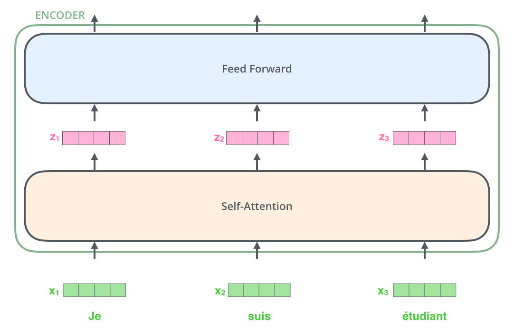{width=70%}


::: footer
Source: <http://jalammar.github.io/illustrated-transformer/>
:::


# Encoder layer

* Two operations are performed on each word embedding $\mathbf{x}_i$: 

    * self-attention vector $\mathbf{z}_i$ depending on the other words.
    
    * a regular feedforward layer to obtain a new representation $\mathbf{r}_i$ (shared among all words). 

{width=65%}


::: footer
Source: <http://jalammar.github.io/illustrated-transformer/>
:::


# Self-attention

* The first step of self-attention is to compute for each word three vectors of length $d_k = 64$ from the embeddings $\mathbf{x}_i$ or previous representations $\mathbf{r}_i$ (d = 512).


    * The **query** $\mathbf{q}_i$ using $W^Q$.
    
    * The **key** $\mathbf{k}_i$ using $W^K$.
    
    * The **value** $\mathbf{v}_i$ using $W^V$.

::: {.columns}
::: {.column width=60%}


::: footer
Source: <http://jalammar.github.io/illustrated-transformer/>
:::

:::
::: {.column width=30%}

* This operation can be done in parallel over all words:


:::
:::


# Self-attention

* Why query / key / value? This a concept inspired from recommendation systems / databases.

* A Python dictionary is a set of key / value entries:

```python
tel = {
    'jack': 4098, 
    'sape': 4139
}
```

* The query would ask the dictionary to iterate over all entries and return the value associated to the key **equal or close to** the query.

```python
tel['jacky'] # 4098
```

* This would be some sort of **fuzzy** dictionary.


# Self-attention


::: {.columns}
::: {.column width=70%}

* In attentional RNNs, the attention scores were used by each word generated by the decoder to decide which **input word** is relevant.

* If we apply the same idea to the **same sentence** (self-attention), the attention score tells how much words of the same sentence are related to each other (context).

    *The animal didn't cross the street because it was too tired.*

* The goal is to learn a representation for the word `it` that contains information about `the animal`, not `the street`.

:::
::: {.column width=30%}


:::
:::


::: footer
Dzmitry Bahdanau, Kyunghyun Cho, Yoshua Bengio (2014). Neural Machine Translation by Jointly Learning to Align and Translate. arXiv:1409.0473
:::

# Self-attention


* Each word $\mathbf{x}_i$ of the sentence generates its query $\mathbf{q}_i$, key $\mathbf{k}_i$ and value $\mathbf{v}_i$.

::: {.columns}
::: {.column width=45%}

* For all other words $\mathbf{x}_j$, we compute the **match** between the query $\mathbf{q}_i$ and the keys $\mathbf{k}_j$ with a dot product:

$$e_{i, j} = \mathbf{q}_i^T \, \mathbf{k}_j$$ 

* We normalize the scores by dividing by $\sqrt{d_k} = 8$ and apply a softmax:

$$a_{i, j} = \text{softmax}(\dfrac{\mathbf{q}_i^T \, \mathbf{k}_j}{\sqrt{d_k}})$$

* The new representation $\mathbf{z}_i$ of the word $\mathbf{x}_i$ is a weighted sum of the values of all other words, weighted by the attention score:

$$\mathbf{z}_i = \sum_{j} a_{i, j} \, \mathbf{v}_j$$

:::
::: {.column width=55%}


:::
:::


::: footer
Source: <http://jalammar.github.io/illustrated-transformer/>
:::


# Self-attention

::: {.columns}
::: {.column width=40%}


::: footer
Source: <http://jalammar.github.io/illustrated-transformer/>
:::

:::
::: {.column width=60%}

* If we concatenate the word embeddings into a $n\times d$ matrix $X$, self-attention only implies matrix multiplications and a row-based softmax:

$$
\begin{cases}
    Q = X \times W^Q \\
    K = X \times W^K \\
    V = X \times W^V \\
    Z = \text{softmax}(\dfrac{Q \times K^T}{\sqrt{d_k}}) \times V \\
\end{cases}
$$


:::
:::


* Note 1: everything is differentiable, backpropagation will work.

* Note 2: the weight matrices do not depend on the length $n$ of the sentence.

# Multi-headed self-attention

* In the sentence *The animal didn't cross the street because it was too tired.*, the new representation for the word `it` will hopefully contain features of the word `animal` after training.

* But what if the sentence was *The animal didn't cross the street because it was too **wide**.*? The representation of `it` should be linked to `street` in that context.

* This is not possible with a single set of matrices $W^Q$, $W^K$ and $W^V$, as they would average every possible context and end up being useless.


::: footer
Source: <https://ai.googleblog.com/2017/08/transformer-novel-neural-network.html>
:::

# Multi-headed self-attention

* The solution is to use **multiple attention heads** ($h=8$) with their own matrices $W^Q_k$, $W^K_k$ and $W^V_k$.


::: footer
Source: <http://jalammar.github.io/illustrated-transformer/>
:::


# Multi-headed self-attention

* Each **attention head** will output a vector $\mathbf{z}_i$ of size $d=512$ for each word.

* How do we combine them?


::: footer
Source: <http://jalammar.github.io/illustrated-transformer/>
:::

# Multi-headed self-attention

* The proposed solution is based on **ensemble learning** (stacking):

    * let another matrix $W^O$ decide which attention head to trust...

    * $8 \times 512$ rows, 512 columns.

{width=80%}

::: footer
Source: <http://jalammar.github.io/illustrated-transformer/>
:::


# Multi-headed self-attention


::: footer
Source: <http://jalammar.github.io/illustrated-transformer/>
:::


# Multi-headed self-attention

::: {.columns}
::: {.column width=50%}


* Each attention head learns a different context:

    * `it` refers to `animal`.

    * `it` refers to `street`.

    * etc.

* The original transformer paper in 2017 used 8 attention heads.

* OpenAI's GPT-3 uses 96 attention heads...

:::
::: {.column width=50%}


:::
:::


::: footer
Source: <http://jalammar.github.io/illustrated-transformer/>
:::

# Encoder layer

* Multi-headed self-attention produces a vector $\mathbf{z}_i$ for each word of the sentence.
    
* A regular feedforward MLP transforms it into a new representation $\mathbf{r}_i$. 

    * one input layer with 512 neurons.

    * one hidden layer with 2048 neurons and a ReLU activation function.

    * one output layer with 512 neurons.

* The same NN is applied on all words, it does not depend on the length $n$ of the sentence.

{width=45%}


::: footer
Source: <http://jalammar.github.io/illustrated-transformer/>
:::


# Positional encoding

* As each word is processed in parallel, the order of the words in the sentence is lost.

*street was animal tired the the because it cross too didn't*

* We need to explicitly provide that information in the **input** using positional encoding.

* A simple method would be to append an index $i = 1, 2, \ldots, n$ to the word embeddings, but it is not very robust.

{width=60%}


::: footer
Source: <http://jalammar.github.io/illustrated-transformer/>
:::


# Positional encoding

* If the elements of the 512-d embeddings are numbers between 0 and 1, concatenating an integer between 1 and $n$ will unbalance the dimensions. 

* Normalizing that integer between 0 and 1 requires to know $n$ in advance, this introduces a maximal sentence length...

* How about we append the binary code of that integer?

{width=30%}

* Sounds good, we have numbers between 0 and 1, and we just need to use enough bits to encode very long sentences. 

* However, representing a binary value (0 or 1) with a 64 bits floating number is a waste of computational resources.

::: footer
Source: <https://kazemnejad.com/blog/transformer_architecture_positional_encoding/>
:::


# Positional encoding

::: {.columns}
::: {.column width=60%}

* We can notice that the bits of the integers oscillate at various frequencies:

    * the lower bit oscillates every number.

    * the bit before oscillates every two numbers.

    * etc.

:::
::: {.column width=35%}


:::
:::


::: {.columns}
::: {.column width=40%}

* We could also represent the position of a word using sine and cosine functions at different frequencies (Fourier basis).

* We create a vector, where each element oscillates at increasing frequencies.

* The "code" for each position in the sentence is unique.

:::
::: {.column width=60%}


:::
:::


::: footer
Source: <https://kazemnejad.com/blog/transformer_architecture_positional_encoding/>
:::


# Positional encoding

* In practice, a 512-d vector is created using sine and cosine functions.

$$
    \begin{cases}
        t(\text{pos}, 2i) = \sin(\dfrac{\text{pos}}{10000^{2 i / 512}})\\
        t(\text{pos}, 2i + 1) = \cos(\dfrac{\text{pos}}{10000^{2 i / 512}})\\
    \end{cases}
$$


{width=60%}


::: footer
Source: <http://jalammar.github.io/illustrated-transformer/>
:::


# Positional encoding

* The positional encoding vector is **added** element-wise to the embedding, not concatenated!

$$\mathbf{x}_{i} = \mathbf{x}^\text{embed}_{i} + \mathbf{t}_i$$


::: footer
Source: <http://jalammar.github.io/illustrated-transformer/>
:::


# Encoder layer

::: {.columns}
::: {.column width=50%}


* Last tricks of the encoder layers:

    * skip connections (residual layer)

    * layer normalization

* The input $X$ is added to the output of the multi-headed self-attention and normalized (zero mean, unit variance).

* **Layer normalization** (Ba et al., 2016) is an alternative to batch normalization, where the mean and variance are computed over single vectors, not over a minibatch:

$$\mathbf{z} \leftarrow \dfrac{\mathbf{z} - \mu}{\sigma}$$

with $\mu = \dfrac{1}{d} \displaystyle\sum_{i=1}^d z_i$ and $\sigma = \dfrac{1}{d} \displaystyle\sum_{i=1}^d (z_i - \mu)^2$.


::: footer
Ba, J. L., Kiros, J. R., & Hinton, G. E. (2016). Layer Normalization. ArXiv:1607.06450
:::

:::
::: {.column width=50%}


* The feedforward network also uses a skip connection and layer normalization.

:::
:::


::: footer
Source: <http://jalammar.github.io/illustrated-transformer/>
:::


# Encoder

* We can now stack 6 (or more, 96 in GPT-3) of these encoder layers and use the final representation of each word as an input to the decoder.


::: footer
Source: <http://jalammar.github.io/illustrated-transformer/>
:::


# Decoder

* In the first step of decoding, the final representations of the encoder are used as query and value vectors of the decoder to produce the first word. 

* The input to the decoder is a "start of sentence" symbol.


::: footer
Source: <http://jalammar.github.io/illustrated-transformer/>
:::


# Decoder

* The decoder is **autoregressive**: it outputs words one at a time, using the previously generated words as an input.


::: footer
Source: <http://jalammar.github.io/illustrated-transformer/>
:::


# Decoder layer

::: {.columns}
::: {.column width=55%}

* Each decoder layer has two multi-head attention sub-layers:

    * A self-attention sub-layer with query/key/values coming from the generated sentence.

    * An **encoder-decoder** attention sub-layer, with the query coming from the generated sentence and the key/value from the encoder.

* The encoder-decoder attention is the regular attentional mechanism used in seq2seq architectures.

* Apart from this additional sub-layer, the same residual connection and layer normalization mechanisms are used.

:::
::: {.column width=45%}


:::
:::


::: footer
Vaswani, A., Shazeer, N., Parmar, N., Uszkoreit, J., Jones, L., Gomez, A. N., et al. (2017). **Attention Is All You Need**. arXiv:1706.03762.
:::


# Masked self-attention

* When the sentence has been fully generated (up to the `<eos>` symbol), **masked self-attention** has to applied in order for a word in the middle of the sentence to not "see" the solution in the input when learning.

* As usual, learning occurs on minibatches of sentences, not on single words.


::: footer
Source: <https://jalammar.github.io/illustrated-gpt2/>
:::

# Output

* The output of the decoder is a simple softmax classification layer, predicting the one-hot encoding of the word using a vocabulary (`vocab_size=25000`).


{width=60%}


::: footer
Source: <http://jalammar.github.io/illustrated-transformer/>
:::

# Training procedure


* The transformer is trained on the WMT datasets:

    * English-French: 36M sentences, 32000 unique words.

    * English-German: 4.5M sentences, 37000 unique words.

* Cross-entropy loss, Adam optimizer with scheduling, dropout. Training took 3.5 days on 8 P100 GPUs.

* The sentences can have different lengths, as the decoder is autoregressive.

* The transformer network beat the state-of-the-art performance in translation with less computations and without any RNN.

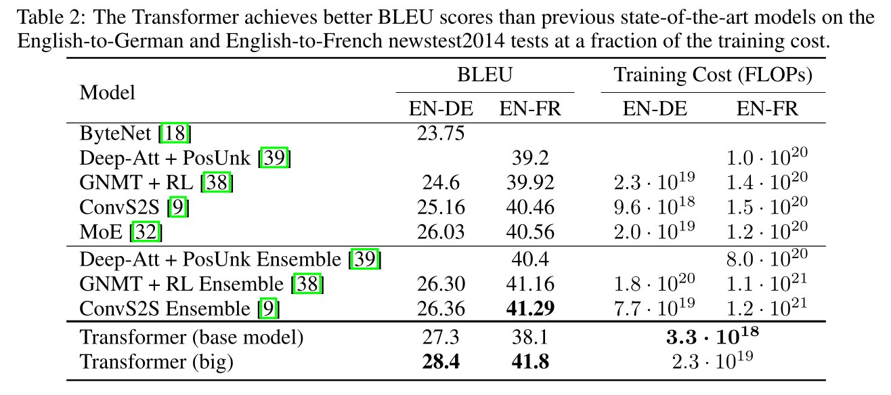{width=60%}

::: footer
Vaswani, A., Shazeer, N., Parmar, N., Uszkoreit, J., Jones, L., Gomez, A. N., et al. (2017). **Attention Is All You Need**. arXiv:1706.03762.
:::

# 2 - Self-supervised transformers

# Transformer-based language models

* The Transformer is considered as the **AlexNet** moment of natural language processing (NLP).

* However, it is limited to supervised learning of sentence-based translation.

* Two families of architectures have been developed from that idea to perform all NLP tasks using **unsupervised pretraining** or **self-supervised training**:

    * BERT (Bidirectional Encoder Representations from Transformers) from Google.

    * GPT (Generative Pre-trained Transformer) from OpenAI.

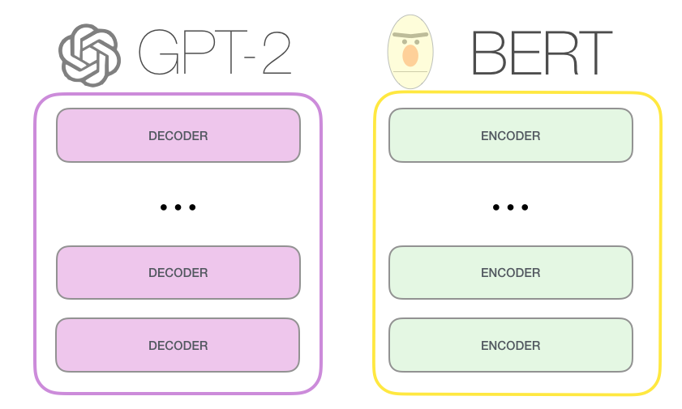{width=40%}

::: footer
Source: <https://jalammar.github.io/illustrated-gpt2/>
:::

::: footer
Devlin J, Chang M-W, Lee K, Toutanova K. 2019. BERT: Pre-training of Deep Bidirectional Transformers for Language Understanding. arXiv:181004805
:::

::: footer
GPT: <https://openai.com/blog/better-language-models/>
:::

# BERT - Bidirectional Encoder Representations from Transformers

* BERT only uses the encoder of the transformer (12 layers, 12 attention heads, $d = 768$). 

* BERT is pretrained on two different unsupervised tasks before being fine-tuned on supervised tasks.

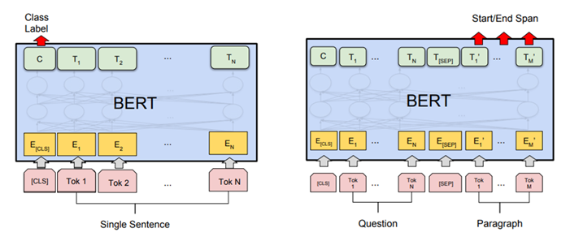

::: footer
Devlin J, Chang M-W, Lee K, Toutanova K. 2019. BERT: Pre-training of Deep Bidirectional Transformers for Language Understanding. arXiv:181004805
:::

# BERT - Bidirectional Encoder Representations from Transformers

* **Task 1:** Masked language model. Sentences from BooksCorpus and Wikipedia (3.3G words) are presented to BERT during pre-training, with 15% of the words masked.

* The goal is to predict the masked words from the final representations using a shallow FNN.

{width=60%}


::: footer
Source: <https://jalammar.github.io/illustrated-bert/>
:::


# BERT - Bidirectional Encoder Representations from Transformers

* **Task 2:** Next sentence prediction. Two sentences are presented to BERT. 

* The goal is to predict from the first representation whether the second sentence should follow the first.

{width=60%}


::: footer
Source: <https://jalammar.github.io/illustrated-bert/>
:::


# BERT - Bidirectional Encoder Representations from Transformers


* Once BERT is pretrained, one can use **transfer learning** with or without fine-tuning from the high-level representations to perform:

    * sentiment analysis / spam detection

    * question answering

{width=70%}

::: footer
Source: <https://jalammar.github.io/illustrated-bert/>
:::


# BERT - Bidirectional Encoder Representations from Transformers


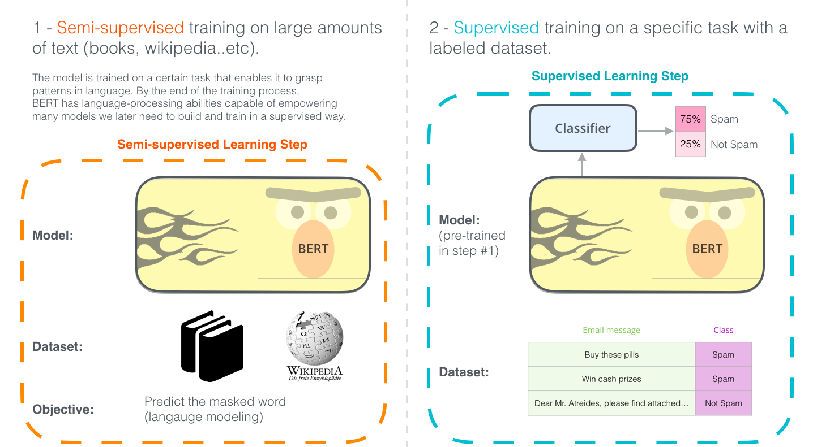


::: footer
Source: <https://jalammar.github.io/illustrated-bert/>
:::


# GPT - Generative Pre-trained Transformer

* As the Transformer, GPT is an **autoregressive** language model learning to predict the next word using only the transformer's **decoder**.


::: footer
Source: <https://jalammar.github.io/illustrated-gpt2/>
:::


# GPT - Generative Pre-trained Transformer


::: footer
Source: <https://jalammar.github.io/illustrated-gpt2/>
:::


# GPT - Generative Pre-trained Transformer

* GPT-2 comes in various sizes, with increasing performance.

* GPT-3 is even bigger, with 175 **billion** parameters and a much larger training corpus.


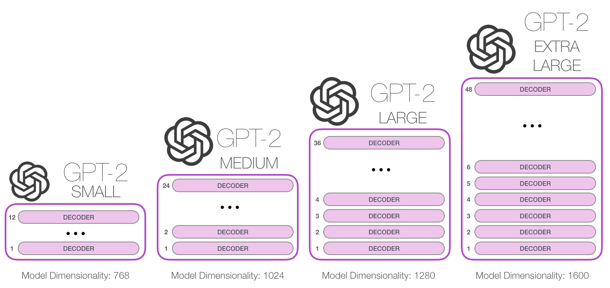

::: footer
Source: <https://jalammar.github.io/illustrated-gpt2/>
:::


# GPT - Generative Pre-trained Transformer

* GPT can be fine-tuned (transfer learning) to perform **machine translation**.


::: footer
Source: <https://jalammar.github.io/illustrated-gpt2/>
:::


# GPT - Generative Pre-trained Transformer

* GPT can be fine-tuned to summarize Wikipedia articles.


::: footer
Source: <https://jalammar.github.io/illustrated-gpt2/>
:::


# GPT - Generative Pre-trained Transformer

* GPT can be fine-tuned to summarize Wikipedia articles.


::: footer
Source: <https://jalammar.github.io/illustrated-gpt2/>
:::


# Try transformers at https://huggingface.co/

```bash
pip install transformers
```

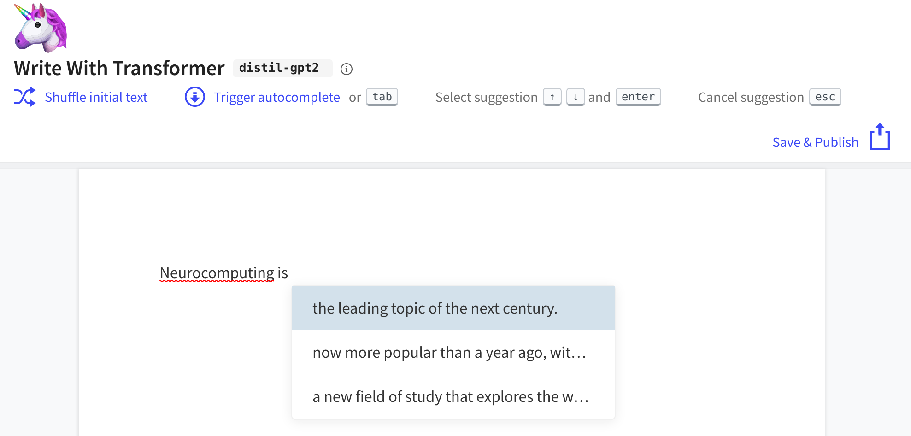


# Github copilot

* Github and OpenAI trained a GPT-3-like architecture on the available open source code.

* Copilot is able to "autocomplete" the code based on a simple comment/docstring.

<https://copilot.github.com/>


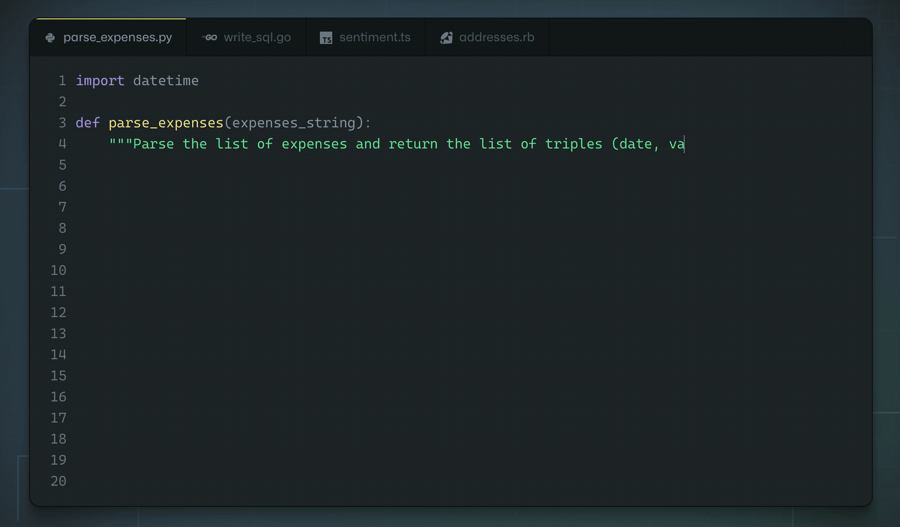{width=80%}

# Transformers and NLP

* All NLP tasks (translation, sentence classification, text generation) are now done using transformer-like architectures (BERT, GPT), **unsupervisedly** pre-trained on huge corpuses. 

* BERT can be used for feature extraction, while GPT is more generative.

* Transformer architectures seem to **scale**: more parameters = better performance. Is there a limit?

::: {.columns}
::: {.column width=50%}


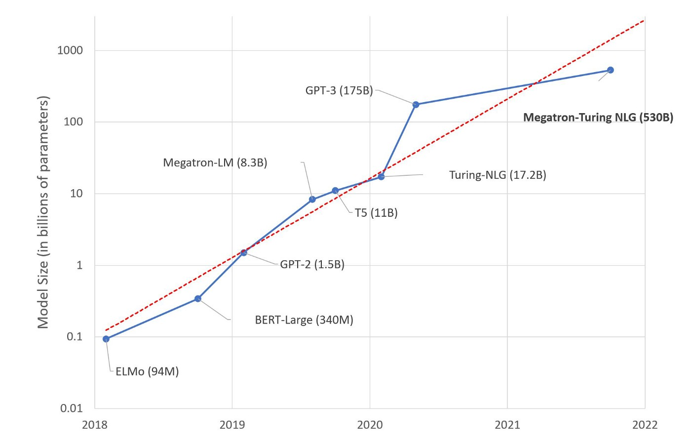

::: footer
Source: <https://julsimon.medium.com/large-language-models-a-new-moores-law-66623de5631b>
:::

:::
::: {.column width=50%}


* The price to pay is that these models are very expensive to train (training one instance of GPT-3 costs 12M$) and to use (GPT-3 is only accessible with an API). 

* Many attempts have been made to reduce the size of these models while keeping a satisfying performance.

    * DistilBERT, RoBERTa, BART, T5, XLNet...

* See <https://medium.com/mlearning-ai/recent-language-models-9fcf1b5f17f5>

:::
:::


# 3 - Vision transformers

# Vision transformer (ViT)

* The transformer architecture can also be applied to computer vision, by splitting images into a **sequence** of small patches (16x16).

* The sequence of vectors can then be classified by the output of the transformer using labels.

{width=60%}

::: footer
Dosovitskiy A, Beyer L, Kolesnikov A, Weissenborn D, Zhai X, Unterthiner T, Dehghani M, Minderer M, Heigold G, Gelly S, Uszkoreit J, Houlsby N. 2021. An Image is Worth 16x16 Words: Transformers for Image Recognition at Scale. arXiv:201011929
:::


# Vision transformer (ViT)

* The Vision Transformer (ViT) outperforms state-of-the-art CNNs while requiring less computations.

{width=70%}

{width=60%}

::: footer
Dosovitskiy A, Beyer L, Kolesnikov A, Weissenborn D, Zhai X, Unterthiner T, Dehghani M, Minderer M, Heigold G, Gelly S, Uszkoreit J, Houlsby N. 2021. An Image is Worth 16x16 Words: Transformers for Image Recognition at Scale. arXiv:201011929
:::

::: footer
<https://ai.googleblog.com/2020/12/transformers-for-image-recognition-at.html>
:::

# Self-supervised Vision Transformer (SiT)

* ViT only works on big supervised datasets (ImageNet). Can we benefit from self-supervised learning as in BERT or GPT?

* The Self-supervised Vision Transformer (SiT) has an denoising autoencoder-like structure, reconstructing corrupted patches autoregressively.

{width=70%}

::: footer
Atito, S., Awais, M., and Kittler, J. (2021). SiT: Self-supervised vIsion Transformer. arXiv:2104.03602
:::

# Self-supervised Vision Transformer (SiT)

* Self-supervised learning is possible through from **data augmentation** techniques.

* Various corruptions (masking, replacing, color distortion, blurring) are applied to the input image, but SiT must reconstruct the original image (denoising autoencoder). 

{width=70%}

* An auxiliary **rotation loss** forces SiT to predict the orientation of the image (e.g. 30°). Another auxiliary **contrastive loss** ensures that high-level representations are different for different images.

{width=70%}

::: footer
Atito, S., Awais, M., and Kittler, J. (2021). SiT: Self-supervised vIsion Transformer. arXiv:2104.03602
:::

# Self-distillation with no labels (DINO)

* A recent approach for self-supervised learning has been proposed by Facebook AI researchers using **self-distillation**.

* The images are split into **global** and **local patches** at different scales.

* Global patches contain label-related information (whole objects) while local patches contain finer details.

{width=60%}

::: footer
Caron, M., Touvron, H., Misra, I., Jégou, H., Mairal, J., Bojanowski, P., et al. (2021). Emerging Properties in Self-Supervised Vision Transformers. arXiv:2104.14294
:::

::: footer
Source: <https://towardsdatascience.com/on-dino-self-distillation-with-no-labels-c29e9365e382>
:::


# Self-distillation with no labels (DINO)

::: {.columns}
::: {.column width=70%}

* The idea of **self-distillation** in DINO is to use two similar ViT networks to classify the patches.

* The **teacher** network gets the global views as an input, while the **student** network get both the local and global ones.

* Both have a MLP head to predict the softmax probabilities, but do **not** use any labels.

:::
::: {.column width=30%}


:::
:::


* The student tries to imitate the output of the teacher, by minimizing the **cross-entropy** (or KL divergence) between the two probability distributions.

* The teacher slowly integrates the weights of the student (momentum or exponentially moving average ema):

$$\theta_\text{teacher} \leftarrow \beta \, \theta_\text{teacher} + (1 - \beta) \, \theta_\text{student}$$

::: footer
Caron, M., Touvron, H., Misra, I., Jégou, H., Mairal, J., Bojanowski, P., et al. (2021). Emerging Properties in Self-Supervised Vision Transformers. arXiv:2104.14294
:::


# Self-distillation with no labels (DINO)


::: footer
Caron, M., Touvron, H., Misra, I., Jégou, H., Mairal, J., Bojanowski, P., et al. (2021). Emerging Properties in Self-Supervised Vision Transformers. arXiv:2104.14294
:::

::: footer
Source: <https://ai.facebook.com/blog/dino-paws-computer-vision-with-self-supervised-transformers-and-10x-more-efficient-training/>
:::


# Self-distillation with no labels (DINO)

::: {.columns}
::: {.column width=50%}


* The predicted classes do not matter when pre-training, as there is no ground truth. 

* The only thing that matters is the **high-level representation** of an image before the softmax output, which can be used for transfer learning.

* Self-distillation forces the representations to be meaningful at both the global and local scales, as the teacher gets global views. 

* ImageNet classes are already separated in the high-level representations: a simple kNN (k-nearest neighbour) classifier achieves 74.5% accuracy (vs. 79.3% for a supervised ResNet50).

:::
::: {.column width=50%}


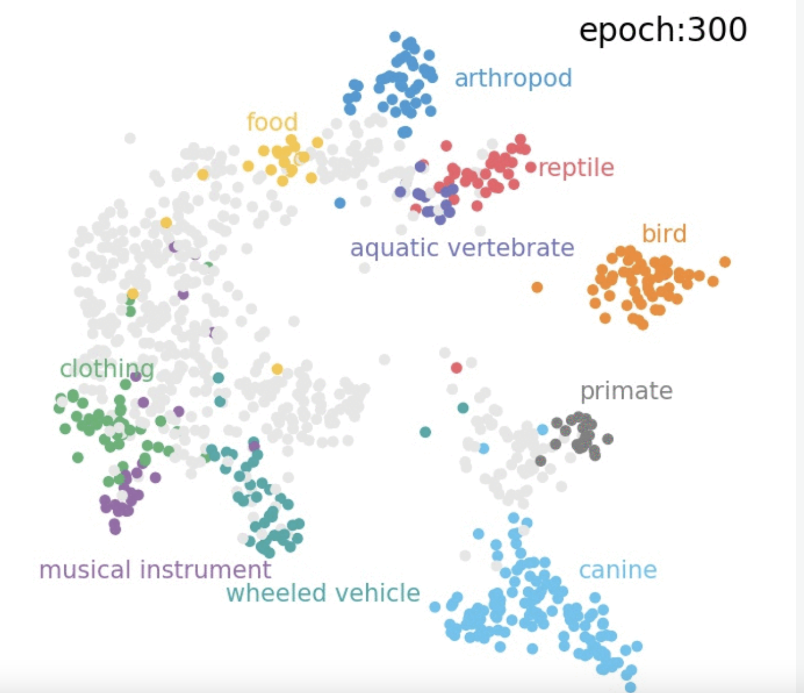

:::
:::


::: footer
<https://ai.facebook.com/blog/dino-paws-computer-vision-with-self-supervised-transformers-and-10x-more-efficient-training>
:::


# Self-distillation with no labels (DINO)

* More interestingly, by looking at the self-attention layers, one can obtain saliency maps that perform **object segmentation** without ever having been trained to!

<br>

<video data-autoplay src="videos/DINO.mp4" style="display:block; margin: 0 auto 10px 10px; width: 90%" loop allow="autoplay loop"></video>

::: footer
Source: <https://www.youtube.com/watch?v=8I1RelnsgMw>
:::

# Transformer for time series

* Transformers can also be used for time-series classification or forecasting instead of RNNs.

* Example: weather forecasting, market prices, etc.

::: {.columns}
::: {.column width=40%}

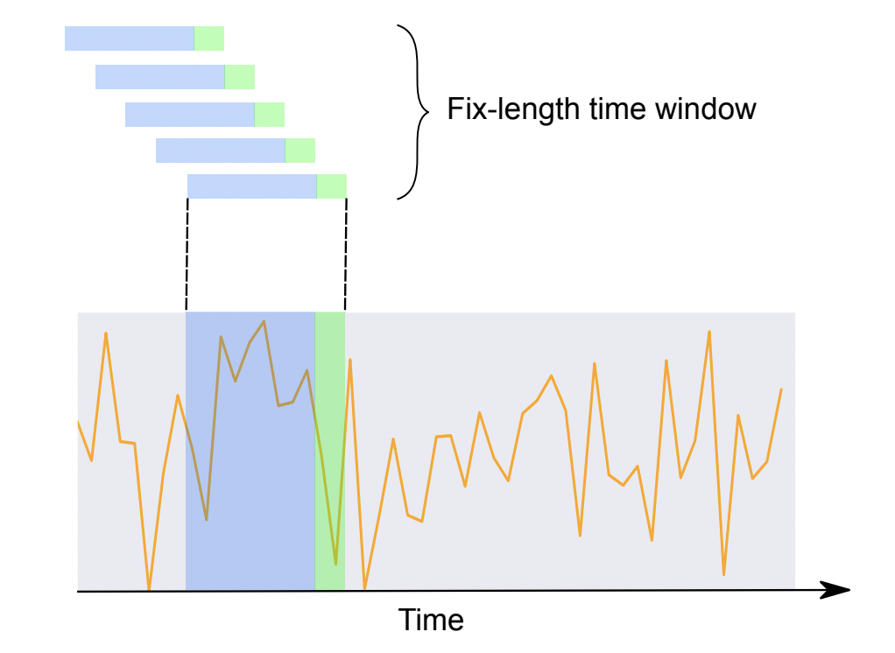

:::
::: {.column width=60%}

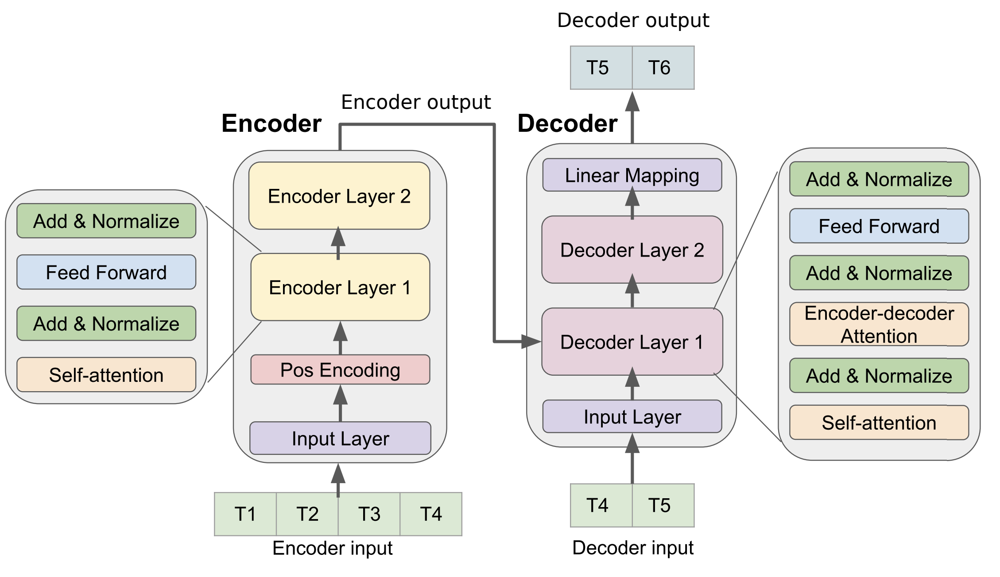

:::
:::


::: footer
Wu, N., Green, B., Ben, X., and O’Banion, S. (2020). Deep Transformer Models for Time Series Forecasting: The Influenza Prevalence Case. arXiv:2001.08317
:::

# References

* Various great blog posts by Jay Alammar to understand attentional networks, transformers, etc:

<https://jalammar.github.io/visualizing-neural-machine-translation-mechanics-of-seq2seq-models-with-attention/>

<http://jalammar.github.io/illustrated-transformer/>

<https://jalammar.github.io/illustrated-bert/>

<https://jalammar.github.io/illustrated-gpt2/>

* Application of transformers outside NLP:

<https://medium.com/swlh/transformers-are-not-only-for-nlp-cd837c9f175>

* Extensions of the Vision Transformer:

<https://theaisummer.com/transformers-computer-vision/>