# 1 - AI hype

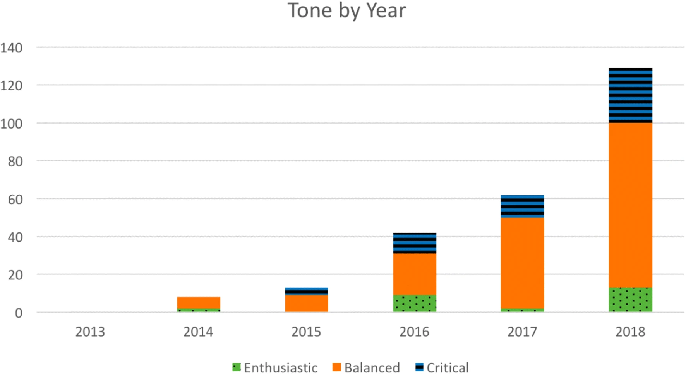

::: footer
Source: <https://link.springer.com/article/10.1007/s00146-020-00965-5>
:::

---

> *"Intuition, insight, and learning are no longer exclusive possessions of human beings: any large high-speed computer can be programed to exhibit them also."*

. . .

> **Herbert Simon**, MIT, Nobel Prize, Turing award, **1958**.

---

<video data-autoplay  src="videos/thinkingmachine.mp4" style="display:block; margin: 0 auto 10px 10px; width: 800px" controls allow="autoplay loop"></video>

::: footer
Source: <https://www.youtube.com/watch?v=aygSMgK3BEM>
:::

---

> *"If a typical person can do a mental task with less than one second of thought, we can probably automate it using AI either now or in the near future."*
>
> **Andrew Ng**, Stanford University, Google Brain / Baidu, 2016.

---

> *"The development of full artificial intelligence could spell the end of the human race... It would take off on its own, and re-design itself at an ever increasing rate. Humans, who are limited by slow biological evolution, couldn't compete, and would be superseded."*
>
> **Stephen Hawking**, Cambridge University, 2014.

---

> *"Artificial intelligence will reach human levels by around 2029. Follow that out further to, say, 2045, we will have multiplied the intelligence, the human biological machine intelligence of our civilization a billion-fold."*
>
> **Ray Kurzweil**, Google, 2017.

# The singularity

* If technological progress continues at its current rate, it will increase **exponentially**.

* Artificial Intelligence will soon reach the human intelligence level: this is the **singularity**.

* Past that point, **super artificial intelligence** will be infinitely more intelligent than humans.

* **Skynet** syndrome: Will machines still need us after the singularity?

* Kurzweil and colleagues argue for **transhumanity**, i.e. the augmentation of human intelligence by super AI.

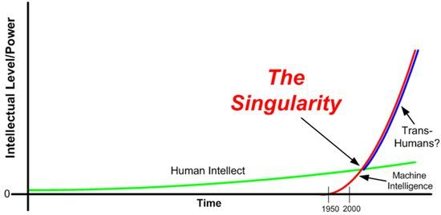

::: footer
Source: <https://hpluspedia.org/wiki/The_Singularity>
:::

# Moore's law

* The singularity hypothesis relies on an exponential increase of computational power.

* **Moore's law** (the number of transistors in a dense integrated circuit doubles about every two years) is the only known physical process following an exponential curve, and it is coming to an end.

{width=60%}

::: footer
Source: <https://www.alleywatch.com/2017/03/preparing-end-moores-law/>
:::

# The singularity

* But is scientific knowledge exponentially increasing?

> *"Max Planck said, 'Science progresses one funeral at a time.' The future depends on some graduate student who is deeply suspicious of everything I have said"*
>
> **Geoffrey Hinton**, Univ. Toronto, 2017.

* Is the current deep learning approach taking all the light, at the expense of more promising approaches?

* Science progresses with **breakthroughs**, which are by definition unpredictable.

* **Serendipity** (luck + curiosity) is at the heart of scientific discoveries (gravity, microwaves, etc).

# 2 - Current limitations of  deep learning

# Data is never infinite

* Deep networks are very powerful and complex models, which tend to **overfit** (bad interpolation).

* They learn their parameters from the training data only:

# Data is never infinite

* Deep networks are very powerful and complex models, which tend to **overfit** (bad interpolation).

* They learn their parameters from the training data only:

# Data is never infinite

::: {.columns}
::: {.column width=50%}

* Datasets for deep learning are typically huge:

    * ImageNet (14 million images)

    * OpenImages (9 million images)

    * Machine Translation of Various Languages (30 million sentences)

    * Librispeech (1000 hours of speech)

    * ...

* The deeper your network, the more powerful, but the more data it needs to be useful.

* Solutions: data augmentation, transfer learning, unsupervised pre-training...

:::
::: {.column width=50%}

:::
:::

::: footer
Source: <https://patrykchrabaszcz.github.io/Imagenet32/>
:::

# Data is never infinite

* Deep Reinforcement Learning has the same **sample complexity** problem: it needs many trial-and-errors to find a correct behavior.

* DQN and its variants need 200 million frames to learn to play Atari games: 38 days of uninterrupted human playing...

::: {.columns}
::: {.column width=50%}

:::
::: {.column width=50%}

:::
:::

* On December 18th 2018, Google Deepmind defeated the human team "Mana" on Starcraft II, a much more complex game than Go for computers.

*"The AlphaStar league was run for 14 days, using 16 TPUs for each agent. During training, each agent experienced up to 200 years of real-time StarCraft play."*

::: footer
Source: <https://deepmind.com/blog/alphastar-mastering-real-time-strategy-game-starcraft-ii/>
:::

# Computational power and energy

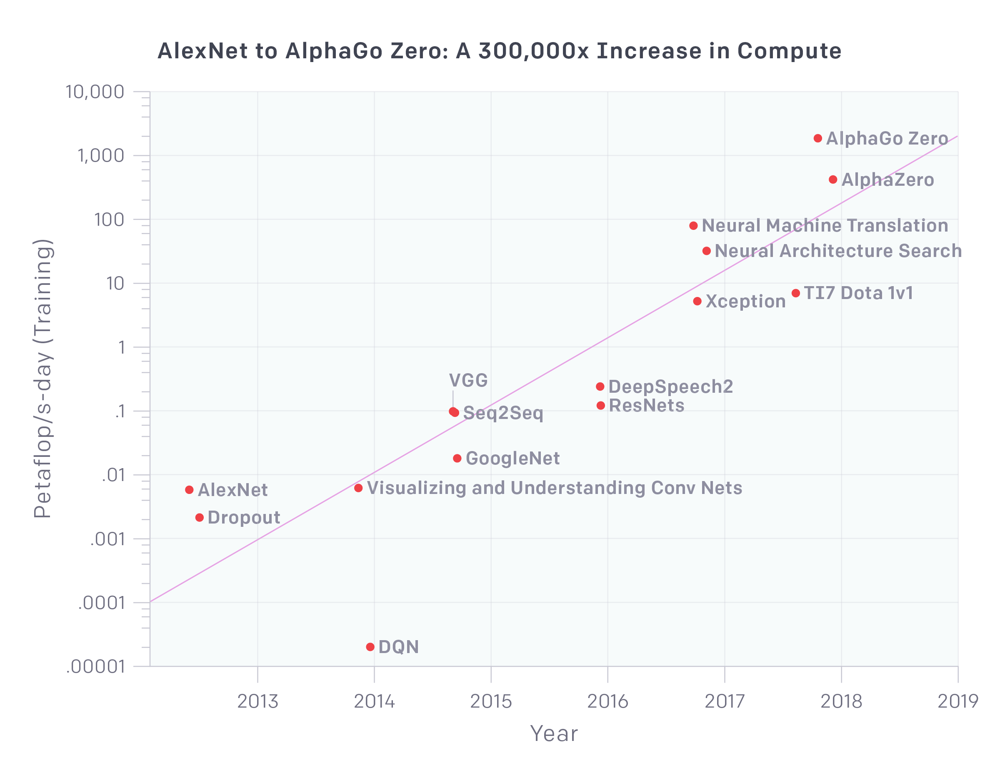{width=80%}

::: footer
Source : <https://openai.com/blog/ai-and-compute/>
:::

# Computational power and energy

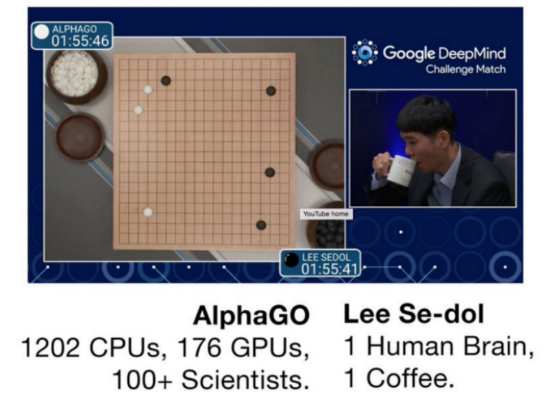{width=60%}

* AlphaGo consumes 1 MW. The world total electricity production is around 25 TW (25 million AlphaGos).

* The humain brain needs 20 W.

::: footer
Source: <https://www.ceva-dsp.com/ourblog/artificial-intelligence-leaps-forward-mastering-the-ancient-game-of-go/>
:::

# Computational power and energy

* The computational power needed by deep networks increases exponentially: more layers, more parameters, more data, more everything.

* Training modern deep networks is now out of reach of most universities / companies.

* GPT-3 (OpenAI) was trained on 500B words (Wikipedia, Common Crawl) and has 175B parameters. Training it on a single V100 would take 355 years and cost 4.6 M\$ in the cloud.

::: {.columns}
::: {.column width=50%}

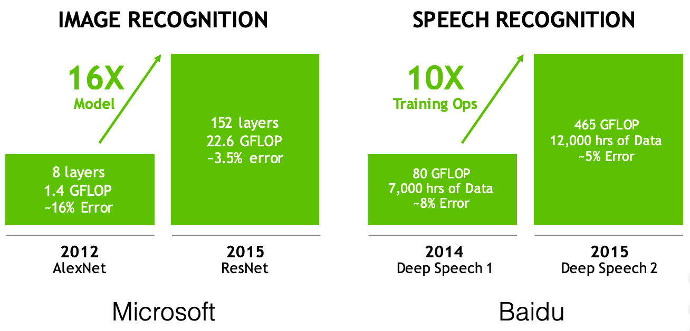{width=80%}

:::
::: {.column width=50%}

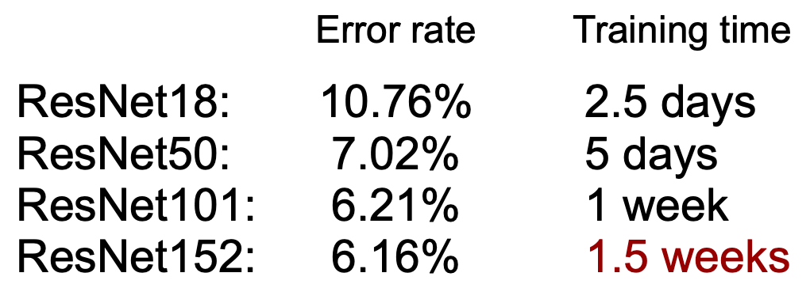

:::
:::

* **Inference times** (making a prediction after training) become prohibitive: it is hard to use deep networks on low-budget hardware such as smartphones or embedded hardware (FPGA, DSP), computations must be deported to the cloud. 

* Can't we make the networks smaller after training?

::: footer
Source: Dally, NIPS’2016 workshop on Efficient Methods for Deep Neural Networks
:::

::: footer
Source: <https://lambdalabs.com/blog/demystifying-gpt-3/>
:::

# Quantization

* NN require single or double-precision floating numbers (32 or 64 bits) to represent weights during learning, as small learning rates are used (e.g. $10^{-5}$) to add very small quantities to them.

* After learning, do we need such a high precision? 2.378898437534897932 $\approx$ 2.4

* **Quantization** consists of transforming the weights into 8-bits integers or even 1 or 2 bits (binary networks) without losing (too much accuracy). 

* Frameworks such as Tensorflow Lite, TensorRT or PyTorch allow to automatically apply quantization on pretrained networks and embed, or even to use Quantization-aware training (QAT). 

* See <https://arxiv.org/pdf/2004.09602.pdf> for a review.

::: footer
Source: <https://medium.com/@kaustavtamuly/compressing-and-accelerating-high-dimensional-neural-networks-6b501983c0c8>
:::

# Pruning

* Another technique to reduce inference times by making the networks smaller is **pruning**: removing weights, filters, neurons or even layers that are not necessary after learning. 

::: {.columns}
::: {.column width=60%}

:::
::: {.column width=40%}

* NN need a lot of weights/neurons to find the solution (training), but not obligatorily to implement it. 

* Several metrics or techniques can be used to decide whether or not to keep parameters:

    * thresholds
    * redundancy
    * contribution to loss

:::
:::

* Some methods iteratively re-train the network after pruning, leading to reductions up to 90%.

* See <https://link.springer.com/article/10.1007/s10462-020-09816-7> for a review.

::: footer
Source: <https://towardsdatascience.com/pruning-deep-neural-network-56cae1ec5505>
:::

# Model distillation

* The deep **teacher** learns to perform classification on the **hard** one-hot encoded labels.

* Its knowledge can be transferred (**distilled**) to a shallower network.

* The shallow **student** learns to perform **regression** on the logits $\mathbf{z}$ of the softmax output of the teacher, which is easier and leads to the same accuracy!

$$
    y_j = P(\text{class = j} | \mathbf{x}) = \mathcal{S}(z_j) = \frac{\exp(z_j)}{\sum_k \exp(z_k)}
$$

* Logits carry information about the similarity between classes: cats are closer to dogs than to cars.

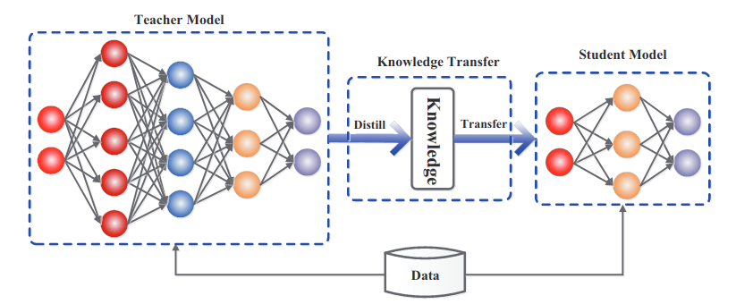{width=60%}

::: footer
Hinton G, Vinyals O, Dean J. 2015. Distilling the Knowledge in a Neural Network. arXiv:150302531
:::

::: footer
Source: Gou J, Yu B, Maybank SJ, Tao D. 2020. Knowledge Distillation: A Survey. arXiv:200605525
:::

# Data is biased

* Deep networks only learn from data, so if the data is wrong or **biased**, the predictions will reproduce it.

* **Scenario 1:** you use AI to sort CVs based on how well your previous employees performed.

    * If you only hired white middle-aged men in the past, the AI will discard all the others. (Amazon)

<!--
* **Scenario 2:** you use AI to predict whether an individual is likely to commit a crime based on population statistics.

$\rightarrow$ Black people are 37% of the incarcerated population in the US, but only 12% of the population. Black people will be overly tagged as potential criminals. (DoJ)
-->

* **Scenario 2:** You train your speech recognition system on male American voices.

    * You will not recognize female voices or foreign accents well (everybody).

* **Scenario 3:** You create an AI chatbot on twitter, "Tay.ai", learning from conversations with the twitter crowd.

    * The chatbot became in hours a horrible sexist, racist, homophobic monster (Microsoft).

* AI bias is currently taken very seriously by the major players.

::: footer
Source: <https://www.fastcompany.com/40536485/now-is-the-time-to-act-to-stop-bias-in-ai>, <https://www.weforum.org/agenda/2019/01/to-eliminate-human-bias-from-ai-we-need-to-rethink-our-approach/>
:::

# Adversarial attacks

{width=60%}

* One major problem of deep networks is that they are easy to fool.

* Instead of searching for the weights which produce the right output for a given image (training), you search for the image that produces a different output for a given set of trained weights (adversarial training).

* It turns out that a minimal change on the input image is enough to completely change the output of a trained network.

* Using neural networks everywhere (self-driving cars, biometric recognition) poses serious security issues which are unsolved as of now.

* Many different attacks and defenses are currently investigated <https://arxiv.org/pdf/1712.07107.pdf>.

::: footer
Source: <https://blog.openai.com/adversarial-example-research>, <https://arxiv.org/abs/1707.08945>
:::

# Adversarial attacks

::: {.columns}
::: {.column width=50%}

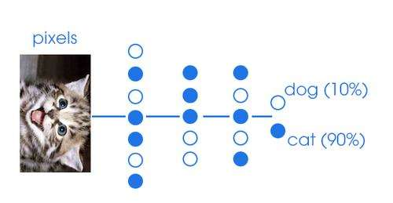

:::
::: {.column width=50%}

* Let's suppose we have a network trained to recognize cats from dogs using the loss function $\mathcal{L}(\theta)$.

* As an attacker, you want to find a cat-like image $\mathbf{x}'$ that makes the network answer `dog`.

* You define an adversarial loss making the network want to answer `dog` for a cat image:

$$
    \mathcal{L}_\text{adversarial}(\mathbf{x}) = \mathbb{E}_{\mathbf{x} \in  \text{cat}} ||\text{dog} - \mathbf{y}(\mathbf{x})||^2
$$

:::
:::

* Starting from a cat image $\mathbf{x}$, you can apply gradient descent **on the image space** to minimize the adversarial loss:

$$
    \Delta \mathbf{x} = - \eta \, \frac{\partial \mathcal{L}_\text{adversarial}(\mathbf{x})}{\partial \mathbf{x}}
$$

* One should add a constraint on $\Delta \mathbf{x}$ to keep it small (Lagrange optimization).

* You only need access to the output $\mathbf{y}$ to attack the network, not its weights (**blackbox attack**)

# Adversarial attacks

::: {.columns}
::: {.column width=60%}

* Adversarial attacks work even when printed on paper.

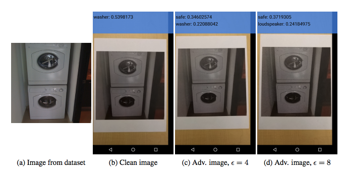

* Object detection:

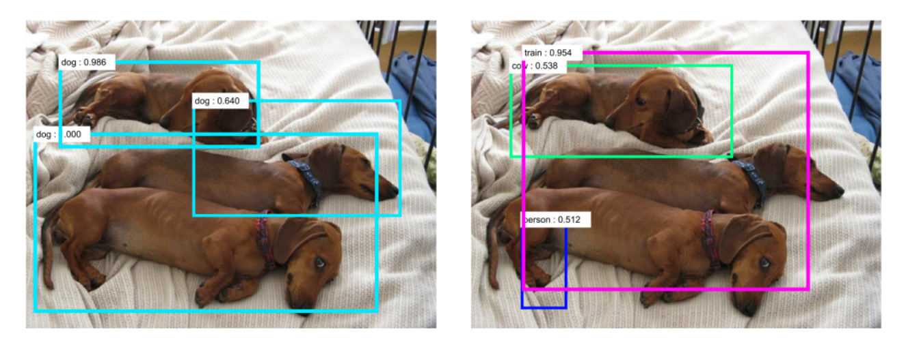

:::
::: {.column width=40%}

* They also work in real life: a couple of stickers are enough to have this stop sign recognized as a speed limit sign by an autonomous car...

* Face identification is a major issue:

:::
:::

::: footer
Source: <https://blog.openai.com/adversarial-example-research>, <https://arxiv.org/abs/1707.08945>
:::

# Learning is mostly offline

* NN are prone to **catastrophic forgetting**: if you learn A then B, you forget A.

{width=70%}

* The only solution is to mix A and B during training (**stochastic** gradient descent).

* **Online learning**  or **lifelong learning** is very difficult: you can't adapt a NN once it has learned.

* Currently a hot topic of research, but not working yet.

# One task at a time

* The fact that computers can be better than humans on single tasks should not be worrying:

    * The program written by Jim Slagle for his PhD thesis with Marvin Minsky was already better than MIT students at calculus in **1961**.

::: {.columns}
::: {.column width=70%}

* Deep networks are still highly specialized, they do either:

    * Computer Vision

    * Speech processing

    * Natural Language Processing

    * Motor Control

but never two at the same time.

:::
::: {.column width=30%}

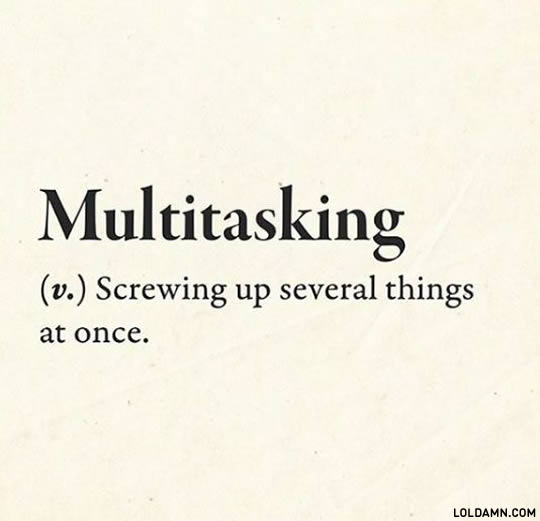

:::
:::

* Some may be able to play different games at the same time (DQN, AlphaZero) but it stays in the same domain.

* The ability to perform different tasks at the same time is a criteria for **general intelligence**.

# Overattribution

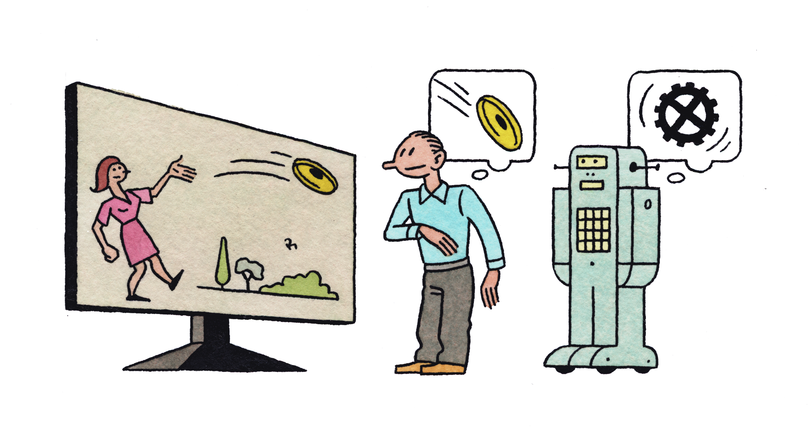{width=60%}

* Deep networks do not learns concepts such as cats, dogs, paddles or walls: they merely learn correlations between images and labels.

* Comparative (animal) psychology sometimes call this phenomenon **overattribution**.

* We want AI to be intelligent, so we attribute it intelligent features.

* The only way to verify this is to have deep networks **verbalize** their decisions (not there yet).

<!--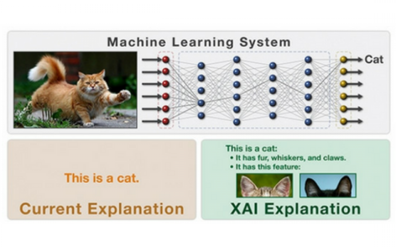{width=60%}-->

::: footer
<https://www.technologyreview.com/s/609048/the-seven-deadly-sins-of-ai-predictions/>
:::

# Explainable / interpretable AI

* Research on **interpretability** (XAI, explainable AI) may allow to better understand and trust how deep networks take decisions.

* Neural networks are **black box models**: they are able to learn many things, but one does not know how.

    * Can we really trust their decisions? Safety-critical applications.

* **Layer-wise relevance propagation** allows to visualize which part of the input is most resposnible for the prediction.

* It is a form of backpropagation, but from the prediction $\mathbf{y}$ to the input $\mathbf{x}$, instead of from the loss function $\mathcal{L}(\theta)$ to the parameters $\theta$.

* See <http://www.heatmapping.org/> for explanations and code.

::: footer
Binder, A., Montavon, G., Bach, S., Müller, K.-R., and Samek, W. (2016). Layer-wise Relevance Propagation for Neural Networks with Local Renormalization Layers. arXiv:1604.00825
:::

# Explainable / interpretable AI

* The results are sometimes surprising.

* Horse images in Pascal VOC all have a tag in the bottom left. The CNN has learned to detect that tag, not the horse...

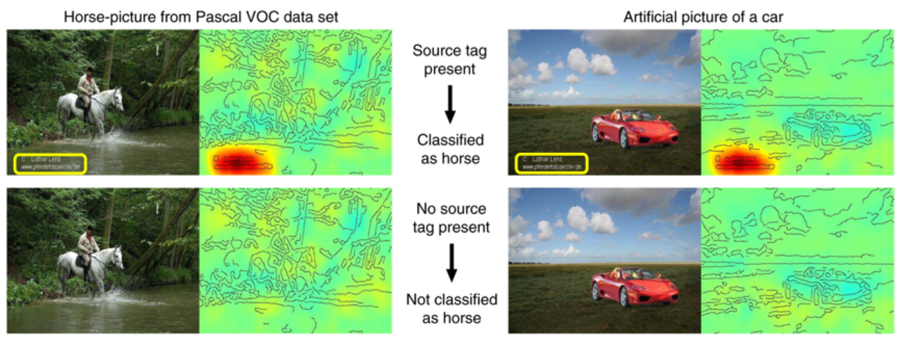

::: footer
Lapuschkin et al. (2019). Unmasking Clever Hans predictors and assessing what machines really learn. Nature Communications 10, 1096. doi:10.1038/s41467-019-08987-4.
:::

# 3 - What deep learning might never be able to do

# No real generalization

* Deep networks can be forced to interpolate with **enough data** (generalization), but cannot **extrapolate**.

* For example, CNNs do not generalize to different viewpoints, unless you add them to the training data:

::: {.columns}
::: {.column width=50%}

:::
::: {.column width=50%}

:::
:::

::: footer
Sources: <http://imatge-upc.github.io/telecombcn-2016-dlcv> <https://towardsdatascience.com/real-artificial-intelligence-understanding-extrapolation-vs-generalization-b8e8dcf5fd4b>
:::

---

> A **schmister** is a sister over the age of 10 but under the age of 21.
>
> Do you have a schmister?

# Lack of abstraction

* Deep learning currently lacks a mechanism for learning abstractions through explicit, verbal definition.

* They would need to experience thousands of sentences with schmister before they can use it.

> "Indeed even 7-month old infants can do so, acquiring learned abstract language-like rules from a small number of unlabeled examples, in just two minutes (Marcus, Vijayan, Bandi Rao, & Vishton, 1999)."
>
> Marcus, G. (2018). Deep Learning: A Critical Appraisal. arXiv:1801.00631.

---

> I stuck a pin in a carrot; when I pulled the pin out, it had a hole.
>
> What has a hole, the carrot or the pin?

# Lack of common sense

::: {.columns}
::: {.column width=50%}

* DL models do not have a **model of physics**: if the task (and the data) do not contain physics, it won't learn it.

* DL finds **correlations** between the inputs and the outputs, but not the **causation**.

* Using gigantic datasets as in GPT-3 might give the illusion of reasoning, but it sometimes fails on surprisingly simple tasks.

* DL has no **theory of mind**: when playing against humans (Go), it does not bother inferring the opponent's mental state, it just plays his game.

:::
::: {.column width=50%}

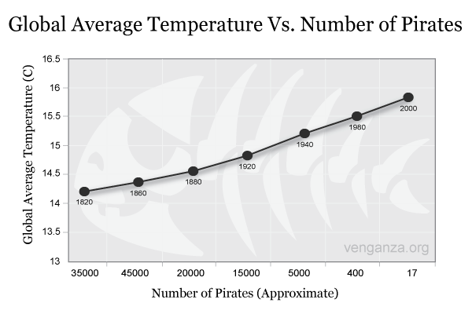

:::
:::

* No DL model to date has been able to show **causal reasoning** (or at least in a generic way).

* Other AI approaches are better at causal reasoning (hierarchical Bayesian computing, probabilistic graphical models), but they do not mix well with deep learning yet.

# Game fallacy

* Deep learning has only been successful on relatively "easy" tasks until now.

* Games like Chess or Go are easy for AI, as the rules are simple, fixed and deterministic.

* Things get much more complicated when you go in the real-world: think of where the Robocup is.

* Moravec's paradox:

> it is comparatively easy to make computers exhibit adult level performance on intelligence tests or playing checkers, and difficult or impossible to give them the skills of a one-year-old when it comes to perception and mobility.

<https://blog.piekniewski.info/2016/11/15/ai-and-the-ludic-fallacy/>

---

<video data-autoplay  src="videos/robocup.mp4" style="display:block; margin: 0 auto 10px 10px; width: 800px" controls allow="autoplay loop"></video>

::: footer
Source: <https://www.youtube.com/watch?v=1h5147KLikU>
:::

---

<video data-autoplay  src="videos/moravecparadox.mp4" style="display:block; margin: 0 auto 10px 10px; width: 800px" controls allow="autoplay loop"></video>

::: footer
Source: <https://www.youtube.com/watch?v=jxvZ0AdM0SY>
:::

---

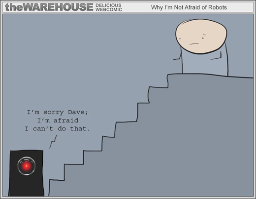

::: footer
Source <http://blogs.discovermagazine.com/sciencenotfiction/2011/06/25/towards-a-new-vision-of-the-singularity/>
:::

# Embodiment

::: {.columns}
::: {.column width=50%}

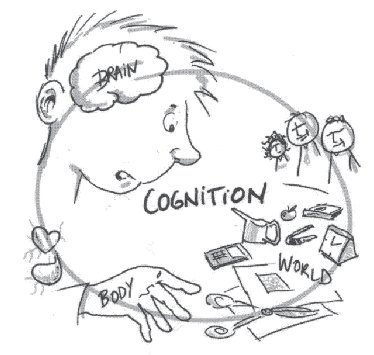

:::
::: {.column width=50%}

* Intelligence and cognition require a **body** to interact with the world.

* The brain is not an isolated number cruncher.

* The body **valuates** the world: it provides needs, goals, emotions.

* It can even be a co-processor of the brain: gut feelings.

* Emotions are totally absent from the current AI approach.

* Goals are set externally: so-called AIs do not form their own goals (desirable?).

* Deep Reinforcement Learning is a first small step in that direction.

:::
:::

::: footer
<https://www.researchgate.net/publication/295399680_Impact_of_Perception_Theories_on_Kansei_Design>
:::

# Conclusion on the limits of deep learning

* Deep learning methods are very powerful and have not reached yet their full potential for technological applications.

* However, there are fundamental reasons why deep learning methods may not reach **general intelligence**.

* End-to-end learning with **backpropagation** works very well, but what if it was the problem?

> My view is throw it all away and start again.
>
> *Geoffrey Hinton on backpropagation.*

* The only intelligent system we know is the **brain**. 

* By taking inspiration from how the brain works, instead of <strike>stupidly</strike> minimizing loss functions, we **may** be able to reach human intelligence.

# References

* Marcus, G. (2018). Deep Learning: A Critical Appraisal. arXiv:1801.00631. Available at: <http://arxiv.org/abs/1801.00631>.

* Marcus, G. (2018). In defense of skepticism about deep learning. Available at: <https://medium.com/@GaryMarcus/in-defense-of-skepticism-about-deep-learning-6e8bfd5ae0f1>.

* Piekniewski, F. (2018). AI winter is well on its way. Piekniewski’s blog. Available at: <https://blog.piekniewski.info/2018/05/28/ai-winter-is-well-on-its-way>.

* Brooks, R. (2019). Predictions Scorecard, 2019 January 01. Available at: <http://rodneybrooks.com/predictions-scorecard-2019-january-01>.

* Richbourg, R. (2018). ‘It’s Either a Panda or a Gibbon’: AI Winters and the Limits of Deep Learning. Available at: <https://warontherocks.com/2018/05/its-either-a-panda-or-a-gibbon-ai-winters-and-the-limits-of-deep-learning>.

* Seif, G. (2019). Is Deep Learning Already Hitting its Limitations? Available at: <https://towardsdatascience.com/is-deep-learning-already-hitting-its-limitations-c81826082ac3>.

* Hawkins, J (2015). The Terminator Is Not Coming. The Future Will Thank Us. Available at: <https://www.recode.net/2015/3/2/11559576/the-terminator-is-not-coming-the-future-will-thank-us>.
