# 1 - Towards biological deep learning?

# The credit assignment problem

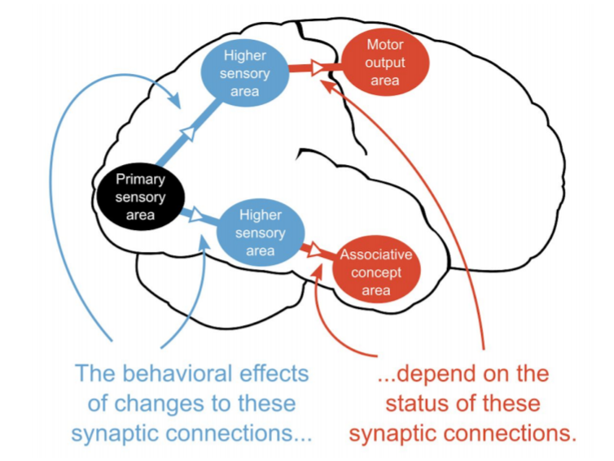

::: footer
<https://simons.berkeley.edu/sites/default/files/docs/9574/backpropagationanddeeplearninginthebrain-timothylillicrap.pdf>
::: 

# Backpropagation is not biologically plausible

::: {.columns}
::: {.column width=50%}

* Backpropagation solves the credit assignment problem by transmitting the error gradient **backwards** through the weights ($\sim$ synapses).

$$\Delta W_0 = \eta \, (\mathbf{t} - \mathbf{y}) \times W_1 \times \mathbf{x}^T$$

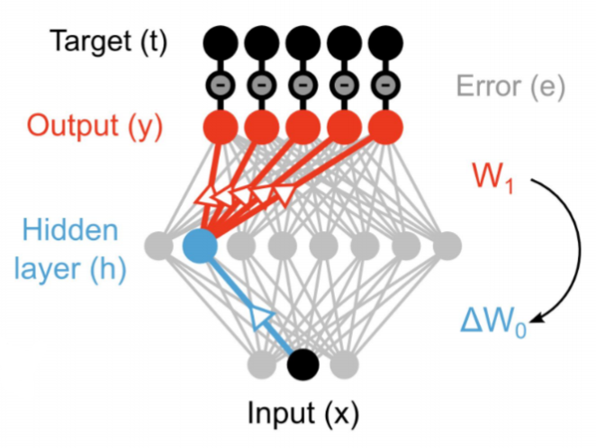

* But information only goes in one direction in the brain: from the presynaptic neuron to the postsynaptic one.

:::
::: {.column width=50%}

* A synapse does know not the weight of other synapses and cannot transmit anything backwards.

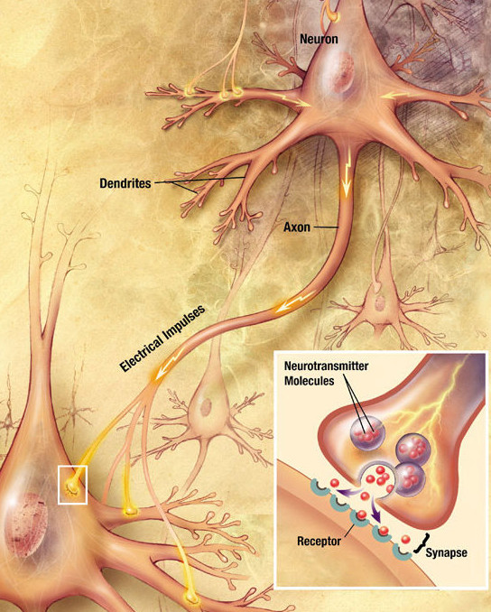{width=80%}

:::
:::

::: footer
<https://simons.berkeley.edu/sites/default/files/docs/9574/backpropagationanddeeplearninginthebrain-timothylillicrap.pdf>
::: 

# Feedback alignment

::: {.columns}
::: {.column width=45%}

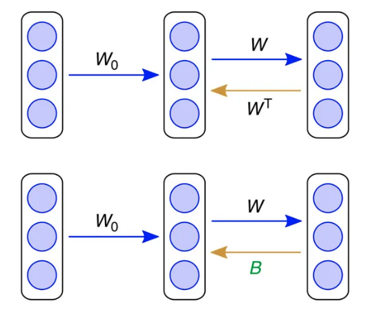

:::
::: {.column width=55%}

* An alternative mechanism consists of backpropagating the error through another set of **feedback weights**.

* Feedback connections are ubiquitous in the brain, especially in the neocortex.

* The feedback weights do not need to learn: they can stay random.

* The mechanism only works for small networks on MNIST.

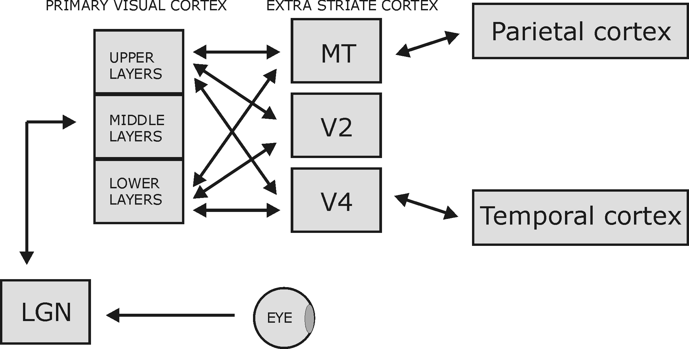

:::
:::

::: footer
Lillicrap, T. P., Cownden, D., Tweed, D. B., and Akerman, C. J. (2016). Random synaptic feedback weights support error backpropagation for deep learning. Nat Commun 7, 1–10. doi:10.1038/ncomms13276.
:::

# Deep learning architectures are way too simple and unidirectional

::: {.columns}
::: {.column width=50%}

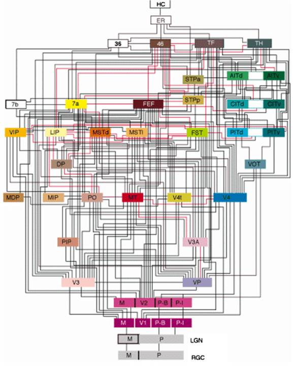

:::
::: {.column width=50%}

* Deep learning architectures are mostly unidirectional, from the input to the output, without feedback connections.

* The brain is totally differently organized: a big "mess" of interconnected areas processing everything in parallel.

* The figure on the left is only for vision, and only for the cerebral cortex: the thalamus, basal ganglia, hippocampus, cerebellum, etc, create additional shortcuts.

* Is the complex structure of the brain just a side effect of evolution, or is it the only possible solution?

* **Inductive bias**: the choice of the architecture constrains the functions it can perform / learn.

:::
:::

::: footer
Felleman, D. J., and Van Essen, D. C. (1991). Distributed hierarchical processing in the primate cerebral cortex. Cereb. Cortex 1, 1–47. doi:10.1093/cercor/1.1.1.
:::

# Biological neurons have dynamics

* The **artificial neuron** has no dynamics, it is a simple mathematical function:

$$
    y = f( \sum_{i=1}^d w_i \, x_i + b)
$$

* If you do not change the inputs to an artificial neuron, its output won't change.

* Time does not exist, even in a LSTM: the only temporal variable is the frequency at which inputs are set.

::: {.columns}
::: {.column width=50%}

:::
::: {.column width=50%}

* Biological neurons have **dynamics**: 

    * They adapt their firing rate to constant inputs.

    * they continue firing after an input disappears.

    * they fire even in the absence of inputs (tonic).

* These dynamics are essential to information processing in the brain.

:::
:::

# Recurrent dynamics and emergence of functions

* Recurrent networks of dynamical neurons can exhibit very complex dynamics. 

* Biological neural networks evolve at the **edge of chaos**, i.e. in a highly non-linear regime while still being deterministic.

::: {.columns}
::: {.column width=50%}

* This allows the **emergence** of complex functions:

    * the whole is more than the sum of its parts.

:::
::: {.column width=50%}

:::
:::

# Overview of neuron models

# Self-organization
  

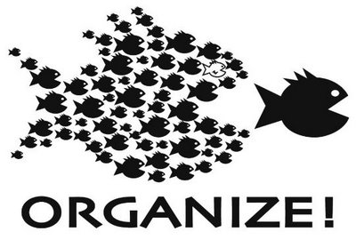{width=40%}

*  There are two complementary approaches to unsupervised learning: 

    * the **statistical approach**,  which tries to extract the most relevant information from the distribution of unlabeled data (autoencoders, etc).

    * **self-organization**, which tries to understand the principles of organization of natural systems and use them to create efficient algorithms.

* Self-organization is a generic process relying on four basic principles: locality of computations, learning, competition and cooperation.

# Self-organization

* **Self-organization** is observed in a wide range of natural processes: 

    * Physics: formation of crystals, star formation, chemical reactions...
    
    * Biology: folding of proteins, social insects, flocking behavior, brain functioning, Gaia hypothesis...
    
    * Social science: critical mass, group thinking, herd behavior... 

::: {.columns}
::: {.column width=50%}

{width=70%}

:::
::: {.column width=50%}

{width=70%}

:::
:::

# Self-organization : locality of computations and learning

::: {.columns}
::: {.column width=50%}

**Not self-organized:**

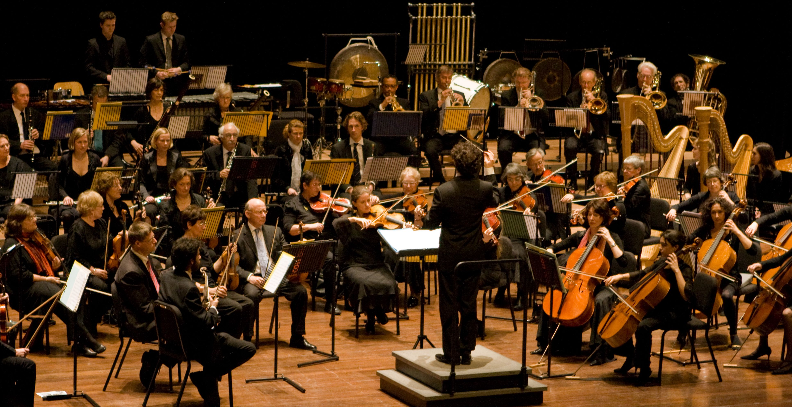

:::
::: {.column width=50%}

**Self-organized:**

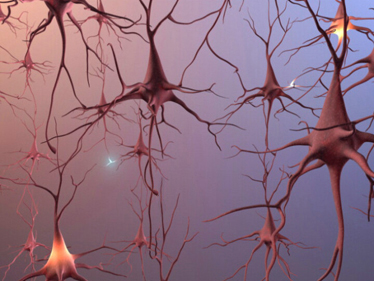{width=60%}

:::
:::

* A self-organizing system is composed of elementary units (particles, cells, neurons, organs, individuals...) which all perform similar deterministic functions (rule of behavior) on a small part of the available information.

* There is **no central supervisor** or coordinator that knows everything and tells each unit what to do: 

    * they have their own rule of behavior and apply it to the information they receive.

* The units are able to adapt their behavior to the available information: principle of **localized learning**.

* There is no **explicit loss function** specifying what the system should do: **emergence**.

# Example: Conway's game of life.

::: {.columns}
::: {.column width=50%}

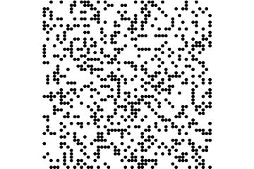

::: footer
<https://www.jakubkonka.com/2015/03/15/game-of-life.html>
:::

:::
::: {.column width=50%}

* The rules of Conway's **Game of Life** (1970) are extremely simple:

    * A cell is either **dead** or **alive**.

    * A living cell with less than 1 neighbor dies. 

    * A living cell with more than 4 neighbors dies. 

    * A dead cell with 3 neighbors relives. 

:::
:::

* Despite this simplicity, GoL can exhibit very complex patterns (fractals, spaceships, pulsars).

* The GoL is an example of self-organizing **cellular automata**.

::: footer
<https://en.wikipedia.org/wiki/Conway%27s_Game_of_Life>
:::

# Key differences between deep networks and the brain

::: {.columns}
::: {.column width=50%}

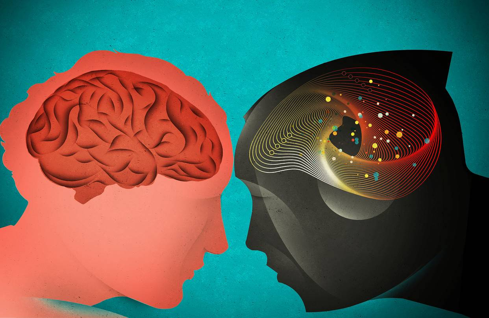

:::
::: {.column width=50%}

* **No backpropagation** in the brain, at least in its current form.

* Information processing is **local** to each neuron and synapse.

* Highly **recurrent** architecture (feedback connections).

* Neurons have **non-linear dynamics**, especially as populations (edge of chaos).

* **Emergence** of functions: the whole is more than the sum of its parts

* **Self-organization**. There is no explicit loss function to minimize: the only task of the brain is to ensure survival of the organism (homeostasis).

:::
:::

::: footer
<https://www.wsj.com/articles/should-artificial-intelligence-copy-the-human-brain-1533355265>
:::
