# 1 - Associative memory

# Procedural vs. episodic memory

* In deep learning, our biggest enemy was **overfitting**, i.e. learning by heart the training examples. 

* But what if it was actually useful in cognitive tasks?

* Deep networks implement a **procedural memory**: they know **how** to do things.

* A fundamental aspect of cognition is **episodic memory**: remembering **when** specific events happened.

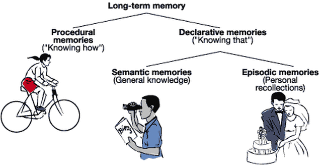

::: footer
<https://brain-basedlearning.weebly.com/memory.html>
:::

# When can episodic memory be useful?

* Episodic memory is particularly useful when retrieving memories from **degraded** or **partial** inputs.

* When the reconstruction is similar to the remembered input, we talk about **auto-associative memory**. 

* An item can be retrieved by just knowing part of its content: **content-adressable memory**.

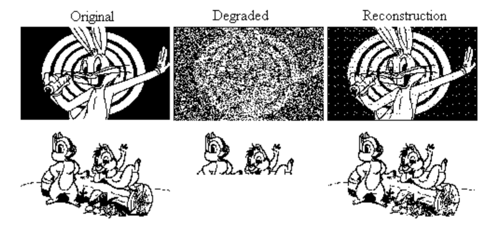 

::: footer
<https://www.cs.cmu.edu/~bhiksha/courses/deeplearning/Fall.2015/slides/lec14.hopfield.pdf>
:::

# Auto-associative memory

Hmunas rmebmeer iamprtnot envtes in tiher leivs. You mihgt be albe to rlecal eervy deiatl of yuor frist eaxm at cllgeoe; or of yuor fsirt pbuilc sepceh; or of yuor frsit day in katigrneedrn; or the fisrt tmie you wnet to a new scohol atefr yuor fimlay mveod to a new ctiy. Hmaun moemry wkors wtih asncisoatois. If you haer the vicoe of an old fernid on the pnohe, you may slntesnoauopy rlaecl seortis taht you had not tghuoht of for yares. If you are hrgnuy and see a pcturie of a bnaana, you mihgt vdivliy rclael the ttsae and semll of a bnanaa and teerbhy rieazle taht you are ideend hngury. In tihs lcterue, we peesrnt modles of nrueal ntkweros taht dbriecse the rcaell of puielovsry seortd imtes form mmorey.

> Text scrambler by http://www.stevesachs.com/jumbler.cgi

# Auto-associative memory

::: {.columns}
::: {.column width=50%}

* The classical approach is the **nearest neighbour** algorithm.

* One compares a new input to each of the training examples using a given metric (distance) and assigns the input to the closest example.

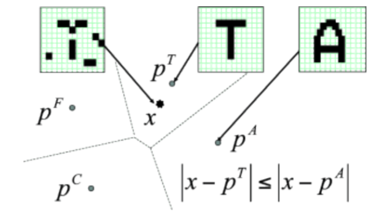

:::
::: {.column width=50%}

* Another approach is to have a recurrent neural network **memorize** the training examples and retrieve them given the input. 

:::
:::

::: footer
<http://didawiki.di.unipi.it/lib/exe/fetch.php/bionics-engineering/computational-neuroscience/2-hopfield-hand.pdf>
:::

# Hetero-associative memory

* When the reconstruction is different from the input, it is an **hetero-associative memory**.

* Hetero-associative memories often work in both directions (bidirectional associative memory): 

    * name $\leftrightarrow$ face.

{width=70%}

::: footer
<https://slideplayer.com/slide/7303074/>
:::

<!-- # Proust's madeleine

::: {.columns}
::: {.column width=50%}

“No sooner had the warm liquid mixed with the crumbs touched my palate than a shudder ran through me and I stopped, intent upon the extraordinary thing that was happening to me. An exquisite pleasure had invaded my senses, something isolated, detached, with no suggestion of its origin. And at once the vicissitudes of life had become indifferent to me, its disasters innocuous, its brevity illusory – this new sensation having had on me the effect which love has of filling me with a precious essence; or rather this essence was not in me it was me. ... Whence did it come? What did it mean? How could I seize and apprehend it? ... And suddenly the memory revealed itself. The taste was that of the little piece of madeleine which on Sunday mornings at Combray (because on those mornings I did not go out before mass), when I went to say good morning to her in her bedroom, my aunt Léonie used to give me, dipping it first in her own cup of tea or tisane. The sight of the little madeleine had recalled nothing to my mind before I tasted it. And all from my cup of tea.”

:::
::: {.column width=50%}

> Marcel Proust, In Search of Lost Time

:::
:::

 -->

# 2 - Hopfield networks

# Feedforward and recurrent neural networks

* Feedforward networks only depend on the current input:

$$\mathbf{y}_t = f(W \times \mathbf{x}_t + \mathbf{b})$$

* Recurrent networks also depend on their previous output:

$$\mathbf{y}_t = f(W \times [\mathbf{x}_t \, ; \, \mathbf{y}_{t-1}] + \mathbf{b})$$

* Both are strongly dependent on their inputs and do not have their own dynamics.

::: footer
<https://www.researchgate.net/publication/266204519_A_Survey_on_the_Application_of_Recurrent_Neural_Networks_to_Statistical_Language_Modeling>
:::

# Hopfield networks

::: {.columns}
::: {.column width=50%}

* **Hopfield networks** only depend on a single input (one constant value per neuron) and their previous output using **recurrent weights**:

$$\mathbf{y}_t = f(\mathbf{x} + W \times \mathbf{y}_{t-1} + \mathbf{b})$$

* For a single constant input $\mathbf{x}$, one lets the network **converge** for enough time steps $T$ and observe what the final output $\mathbf{y}_T$ is.

* Hopfield network have their own **dynamics**: the output evolves over time, but the input is constant.

* One can even omit the input $\mathbf{x}$ and merge it with the bias $\mathbf{b}$: the dynamics will only depend on the **initial state** $\mathbf{y}_0$.

$$\mathbf{y}_t = f(W \times \mathbf{y}_{t-1} + \mathbf{b})$$

:::
::: {.column width=50%}

:::
:::

::: footer
Source: Wikipedia
:::

# Hopfield networks

::: {.columns}
::: {.column width=50%}

* Binary Hopfield networks use **binary units**. 

* The neuron $i$ has a net activation $x_i$ (**potential**) depending on the other neurons $j$ through weights $w_{ji}$:

$$x_i = \sum_{j \neq i} w_{ji} \, y_j + b$$

* The output $y_i$ is the sign of the potential:

$$y_i = \text{sign}(x_i)$$

$$\text{sign}(x) = \begin{cases} +1 \; \text{if} \, x>0 \\ -1 \; \text{otherwise.}\end{cases}$$

* There are **no self-connections**: $w_{ii} = 0$.

* The weights are **symmetrical**: $w_{ij} = w_{ji}$.

:::
::: {.column width=50%}

* In matrix-vector form:

$$\mathbf{y} = \text{sign}(W \times \mathbf{y} + \mathbf{b})$$

:::
:::

::: footer
<http://didawiki.di.unipi.it/lib/exe/fetch.php/bionics-engineering/computational-neuroscience/2-hopfield-hand.pdf>
:::

# Hopfield networks

* At each time step, a neuron will **flip** its state if the sign of the potential $x_i = \sum_{j \neq i} w_{ji} \, y_j + b$ does not match its current output $y_i$.

* This will in turn modify the potential of all other neurons, who may also flip. The potential of that neuron may change its sign, so the neuron will flip again.

* After a finite number of iterations, the network reaches a **stable state** (proof later).

* Neurons are evaluated one after the other: **asynchronous evaluation**.

::: footer
<https://www.cs.cmu.edu/~bhiksha/courses/deeplearning/Fall.2015/slides/lec14.hopfield.pdf>
:::

# Hopfield networks

* Let's consider a Hopfield network with 5 neurons, **sparse connectivity** and no bias.

* In the initial state, 2 neurons are on (+1), 3 are off (-1).

{width=60%}

# Hopfield networks

* Let's evaluate the top-right neuron. 

* Its potential is -4 * 1 + 3 * (-1) + 3 * (-1) = -10 $<$ 0. Its output stays at -1. 

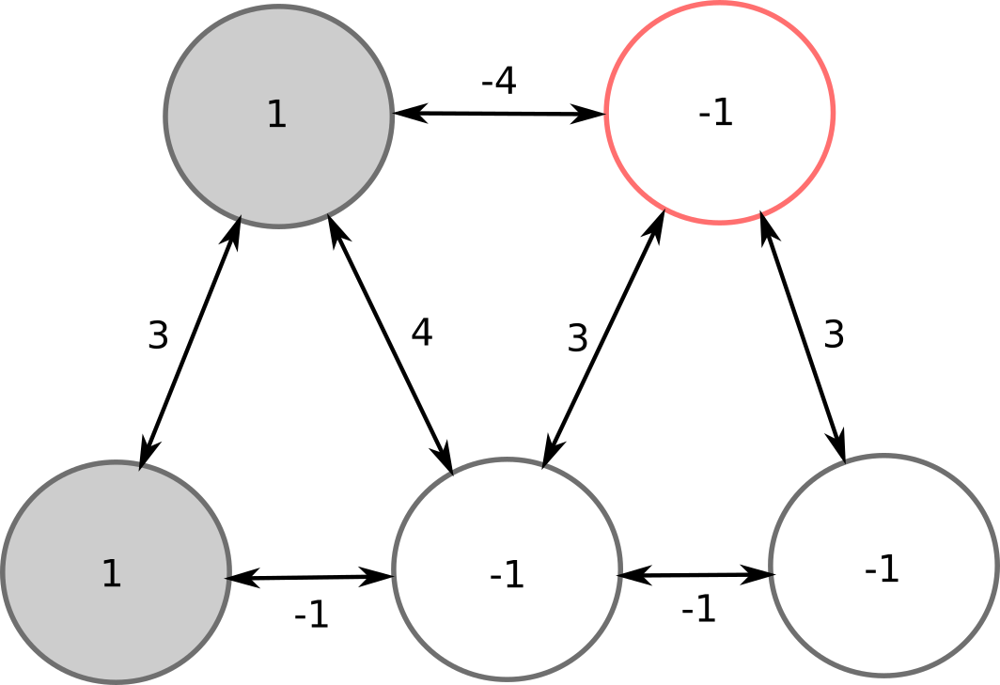{width=60%}

# Hopfield networks

* Now the bottom-left neuron.

* The same: 3 * 1 + (-1) * (-1) = 4 $>$ 0, the output stays at +1.

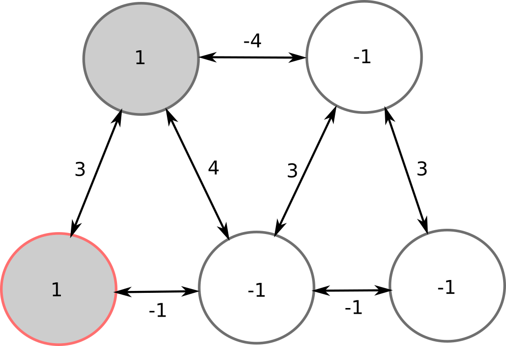{width=60%}

# Hopfield networks

* But the bottom-middle neuron has to flip its sign: -1 * 1 + 4 * 1 + 3 * (-1) - 1 * (-1) = 1 $>$ 0.

* Its new output is +1.

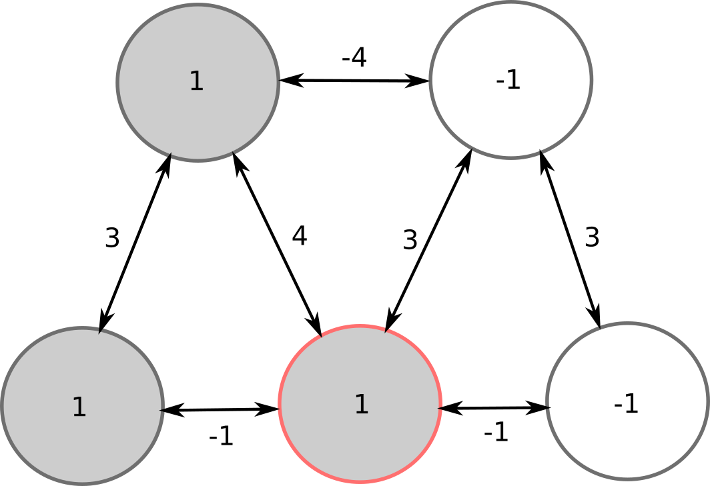{width=60%}

# Hopfield networks

* We can continue evaluating the neurons, but nobody will flip its sign.

* This configuration is a **stable pattern** of the network.

{width=60%}

# Hopfield networks

* There is another stable pattern, where the two other neurons are active: **symmetric** or **ghost** pattern.

* All other patterns are unstable and will eventually lead to one of the two **stored patterns**.

{width=60%}

# Hopfield networks

::: {.columns}
::: {.column width=50%}

:::
::: {.column width=50%}

:::
:::

* The weight matrix $W$ allows to encode a given number of stable patterns, which are **fixed points** of the network's dynamics.

* Any initial configuration will converge to one of the stable patterns.

# Hopfield networks

::: {.columns}
::: {.column width=50%}

* Initialize a **symmetrical weight matrix** without self-connections. 

* Set an input to the network through the bias $\mathbf{b}$.

* **while** not stable:

    * Pick a neuron $i$ randomly.

    * Compute its potential:

    $$x_i = \sum_{j \neq i} w_{ji} \, y_j + b$$

    * Flip its output if needed:

    $$y_i = \text{sign}(x_i)$$

:::
::: {.column width=50%}

:::
:::

# Asynchronous evaluation

* Why do we need to update neurons one by one, instead of all together as in ANNs (vector-based)?

* Consider the two neurons below:

{width=30%}

* If you update them at the same time, they will both flip:

{width=30%}

* But at the next update, they will both flip again: the network will oscillate for ever.

{width=30%}

# Asynchronous evaluation

* By updating neurons one at a time (randomly), you make sure that the network converges to a stable pattern:

{width=30%}

{width=30%}

{width=30%}

# Energy of the Hopfield network

* Let's have a look at the quantity $y_i \, (\sum_{j \neq i} w_{ji} \, y_j + b)$ before and after an update:

    * If the neuron does not flip, the quantity does not change.

    * If the neuron flips ($y_i$ goes from +1 to -1, or from -1 to +1), this means that:

        * $y_i$ and $\sum_{j \neq i} w_{ji} \, y_j + b$ had different signs before the update, so $y_i \, (\sum_{j \neq i} w_{ji} \, y_j + b)$ was negative.

        * After the flip, $y_i$ and $\sum_{j \neq i} w_{ji} \, y_j + b$ have the same sign, so $y_i \, (\sum_{j \neq i} w_{ji} \, y_j + b)$ becomes positive.

* The **change** in the quantity $y_i \, (\sum_{j \neq i} w_{ji} \, y_j + b)$ is always positive or equal to zero:

$$ \Delta [y_i \, (\sum_{j \neq i} w_{ji} \, y_j + b)] \geq 0$$

* No update can decrease this quantity.

# Energy of the Hopfield network

* Let's now sum this quantity over the complete network and reverse its sign:

$$E(\mathbf{y}) = - \sum_i y_i \, (\sum_{j > i} w_{ji} \, y_j + b)$$

* We can expand it and simplify it knowing that $w_{ii}=0$ and $w_{ij} = w_{ji}$:

$$E(\mathbf{y}) = - \frac{1}{2} \, \sum_{i, j} w_{ij} \, y_i \, y_j - \sum_j y_j \, b_j$$

* The term $\frac{1}{2}$ comes from the fact that the weights are symmetric and count twice in the double sum.

* In a matrix-vector form, it becomes:

$$E(\mathbf{y}) = -\frac{1}{2} \, \mathbf{y}^T \times W \times \mathbf{y} - \mathbf{b}^T \times \mathbf{y}$$

* $E(\mathbf{y})$ is called the **energy** of the network or its **Lyapunov function** for a pattern $(\mathbf{y})$.

* We know that updates can only **decrease the energy** of the network, it will never go up.

* Moreover, the energy has a **lower bound**: it cannot get below a certain value as everything is finite. 

# Energy of the Hopfield network

* The energy of the network can only decrease but has a lower bound.

$$E(\mathbf{y}) = -\frac{1}{2} \, \mathbf{y}^T \times W \times \mathbf{y} - \mathbf{b}^T \times \mathbf{y}$$

* Stable patterns are **local minima** of the energy function: no update can increase the energy.

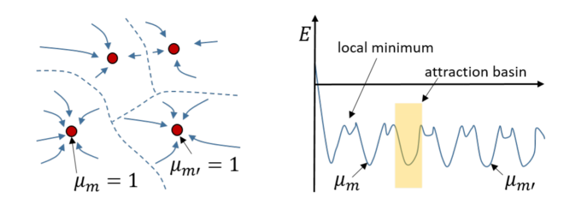

::: footer
Source: <http://didawiki.di.unipi.it/lib/exe/fetch.php/bionics-engineering/computational-neuroscience/2-hopfield-hand.pdf>
:::

# Energy of the Hopfield network

* Stable patterns are **point attractors**.

* Other patterns have higher energies and are **attracted** by the closest stable pattern (attraction basin).

::: footer
Source: <https://en.wikipedia.org/wiki/Hopfield_network>
:::

# Capacity of a Hopfield network

* It can be shown that for a network with $N$ units, one can store up to $0.14 N$ different patterns:

$$C \approx 0.14 \, N$$

* If you have 1000 neurons, you can store 140 patterns.

* As you need 1 million weights for it, it is not very efficient...

::: footer
McEliece R, Posner E, Rodemich E, Venkatesh S. (1987). The capacity of the Hopfield associative memory. IEEE Transactions on Information Theory 33:461–482. doi:10.1109/TIT.1987.1057328
:::

# Storing patterns

* The weights define the stored patterns through their contribution to the energy:

$$E = -\frac{1}{2} \, \mathbf{y}^T \times W \times \mathbf{y} - \mathbf{b}^T \times \mathbf{y}$$

* How do you choose the weights $W$ so that the desired patterns $(\mathbf{y}^1, \mathbf{y}^2, \dots, \mathbf{y}^P)$ are local minima of the energy function?

* Let's omit the bias for a while, as it does not depend on $W$. One can replace the bias with a weight to a neuron whose activity is always +1.

* The pattern $\mathbf{y}^1 = [y^1_1, y^1_2, \ldots, y^1_N]^T$ is stable if no neuron flips after the update:

$$y^1_i = \text{sign}(\sum_{j\neq i} w_{ij} \, y^1_j) \; \; \forall i$$

* Which weights respect this stability constraint?

# Hebb's rule: Cells that fire together wire together

::: {.columns}
::: {.column width=60%}

> When an axon of cell A is near enough to excite a cell B and repeatedly or persistently takes part in firing it, some growth process or metabolic change takes place in one or both cells such that A’s efficiency, as one of the cells firing B, is increased.
>
> **Donald Hebb**, 1949

:::
::: {.column width=40%}

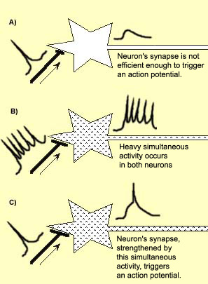

::: footer
<https://thebrain.mcgill.ca/flash/i/i_07/i_07_cl/i_07_cl_tra/i_07_cl_tra.html>
:::

:::
:::

# Hebbian learning

* **Hebbian learning** between two neurons states that the synaptic efficiency (weight) of their connection should be increased if the activity of the two neurons is correlated.

* The correlation between the activities is simply the product:

$$\Delta w_{i,j} = y_i \, y_j$$

* If both activities are high, the weight will increase.

* If one of the activities is low, the weight won't change.

* It is a very rudimentary model of synaptic plasticity, but verified experimentally.

# Storing patterns

* The fixed point respects:

$$y^1_i = \text{sign}(\sum_{j\neq i} w_{ij} \, y^1_j) \; \; \forall i$$

* If we use $w_{i,j} = y^1_i \, y^1_j$ as the result of Hebbian learning (weights initialized at 0), we obtain

$$y^1_i = \text{sign}(\sum_{j\neq i} y^1_i \, y^1_j \, y^1_j) = \text{sign}(\sum_{j\neq i} y^1_i) = \text{sign}((N-1) \, y^1_i) = \text{sign}(y^1_i) = y^1_i \; \; \forall i$$

as $y^1_j \, y^1_j = 1$ (binary units).

* This means that setting $w_{i,j} = y^1_i \, y^1_j$ makes $\mathbf{y}^1$ a fixed point of the system!

* Remembering that $w_{ii}=0$, we find that $W$ is the correlation matrix of $\mathbf{y}^1$ minus the identity:

$$W = \mathbf{y}^1 \times (\mathbf{y}^1)^T - I$$

(the diagonal of $\mathbf{y}^1 \times (\mathbf{y}^1)^T$ is always 1, as $y^1_j \, y^1_j = 1$).

# Storing patterns

* If we have $P$ patterns $(\mathbf{y}^1, \mathbf{y}^2, \dots, \mathbf{y}^P)$ to store, the corresponding weight matrix is:

$$W = \frac{1}{P} \, \sum_{k=1}^P \mathbf{y}^k \times (\mathbf{y}^k)^T - I$$

* $\frac{1}{P} \, \sum_{k=1}^P \mathbf{y}^k \times (\mathbf{y}^k)^T$ is the **correlation matrix** of the patterns.

* This does not sound much like **learning** as before, as we are forming the matrix directly from the data, but it is a biologically realistic implementation of **Hebbian learning**.

* We only need to iterate **once** over the training patterns, not multiple epochs.

* Learning can be online: the weight matrix is modified when a new pattern $\mathbf{y}^k$ has to be remembered:

$$W = W + \mathbf{y}^k \times (\mathbf{y}^k)^T - I$$

* There is no catastrophic forgetting until we reach the **capacity** $C = 0.14 \, N$ of the network.

# Hopfield networks

* Given $P$ patterns $(\mathbf{y}^1, \mathbf{y}^2, \dots, \mathbf{y}^P)$ to store, build the weight matrix: 

$$W = \frac{1}{P} \, \sum_{k=1}^P \mathbf{y}^k \times (\mathbf{y}^k)^T - I$$

* The energy of the Hopfield network for a new pattern $\mathbf{y}$ is (implicitly):

$$
\begin{aligned}
    E(\mathbf{y}) &=  -\frac{1}{2} \, \mathbf{y}^T \times (\frac{1}{P} \, \sum_{k=1}^P \mathbf{y}^k \times (\mathbf{y}^k)^T - I) \times \mathbf{y} - \mathbf{b}^T \times \mathbf{y} \\ 
    &= -\frac{1}{2 P} \, \sum_{k=1}^P  ((\mathbf{y}^k)^T \times \mathbf{y})^2   - (\frac{1}{2} \, \mathbf{y}^T + \mathbf{b}^T) \times \mathbf{y} \\
\end{aligned}
$$

i.e. a quadratic function of the dot product between the current pattern $\mathbf{y}$ and the stored patterns $\mathbf{y}^k$.

* The stored patterns are local minima of this energy function, which can be retrieved from any pattern $\mathbf{y}$ by iteratively applying the **asynchronous update**:

$$\mathbf{y} = \text{sign}(W \times \mathbf{y} + \mathbf{b})$$

# Spurious patterns

::: {.columns}
::: {.column width=40%}

:::
::: {.column width=60%}

* The problem when the capacity of the network is full is that the stored patterns will start to overlap.

* The retrieved patterns will be a linear combination of the stored patterns, what is called a **spurious pattern** or **metastable state**.

$$\mathbf{y} = \pm \, \text{sign}(\alpha_1 \, \mathbf{y}^1 + \alpha_2 \, \mathbf{y}^2 + \dots + \alpha_P \, \mathbf{y}^P)$$

* A spurious pattern has never seen by the network, but is remembered like other memories (hallucinations).

:::
:::

* **Unlearning** methods (Hopfield, Feinstein and Palmer, 1983) use a **sleep / wake cycle**:

    * When the network is awake, it remembers patterns.

    * When the network sleeps (dreams), it unlearns spurious patterns.

::: footer
Hopfield JJ, Feinstein DI, Palmer RG. (1983). Unlearning has a stabilizing effect in collective memories. Nature 304:158–159. doi:10.1038/304158a0
:::

# Applications of Hopfield networks

* **Optimization:**

    * Traveling salesman problem <http://fuzzy.cs.ovgu.de/ci/nn/v07_hopfield_en.pdf>

    * Timetable scheduling

    * Routing in communication networks

::: {.columns}
::: {.column width=50%}

* **Physics:**

    * Spin glasses (magnetism)

:::
::: {.column width=50%}

:::
:::

* **Computer Vision:**

    * Image reconstruction and restoration

* **Neuroscience:**

    * Models of the hippocampus, episodic memory

# Pattern completion

<video data-autoplay src="videos/hopfield-completion.mp4" style="display:block; margin: 0 auto 10px 10px; width: 800px;" controls allow="autoplay loop"></video>

::: footer
<https://www.youtube.com/watch?v=HOxSKBxUVpg>
:::

# Pattern completion

<video data-autoplay src="videos/hopfield-completion2.mp4" style="display:block; margin: 0 auto 10px 10px; width: 700px;" controls allow="autoplay loop"></video>

::: footer
<https://www.youtube.com/watch?v=fCvQcNzUZf0>
:::

# 3 - Modern Hopfield networks / Dense Associative Memories

# Problem with old-school Hopfield networks

* The problems with Hopfield networks are:

    * Their limited capacity $0.14 \, N$.

    * Ghost patterns (reversed images).

    * Spurious patterns (bad separation of patterns).

    * Retrieval is not error-free.

* In this example, the masked Homer is closer to the Bart pattern in the energy function, so it converges to its ghost pattern.

::: footer
Source: <https://ml-jku.github.io/hopfield-layers/>
:::

# Problem with old-school Hopfield networks

* The problem comes mainly from the fact the energy function is a **quadratic function** of the dot product between a state $\mathbf{y}$ and the patterns $\mathbf{y}^k$:

$$
    E(\mathbf{y}) \approx -\frac{1}{2 P} \, \sum_{k=1}^P  ((\mathbf{y}^k)^T \times \mathbf{y})^2
$$

* $-((\mathbf{y}^k)^T \times \mathbf{y})^2$ has minimum when $\mathbf{y} = \mathbf{y}^k$.

* Quadratic functions are very wide, so it is hard to avoid **overlap** between the patterns.

::: {.columns}
::: {.column width=30%}

:::
::: {.column width=70%}

:::
:::

* If we had a **sharper** energy functions, could not we store more patterns and avoid interference?

# Modern Hopfield networks

* Yes. We could define the energy function as a polynomial function of order $a> 2$ (Krotov and Hopfield, 2016):

$$
    E(\mathbf{y}) = -\frac{1}{P} \, \sum_{k=1}^P  ((\mathbf{y}^k)^T \times \mathbf{y})^a
$$

and get a polynomial capacity $C \approx \alpha_a \, N^{a-1}$.

* Or even an exponential function $a = \infty$ (Demircigil et al., 2017):

$$
    E(\mathbf{y}) = - \frac{1}{P} \, \sum_{k=1}^P  \exp((\mathbf{y}^k)^T \times \mathbf{y})
$$

and get an exponential capacity $C \approx 2^{\frac{N}{2}}$! One could store exponentially more patterns than neurons.

* The question is then: **which update rule would minimize these energies?**

<lr>

::: footer
Krotov D, Hopfield JJ. (2016). Dense Associative Memory for Pattern Recognition. arXiv:160601164
:::

::: footer
Demircigil M, Heusel J, Löwe M, Upgang S, Vermet F. (2017). On a model of associative memory with huge storage capacity. J Stat Phys 168:288–299. doi:10.1007/s10955-017-1806-y. arXiv:1702.01929
:::

# Modern Hopfield networks

* (Krotov and Hopfield, 2016) and (Demircigil et al., 2017) show that the binary units $y_i$ can still be updated asynchronously by comparing the energy of the model with the unit **on or off**:

$$y_i = \text{sign}(- E(y_i = +1) + E(y_i=-1))$$

* If the energy is lower with the unit on than with the unit off, turn it on! Otherwise turn it off.

* Note that computing the energy necessitates to iterate over all patterns, so in practice you should keep the number of patterns small:

$$
    E(\mathbf{y}) = - \frac{1}{P} \, \sum_{k=1}^P  \exp((\mathbf{y}^k)^T \times \mathbf{y})
$$

* However, you are not bounded by $0.14 \, N$ anymore, just by the available computational power and RAM.

# Modern Hopfield networks

* The increased capacity of the modern Hopfield network makes sure that you store many patterns without interference (separability of patterns).

* Convergence occurs in only one step (one update per neuron).

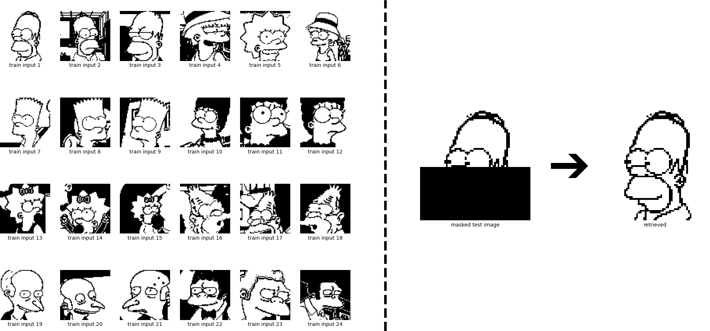

::: footer
Source: <https://ml-jku.github.io/hopfield-layers/>
:::

# 4 - Hopfield networks is all you need

::: footer
Ramsauer H, Schäfl B, Lehner J, Seidl P, Widrich M, Adler T, Gruber L, Holzleitner M, Pavlović M, Sandve GK, Greiff V, Kreil D, Kopp M, Klambauer G, Brandstetter J, Hochreiter S. (2020). Hopfield Networks is All You Need. arXiv:200802217
:::

# Hopfield networks is all you need

* Ramsauer et al. (2020) extend the principle to **continuous patterns**, i.e. vectors. 

* Let's put our $P$ patterns $(\mathbf{y}^1, \mathbf{y}^2, \dots, \mathbf{y}^P)$ in a $N \times P$ matrix:

$$
    X = \begin{bmatrix} \mathbf{y}^1, \mathbf{y}^2, \dots, \mathbf{y}^P \end{bmatrix}
$$

* We can define the following energy function for a vector $\mathbf{y}$:

$$
    E(\mathbf{y}) = - \text{lse}(\beta, X^T \, \mathbf{y}) + \frac{1}{2} \, \mathbf{y}^T \mathbf{y} + \beta^{-1} \, \log P + \frac{1}{2} \, M
$$

where:

$$
    \text{lse}(\beta, \mathbf{z}) = \beta^{-1} \, \log (\sum_{i=1}^P \exp \beta z_i)
$$

is the **log-sum-exp** function and $M$ is the maximum norm of the patterns.

* The first term is similar to the energy of a modern Hopfield network.

::: footer
Ramsauer H, Schäfl B, Lehner J, Seidl P, Widrich M, Adler T, Gruber L, Holzleitner M, Pavlović M, Sandve GK, Greiff V, Kreil D, Kopp M, Klambauer G, Brandstetter J, Hochreiter S. (2020). Hopfield Networks is All You Need. arXiv:200802217
:::

# Hopfield networks is all you need

* The update rule that minimizes the energy

$$
    E(\mathbf{y}) = - \text{lse}(\beta, X^T \, \mathbf{y}) + \frac{1}{2} \, \mathbf{y}^T \mathbf{y} + \beta^{-1} \, \log P + \frac{1}{2} \, M
$$

is:

$$
    \mathbf{y} = \text{softmax}(\beta \, \mathbf{y} \, X^T) \, X^T
$$

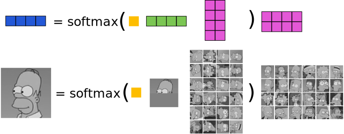{width=55%}

* Why? Just read the 100 pages of mathematical proof.

* Take home message: these are just matrix-vector multiplications and a softmax. We can do that!

::: footer
Source: <https://ml-jku.github.io/hopfield-layers/>
:::

# Hopfield networks is all you need

* Continuous Hopfield networks can retrieve precisely continous vectors with an exponential capacity.

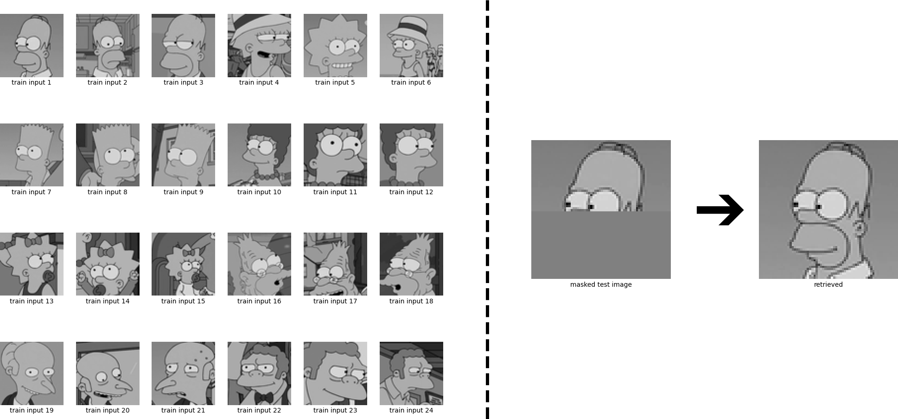

::: footer
Source: <https://ml-jku.github.io/hopfield-layers/>
:::

# Hopfield networks is all you need

::: {.columns}
::: {.column width=70%}

* The sharpness of the attractors is controlled by the **temperature parameter** $\beta$.

* You decide whether you want single patterns or meta-stable states, i.e. **combinations of similar patterns**.

* Why would we want that? Because it is the principle of **self-attention**.

* Which other words in the sentence are related to the current word?

::: footer
Source: <https://ai.googleblog.com/2017/08/transformer-novel-neural-network.html>
:::

:::
::: {.column width=30%}

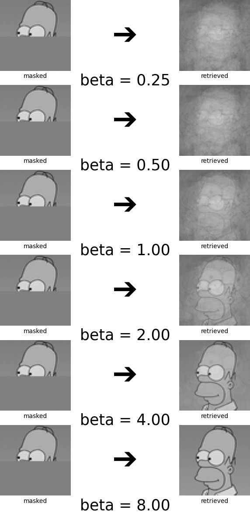

:::
:::

::: footer
Source: <https://ml-jku.github.io/hopfield-layers/>
:::

# Hopfield networks is all you need

::: {.columns}
::: {.column width=60%}

* Using the representation of a word $\mathbf{y}$, as well as the rest of the sentence $X$, we can retrieve a new representation $\mathbf{y}^\text{new}$ that is a mixture of all words in the sentence.

$$
    \mathbf{y}^\text{new} = \text{softmax}(\beta \, \mathbf{y} \, X^T) \, X^T
$$

* This makes the representation of a word more context-related.

* The representations $\mathbf{y}$ and $X$ can be learned using weight matrices, so backpropagation can be used.

* This was the key insight of the **transformer** network that has replaced attentional RNNs in NLP.

* **Hopfield layers** can replace the transformer self-attention with a better performance.

* The transformer network was introduced with the title "Attention is all you need", hence the title of this paper...

* The authors claim that a Hopfield layer can also replace fully-connected layers, LSTM layers, attentional layers, but also SVM, KNN or LVQ...

:::
::: {.column width=40%}

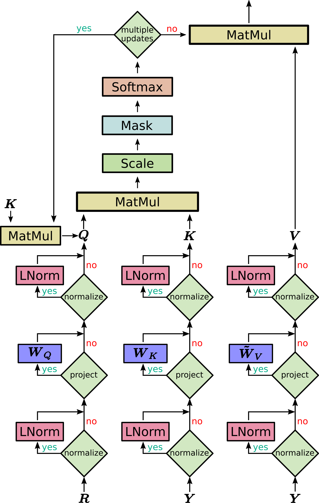

:::
:::

::: footer
Source: <https://ml-jku.github.io/hopfield-layers/>
:::

# References

* Hopfield, J. J. (1982) Neural networks and physical systems with emergent collective computational properties. Proc. Nat. Acad. Sci. (USA) 79, 2554-2558.

* A video from Geoffrey Hinton himself:

<https://www.youtube.com/watch?v=Rs1XMS8NqB4>

* John J. Hopfield (2007), Scholarpedia, 2(5):1977. <http://www.scholarpedia.org/article/Hopfield_network>

* Chris Eliasmith (2007), Scholarpedia, 2(10):1380. <http://www.scholarpedia.org/article/Attractor_network>

* Slides from Davide Bacciu (Pisa) <http://didawiki.di.unipi.it/lib/exe/fetch.php/bionics-engineering/computational-neuroscience/2-hopfield-hand.pdf>