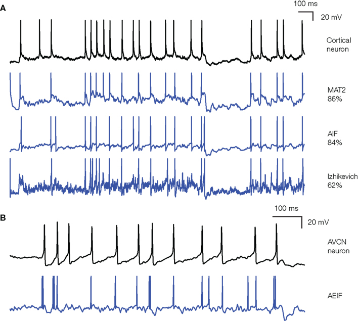
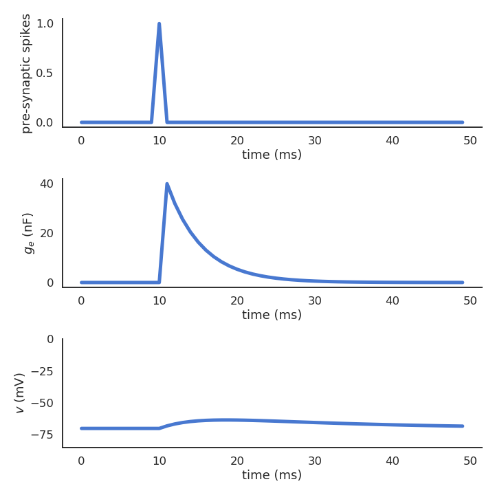
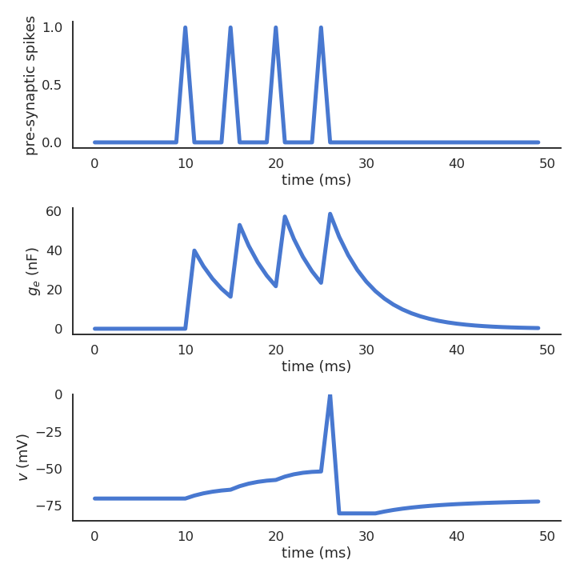
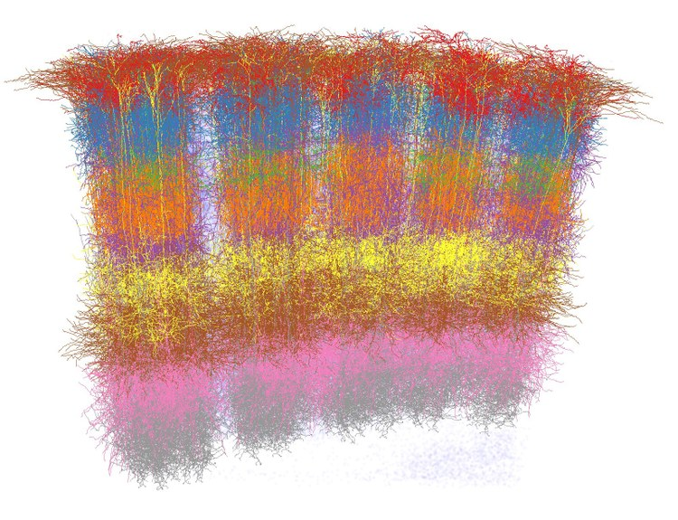
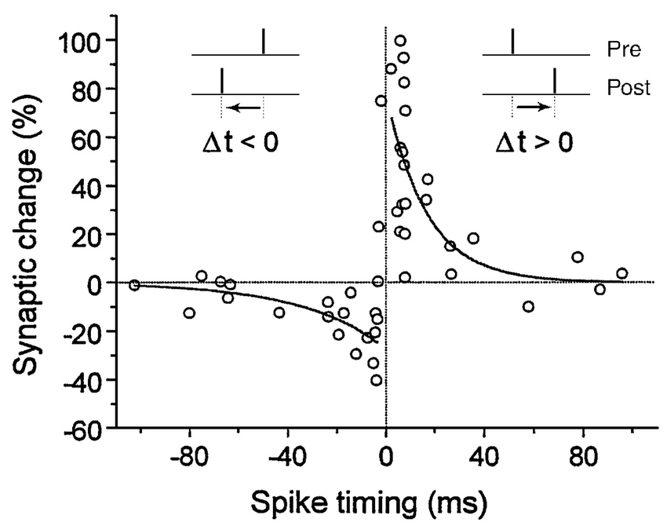
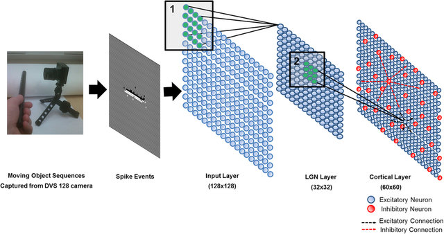
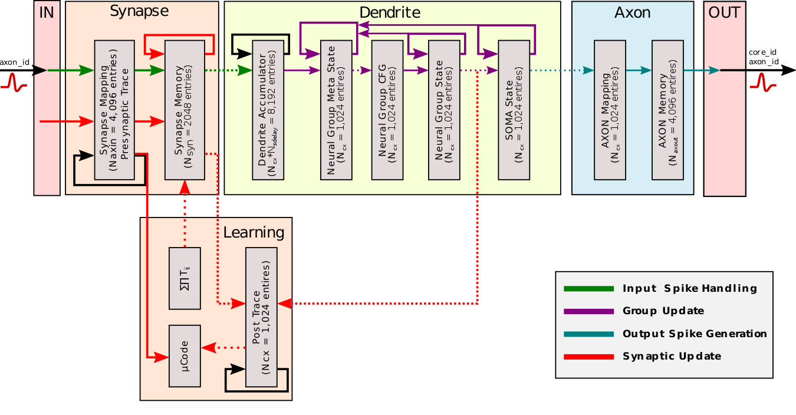
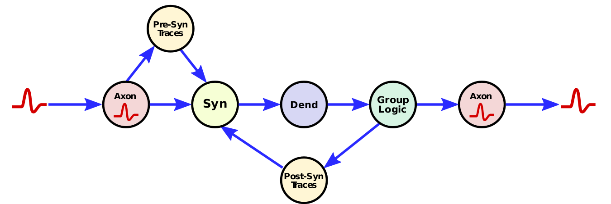
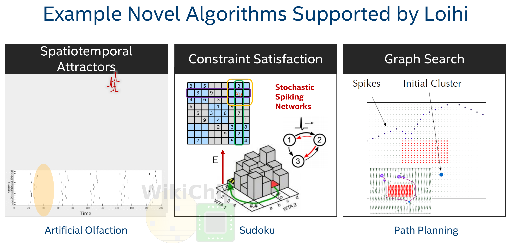

# 1 - Spiking neurons

# Biological neurons communicate through spikes

::: {.columns}
::: {.column width=50%}

::: footer
Rossant et al. (2011). Fitting Neuron Models to Spike Trains. Front. Neurosci. 5. doi:10.3389/fnins.2011.00009
:::

:::
::: {.column width=50%}

* The two important dimensions of the information exchanged by neurons are:

    * The instantaneous **frequency** or **firing rate**: number of spikes per second (Hz).

    * The precise **timing** of the spikes.

* The shape of the spike (amplitude, duration) does not matter much.

* Spikes are binary signals (0 or 1) at precise moments of time.

* **Rate-coded neurons** only represent the firing rate of a neuron and ignore spike timing.

* **Spiking neurons** represent explicitly spike timing, but omit the details of action potentials.

:::
:::

# The leaky integrate-and-fire neuron (Lapicque, 1907)

::: {.columns}
::: {.column width=50%}

* The **leaky integrate-and-fire** (LIF) neuron has a **membrane potential** $v(t)$ that integrates its input current $I(t)$:

$$
    C \, \frac{dv(t)}{dt} = - g_L \, (v(t) - V_L) + I(t)
$$

* $C$ is the membrane capacitance, $g_L$ the leak conductance and $V_L$ the resting potential. 

* In the absence of input current ($I=0$), the membrane potential is equal to the resting potential.

:::
::: {.column width=50%}

::: footer
Source: <https://neuronaldynamics.epfl.ch/online/Ch1.S3.html>
:::

:::
:::

* When the membrane potential exceeds a threshold $V_T$, the neuron emits a spike and the membrane potential is reset to the reset potential $V_r$ for a fixed refractory period $t_\text{ref}$.

$$
    \text{if} \; v(t) > V_T \; \text{: emit a spike and set} \, v(t) = V_r \; \text{for} \, t_\text{ref} \, \text{ms.}
$$

---

{width=70%}

# Different spiking neuron models are possible

* Izhikevich quadratic IF (Izhikevich, 2003).

$$
    \frac{dv(t)}{dt} = 0.04 \, v(t)^2 + 5 \, v(t) + 140 - u(t) + I(t) 
$$
$$
    \frac{du(t)}{dt} = a \, (b \, v(t) - u(t))
$$

::: footer
Izhikevich EM. (2003). Simple model of spiking neurons. IEEE transactions on neural networks 14:1569–72. doi:10.1109/TNN.2003.820440
:::

# Different spiking neuron models are possible

* Adaptive exponential IF (AdEx, Brette and Gerstner, 2005).

$$
    C \, \frac{dv(t)}{dt} = -g_L \ (v(t) - E_L) +  g_L \, \Delta_T \, \exp(\frac{v(t) - v_T}{\Delta_T})  + I(t) - w
$$
$$
    \tau_w \, \frac{dw}{dt} = a \, (v(t) - E_L) - w
$$

::: footer
Brette R, Gerstner W. (2005). Adaptive Exponential Integrate-and-Fire Model as an Effective Description of Neuronal Activity. Journal of Neurophysiology 94:3637–3642. doi:10.1152/jn.00686.2005
:::

# Realistic neuron models can reproduce a variety of dynamics

::: {.columns}
::: {.column width=65%}

:::
::: {.column width=35%}

* Biological neurons do not all respond the same to an input current.

    * Some fire regularly.

    * Some slow down with time.

    * Some emit bursts of spikes.

* Modern spiking neuron models allow to recreate these dynamics by changing a few parameters.

:::
:::

# Synaptic transmission

* Spiking neurons communicate by **increasing the conductance** $g_e$ of the postsynaptic neuron:

$$
    C \, \frac{dv(t)}{dt} = - g_L \, (v(t) - V_L) - g_e(t) \, (v(t) - V_E) + I(t)
$$

::: {.columns}
::: {.column width=50%}

:::
::: {.column width=50%}

* Incoming spikes increase the conductance from a constant $w$ which represents the synaptic efficiency (or weight):

$$
    g_e(t) \leftarrow g_e(t) + w
$$

* If there is no spike, the conductance decays back to zero:

$$
    \tau_e \, \frac{d g_e(t)}{dt} + g_e(t) = 0
$$

* An incoming spike temporarily increases (or decreases if the weight $w$ is negative) the membrane potential of the post-synaptic neuron. 

:::
:::

# Synaptic transmission

::: {.columns}
::: {.column width=60%}

:::
::: {.column width=40%}

* When enough spikes arrive at the post-synaptic neuron close in time:

    * either one pre-synaptic fires very rapidly,

    * or many different pre-synaptic neurons fire in close proximity,

this can be enough to bring the post-synaptic membrane over the threshold, so that it it turns emits a spike.

* This is the basic principle of **synaptic transmission** in biological neurons.

    * Neurons emit spikes, which modify the membrane potential of other neurons, which in turn emit spikes, and so on.

:::
:::

# Populations of spiking neurons

* **Recurrent networks of spiking neurons** exhibit various dynamics.

::: {.columns}
::: {.column width=50%}

* They can fire randomly, or tend to fire synchronously, depending on their inputs and the strength of the connections.

* **Liquid State Machines** are the spiking equivalent of echo-state networks.

:::
::: {.column width=50%}

:::
:::

::: footer
Source: <https://www.pnas.org/content/110/47/19113>
:::

# Hebbian learning

* **Hebbian learning** postulates that synapses strengthen based on the **correlation** between the activity of the pre- and post-synaptic neurons:

When an axon of cell A is near enough to excite a cell B and repeatedly or persistently takes part in firing it, some growth process or metabolic change takes place in one or both cells such that A’s efficiency, as one of the cells firing B, is increased. **Donald Hebb**, 1949

::: footer
Source: <https://slideplayer.com/slide/11511675/>
:::

# STDP: Spike-timing dependent plasticity

* Synaptic efficiencies actually evolve depending on the the **causation** between the neuron's firing patterns:

    * If the pre-synaptic neuron fires **before** the post-synaptic one, the weight is increased (**long-term potentiation**). Pre causes Post to fire.

    * If it fires **after**, the weight is decreased (**long-term depression**). Pre does not cause Post to fire.

{width=70%}

::: footer
Bi, G. and Poo, M. (2001). Synaptic modification of correlated activity: Hebb's postulate revisited. Ann. Rev. Neurosci., 24:139-166.
:::

# STDP: Spike-timing dependent plasticity

::: {.columns}
::: {.column width=50%}

* The STDP (spike-timing dependent plasticity) plasticity rule describes how the weight of a synapse evolves when the pre-synaptic neuron fires at $t_\text{pre}$ and the post-synaptic one fires at $t_\text{post}$.

$$ \Delta w = \begin{cases} A^+ \, \exp - \frac{t_\text{pre} - t_\text{post}}{\tau^+} \; \text{if} \; t_\text{post} > t_\text{pre}\\  A^- \, \exp - \frac{t_\text{pre} - t_\text{post}}{\tau^-} \; \text{if} \; t_\text{pre} > t_\text{post}\\ \end{cases}$$

* STDP can be implemented online using traces.

* More complex variants of STDP (triplet STDP) exist, but this is the main model of synaptic plasticity in spiking networks.

:::
::: {.column width=50%}

:::
:::

::: footer
Bi, G. and Poo, M. (2001). Synaptic modification of correlated activity: Hebb's postulate revisited. Ann. Rev. Neurosci., 24:139-166.
:::

# 2 - Deep convolutional spiking networks

{width=70%}

::: footer
Kheradpisheh, S. R., Ganjtabesh, M., Thorpe, S. J., and Masquelier, T. (2018). STDP-based spiking deep convolutional neural networks for object recognition. Neural Networks 99, 56–67. doi:10.1016/j.neunet.2017.12.005.
:::

# Deep convolutional spiking networks

* A lot of work has lately focused on deep spiking networks, either using a modified version of backpropagation or using STDP.

* The Masquelier lab has proposed a deep spiking convolutional network learning to extract features using STDP (**unsupervised learning**).

* A simple classifier (SVM) then learns to predict classes.

::: footer
Kheradpisheh, S. R., Ganjtabesh, M., Thorpe, S. J., and Masquelier, T. (2018). STDP-based spiking deep convolutional neural networks for object recognition. Neural Networks 99, 56–67. doi:10.1016/j.neunet.2017.12.005.
:::

# Deep convolutional spiking networks

* The image is first transformed into a spiking population using **difference-of-Gaussian** (DoG) filters.

* **On-center** neurons fire when a bright area at the corresponding location is surrounded by a darker area. 

* **Off-center** cells do the opposite.

{width=70%}

::: footer
Kheradpisheh, S. R., Ganjtabesh, M., Thorpe, S. J., and Masquelier, T. (2018). STDP-based spiking deep convolutional neural networks for object recognition. Neural Networks 99, 56–67. doi:10.1016/j.neunet.2017.12.005.
:::

# Deep convolutional spiking networks

{width=80%}

* The convolutional and pooling layers work just as in regular CNNs (shared weights), except the neuron are **integrate-and-fire** (IF).

* There is additionally a **temporal coding scheme**, where the first neuron to emit a spike at a particular location (i.e. over all feature maps) **inhibits** all the others.

* This ensures selectivity of the features through **sparse coding**: only one feature can be detected at a given location.

* STDP allows to learn **causation** between the features and to extract increasingly complex features.

::: footer
Kheradpisheh, S. R., Ganjtabesh, M., Thorpe, S. J., and Masquelier, T. (2018). STDP-based spiking deep convolutional neural networks for object recognition. Neural Networks 99, 56–67. doi:10.1016/j.neunet.2017.12.005.
:::

# Deep convolutional spiking networks

{width=80%}

# Deep convolutional spiking networks

<video data-autoplay src="videos/stdp-masquelier.mp4" style="display:block; margin: 0 auto 10px 10px; width: 800px;" controls loop allow="autoplay loop"></video>

::: footer
<https://www.youtube.com/watch?v=u32Xnz2hDkE>
:::

# Deep convolutional spiking networks

* The network is trained **unsupervisedly** on various datasets and obtains accuracies close to the state of the art:

    * Caltech face/motorbike dataset.
    * ETH-80
    * MNIST

{width=80%}

::: footer
Kheradpisheh, S. R., Ganjtabesh, M., Thorpe, S. J., and Masquelier, T. (2018). STDP-based spiking deep convolutional neural networks for object recognition. Neural Networks 99, 56–67. doi:10.1016/j.neunet.2017.12.005.
:::

# Deep convolutional spiking networks

* The performance on MNIST is in line with classical 3-layered CNNs, but without backpropagation!

::: footer
Kheradpisheh, S. R., Ganjtabesh, M., Thorpe, S. J., and Masquelier, T. (2018). STDP-based spiking deep convolutional neural networks for object recognition. Neural Networks 99, 56–67. doi:10.1016/j.neunet.2017.12.005.
:::

# 3 - Neuromorphic computing

# Event-based cameras

<video data-autoplay src="videos/eventbased3.mp4" style="display:block; margin: 0 auto 10px 10px; width: 800px;" controls loop allow="autoplay loop"></video>

::: footer
<https://www.youtube.com/watch?v=kPCZESVfHoQ>
:::

<!--# Event-based cameras-->

<!--<video data-autoplay src="videos/eventbased2.mp4" style="display:block; margin: 0 auto 10px 10px; width: 800px;" controls loop allow="autoplay loop"></video>-->

<!--[citation <https://www.youtube.com/watch?v=IdYrC4cUO0I>]-->

# Event-based cameras

<video data-autoplay src="videos/eventbased.mp4" style="display:block; margin: 0 auto 10px 10px; width: 800px;" controls loop allow="autoplay loop"></video>

::: footer
<https://www.youtube.com/watch?v=eomALySSGVU>
:::

# Neuromorphic computing

* Event-based cameras are inspired from the retina (**neuromorphic**) and emit spikes corresponding to luminosity changes.

* Classical computers cannot cope with the high fps of event-based cameras.

* Spiking neural networks can be used to process the events (classification, control, etc). But do we have the hardware for that?

::: footer
<https://www.researchgate.net/publication/280600732_A_Computational_Model_of_Innate_Directional_Selectivity_Refined_by_Visual_Experience>
:::

# Intel Loihi

::: footer
<https://en.wikichip.org/wiki/intel/loihi>
:::

# Intel Loihi

* Loihi implements 128 neuromorphic cores, each containing 1,024 primitive spiking neural units grouped into tree-like structures in order to simplify the implementation. 

::: footer
<https://en.wikichip.org/wiki/intel/loihi>
:::

# Intel Loihi

<!--{width=80%}-->

::: {.columns}
::: {.column width=40%}

:::
::: {.column width=60%}

* Each neuromorphic core transits spikes to the other cores.

* Fortunately, the firing rates are usually low (10 Hz), what limits the communication costs inside the chip.

* Synapses are **learnable** with STDP mechanisms (memristors), although offline. 

:::
:::

::: footer
<https://en.wikichip.org/wiki/intel/loihi>
:::

# Neuromorphic computing

::: {.columns}
::: {.column width=45%}

* Intel Loihi consumes 1/1000th of the energy needed by a modern GPU.

* Alternatives to Intel Loihi are:

    * IBM TrueNorth

    * Spinnaker (University of Manchester).

    * Brainchip

* The number of simulated neurons and synapses is still very far away from the human brain, but getting closer!

:::
::: {.column width=55%}

::: footer
<https://fuse.wikichip.org/news/2519/intel-labs-builds-a-neuromorphic-system-with-64-to-768-loihi-chips-8-million-to-100-million-neurons/>
:::

:::
:::

# Towards biologically inspired AI

* Next-gen AI should overcome the limitations of deep learning by:

    * Making use of **unsupervised learning rules** (Hebbian, STDP).

    * Using neural and population **dynamics** (reservoir) to decompose inputs into a spatio-temporal space, instead of purely spatial.

    * Use energy-efficient neural models (spiking neurons) able to run efficiently on **neuromorphic hardware**.

    * Design more complex architectures and use **embodiment**.

{width=60%}

---

<video data-autoplay src="videos/neuronmodels.mp4" style="display:block; margin: 0 auto 10px 10px;" controls allow="autoplay loop"></video>

::: footer
https://www.youtube.com/watch?v=3JQ3hYko51Y
:::